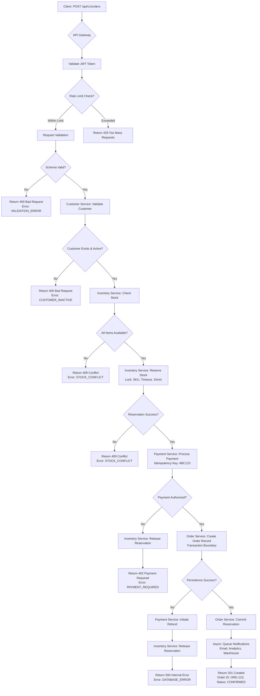
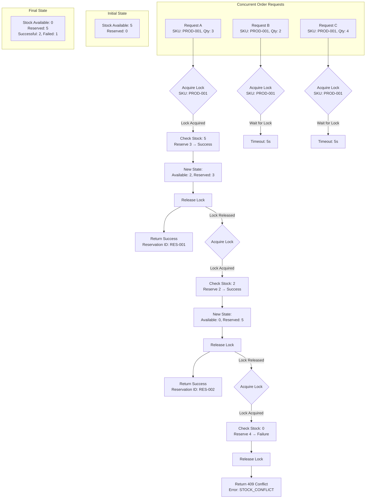
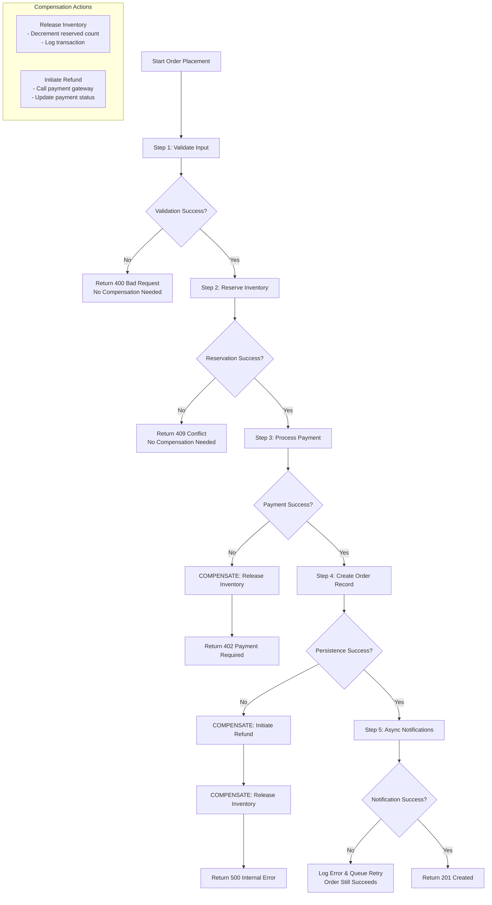
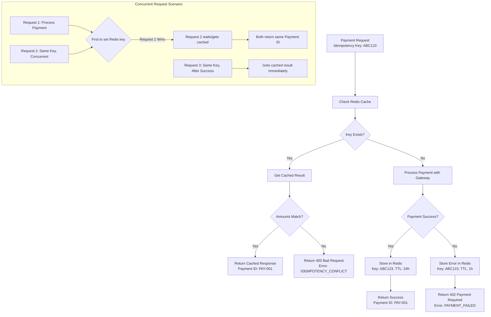

# 🏗️ E-Commerce Order Fulfillment System - Complete TDD Documentation

## 📋 Table of Contents
1. [Business Requirements Matrix](#1-business-requirements-matrix)
2. [Complete Test Case Catalog](#2-complete-test-case-catalog)
3. [Architecture Workflow Diagrams](#3-architecture-workflow-diagrams)
4. [Failure Response Specifications](#4-failure-response-specifications)
5. [MySQL Database Schema](#5-mysql-database-schema)
6. [Test Execution Strategy](#6-test-execution-strategy)

---

## 1. BUSINESS REQUIREMENTS MATRIX

### **BR-01: Customer Management Requirements**
| ID | Requirement | Priority | Description | Validation Rules |
|----|-------------|----------|-------------|-----------------|
| BR-CUST-01 | Name Validation | HIGH | Customer names must be valid and properly formatted | 2-100 chars, letters/hyphens/apostrophes only, no numbers/symbols |
| BR-CUST-02 | Email Validation | HIGH | Email must be unique and properly formatted | RFC 5322 format, unique in system, case-insensitive |
| BR-CUST-03 | Phone Validation | MEDIUM | Phone numbers must follow international standards | E.164 format, optional field, country code validation |
| BR-CUST-04 | Customer Status | HIGH | Customers must be active to perform transactions | Active/Inactive status, fraud detection |
| BR-CUST-05 | Address Management | MEDIUM | Shipping addresses must be complete and valid | Required fields, country validation, postal code format |

### **BR-02: Product Catalog Requirements**
| ID | Requirement | Priority | Description | Validation Rules |
|----|-------------|----------|-------------|-----------------|
| BR-PROD-01 | SKU Management | HIGH | Unique product identifiers with specific format | XXX-XXX-XXX format, uppercase, unique |
| BR-PROD-02 | Price Management | HIGH | Prices must be positive and properly formatted | Positive decimal, 2 decimal places, currency support |
| BR-PROD-03 | Inventory Tracking | CRITICAL | Real-time stock availability | No negative stock, reservation system |
| BR-PROD-04 | Product Status | HIGH | Products must be active to be purchased | Active/Inactive flag, category validation |
| BR-PROD-05 | Price History | MEDIUM | Track price changes for audit | Versioning, change reasons, effective dates |

### **BR-03: Order Processing Requirements**
| ID | Requirement | Priority | Description | Validation Rules |
|----|-------------|----------|-------------|-----------------|
| BR-ORD-01 | Order Creation | CRITICAL | Orders must have valid items and customer | Minimum 1 item, valid customer, stock availability |
| BR-ORD-02 | Item Validation | HIGH | Order items must be valid products with proper quantities | Positive integer quantities, valid SKUs, stock checks |
| BR-ORD-03 | Total Calculation | HIGH | Order totals must be accurate | Item totals sum, tax calculation, shipping fees |
| BR-ORD-04 | Status Management | HIGH | Order status follows defined workflow | State machine, valid transitions, audit trail |
| BR-ORD-05 | Order Cancellation | MEDIUM | Orders can be cancelled with proper compensation | Refund processing, inventory release, status update |

### **BR-04: Payment Processing Requirements**
| ID | Requirement | Priority | Description | Validation Rules |
|----|-------------|----------|-------------|-----------------|
| BR-PAY-01 | Payment Authorization | CRITICAL | Payments must be authorized before order confirmation | Amount validation, fraud checks, gateway integration |
| BR-PAY-02 | Idempotency | HIGH | Payment requests must be idempotent | Unique idempotency key, duplicate prevention |
| BR-PAY-03 | Payment Methods | HIGH | Support multiple payment methods | Credit card, debit card, PayPal, bank transfer |
| BR-PAY-04 | Refund Processing | MEDIUM | Refunds must be properly tracked | Original payment reference, amount validation, status tracking |
| BR-PAY-05 | Fraud Detection | HIGH | Detect and prevent fraudulent transactions | Velocity checks, amount patterns, IP validation |

### **BR-05: Inventory Management Requirements**
| ID | Requirement | Priority | Description | Validation Rules |
|----|-------------|----------|-------------|-----------------|
| BR-INV-01 | Stock Reservation | CRITICAL | Reserve stock during order processing | Atomic operations, expiration (15min), concurrency control |
| BR-INV-02 | Stock Availability | HIGH | Prevent overselling | Real-time checks, lock mechanisms, queue management |
| BR-INV-03 | Inventory Updates | HIGH | Update stock levels accurately | Commit on order confirmation, release on cancellation |
| BR-INV-04 | Low Stock Alerts | MEDIUM | Notify when stock is below threshold | Configurable thresholds, notification channels |
| BR-INV-05 | Stock Reconciliation | MEDIUM | Periodic stock verification | Physical vs system count, discrepancy handling |

### **BR-06: Notification Requirements**
| ID | Requirement | Priority | Description | Validation Rules |
|----|-------------|----------|-------------|-----------------|
| BR-NOT-01 | Order Confirmation | HIGH | Send confirmation after successful order | Email template, customer details, order summary |
| BR-NOT-02 | Payment Notifications | MEDIUM | Notify about payment status | Success/failure emails, retry logic |
| BR-NOT-03 | Shipping Updates | MEDIUM | Provide shipping status updates | Tracking numbers, delivery estimates |
| BR-NOT-04 | Async Processing | HIGH | Notifications must not block order flow | Queue system, worker pool, retry with backoff |
| BR-NOT-05 | Delivery Tracking | LOW | Track notification delivery status | Open rates, click rates, failure logging |

### **BR-07: System User Requirements**
| ID | Requirement | Priority | Description | Validation Rules |
|----|-------------|----------|-------------|-----------------|
| BR-USER-01 | Authentication | HIGH | Secure user authentication | Password hashing, JWT tokens, session management |
| BR-USER-02 | Authorization | HIGH | Role-based access control | Permission matrix, role definitions, access logs |
| BR-USER-03 | Password Security | HIGH | Strong password requirements | Minimum 12 chars, complexity, expiration |
| BR-USER-04 | Account Lockout | MEDIUM | Prevent brute force attacks | Failed attempt tracking, lockout duration |
| BR-USER-05 | Audit Trail | MEDIUM | Track all user actions | Action logging, IP tracking, timestamp |

---

## 2. COMPLETE TEST CASE CATALOG

### **TEST GROUP A: Customer Validation (45 Test Cases)**

#### **A1: Name Validation Tests (23 Test Cases)**
```yaml
Test Cases:
  - TC-CUST-001:
      Description: "Valid full names"
      Input: {"first_name": "John", "last_name": "Doe"}
      Expected: Success (200/201)
      Business Rule: BR-CUST-01
      
  - TC-CUST-002:
      Description: "Empty first name"
      Input: {"first_name": "", "last_name": "Doe"}
      Expected: Error 400 - VALIDATION_ERROR
      Error Code: CUST_001
      Business Rule: BR-CUST-01
      
  - TC-CUST-003:
      Description: "Empty last name"
      Input: {"first_name": "John", "last_name": ""}
      Expected: Error 400 - VALIDATION_ERROR
      Error Code: CUST_001
      Business Rule: BR-CUST-01
      
  - TC-CUST-004:
      Description: "Both names empty"
      Input: {"first_name": "", "last_name": ""}
      Expected: Error 400 - VALIDATION_ERROR
      Error Code: CUST_001
      Business Rule: BR-CUST-01
      
  - TC-CUST-005:
      Description: "Missing first name (null)"
      Input: {"last_name": "Doe"}
      Expected: Error 400 - VALIDATION_ERROR
      Error Code: CUST_001
      Business Rule: BR-CUST-01
      
  - TC-CUST-006:
      Description: "Missing last name (null)"
      Input: {"first_name": "John"}
      Expected: Error 400 - VALIDATION_ERROR
      Error Code: CUST_001
      Business Rule: BR-CUST-01
      
  - TC-CUST-007:
      Description: "Both names missing"
      Input: {}
      Expected: Error 400 - VALIDATION_ERROR
      Error Code: CUST_001
      Business Rule: BR-CUST-01
      
  - TC-CUST-008:
      Description: "Names with leading/trailing spaces"
      Input: {"first_name": "  John  ", "last_name": "  Doe  "}
      Expected: Success (trimmed to "John", "Doe")
      Business Rule: BR-CUST-01
      
  - TC-CUST-009:
      Description: "Invalid characters in first name"
      Input: {"first_name": "J0hn", "last_name": "Doe"}
      Expected: Error 400 - VALIDATION_ERROR
      Error Code: CUST_001
      Business Rule: BR-CUST-01
      
  - TC-CUST-010:
      Description: "Invalid characters in last name"
      Input: {"first_name": "John", "last_name": "D03"}
      Expected: Error 400 - VALIDATION_ERROR
      Error Code: CUST_001
      Business Rule: BR-CUST-01
      
  - TC-CUST-011:
      Description: "Special characters (@#$%)"
      Input: {"first_name": "J@hn", "last_name": "Doe"}
      Expected: Error 400 - VALIDATION_ERROR
      Error Code: CUST_001
      Business Rule: BR-CUST-01
      
  - TC-CUST-012:
      Description: "Valid hyphenated name"
      Input: {"first_name": "John", "last_name": "Doe-Smith"}
      Expected: Success
      Business Rule: BR-CUST-01
      
  - TC-CUST-013:
      Description: "Valid apostrophe in name"
      Input: {"first_name": "John", "last_name": "O'Brien"}
      Expected: Success
      Business Rule: BR-CUST-01
      
  - TC-CUST-014:
      Description: "Single character names"
      Input: {"first_name": "J", "last_name": "D"}
      Expected: Error 400 - VALIDATION_ERROR
      Error Code: CUST_001
      Business Rule: BR-CUST-01
      
  - TC-CUST-015:
      Description: "Minimum length names (2 chars)"
      Input: {"first_name": "Jo", "last_name": "Do"}
      Expected: Success
      Business Rule: BR-CUST-01
      
  - TC-CUST-016:
      Description: "Maximum length names (100 chars)"
      Input: {"first_name": "A"*100, "last_name": "B"*100}
      Expected: Success
      Business Rule: BR-CUST-01
      
  - TC-CUST-017:
      Description: "Exceeds maximum length (101 chars)"
      Input: {"first_name": "A"*101, "last_name": "Doe"}
      Expected: Error 400 - VALIDATION_ERROR
      Error Code: CUST_001
      Business Rule: BR-CUST-01
      
  - TC-CUST-018:
      Description: "Control characters in name"
      Input: {"first_name": "John\n", "last_name": "Doe"}
      Expected: Error 400 - VALIDATION_ERROR
      Error Code: CUST_001
      Business Rule: BR-CUST-01
      
  - TC-CUST-019:
      Description: "Unicode characters"
      Input: {"first_name": "Élise", "last_name": "Noël"}
      Expected: Success
      Business Rule: BR-CUST-01
      
  - TC-CUST-020:
      Description: "Whitespace-only names"
      Input: {"first_name": "   ", "last_name": "   "}
      Expected: Error 400 - VALIDATION_ERROR
      Error Code: CUST_001
      Business Rule: BR-CUST-01
      
  - TC-CUST-021:
      Description: "Mixed case names"
      Input: {"first_name": "JOHN", "last_name": "doe"}
      Expected: Success (case preserved)
      Business Rule: BR-CUST-01
      
  - TC-CUST-022:
      Description: "Multiple spaces between names"
      Input: {"first_name": "John  Michael", "last_name": "Doe"}
      Expected: Success (single space normalized)
      Business Rule: BR-CUST-01
      
  - TC-CUST-023:
      Description: "Name with numbers only"
      Input: {"first_name": "123", "last_name": "456"}
      Expected: Error 400 - VALIDATION_ERROR
      Error Code: CUST_001
      Business Rule: BR-CUST-01
```

#### **A2: Email Validation Tests (15 Test Cases)**
```yaml
Test Cases:
  - TC-CUST-024:
      Description: "Valid standard email"
      Input: {"email": "john.doe@example.com"}
      Expected: Success
      Business Rule: BR-CUST-02
      
  - TC-CUST-025:
      Description: "Empty email"
      Input: {"email": ""}
      Expected: Error 400 - VALIDATION_ERROR
      Error Code: CUST_002
      Business Rule: BR-CUST-02
      
  - TC-CUST-026:
      Description: "Missing @ symbol"
      Input: {"email": "johndoeexample.com"}
      Expected: Error 400 - VALIDATION_ERROR
      Error Code: CUST_002
      Business Rule: BR-CUST-02
      
  - TC-CUST-027:
      Description: "Missing domain"
      Input: {"email": "john@"}
      Expected: Error 400 - VALIDATION_ERROR
      Error Code: CUST_002
      Business Rule: BR-CUST-02
      
  - TC-CUST-028:
      Description: "Missing local part"
      Input: {"email": "@example.com"}
      Expected: Error 400 - VALIDATION_ERROR
      Error Code: CUST_002
      Business Rule: BR-CUST-02
      
  - TC-CUST-029:
      Description: "Duplicate email"
      Precondition: Email "john@example.com" exists
      Input: {"email": "john@example.com"}
      Expected: Error 409 - CONFLICT
      Error Code: CUST_002
      Business Rule: BR-CUST-02
      
  - TC-CUST-030:
      Description: "Email with plus addressing"
      Input: {"email": "john.doe+tag@example.com"}
      Expected: Success
      Business Rule: BR-CUST-02
      
  - TC-CUST-031:
      Description: "Email with subdomain"
      Input: {"email": "john@sub.example.com"}
      Expected: Success
      Business Rule: BR-CUST-02
      
  - TC-CUST-032:
      Description: "Uppercase email"
      Input: {"email": "JOHN.DOE@EXAMPLE.COM"}
      Expected: Success (lowercased to "john.doe@example.com")
      Business Rule: BR-CUST-02
      
  - TC-CUST-033:
      Description: "Email with spaces"
      Input: {"email": "  john@example.com  "}
      Expected: Success (trimmed)
      Business Rule: BR-CUST-02
      
  - TC-CUST-034:
      Description: "Invalid TLD"
      Input: {"email": "john@example.c"}
      Expected: Success (valid)
      Business Rule: BR-CUST-02
      
  - TC-CUST-035:
      Description: "Email with special characters"
      Input: {"email": "john.doe!#$%&'*+-/=?^_`{}|~@example.com"}
      Expected: Success
      Business Rule: BR-CUST-02
      
  - TC-CUST-036:
      Description: "Too long email (>254 chars)"
      Input: {"email": "a"*250 + "@example.com"}
      Expected: Error 400 - VALIDATION_ERROR
      Error Code: CUST_002
      Business Rule: BR-CUST-02
      
  - TC-CUST-037:
      Description: "IP address as domain"
      Input: {"email": "john@[192.168.1.1]"}
      Expected: Success
      Business Rule: BR-CUST-02
      
  - TC-CUST-038:
      Description: "Unicode email"
      Input: {"email": " Pelé@example.com"}
      Expected: Success
      Business Rule: BR-CUST-02
```

#### **A3: Phone Validation Tests (7 Test Cases)**
```yaml
Test Cases:
  - TC-CUST-039:
      Description: "Valid E.164 format"
      Input: {"phone": "+12345678901"}
      Expected: Success
      Business Rule: BR-CUST-03
      
  - TC-CUST-040:
      Description: "Empty phone (optional)"
      Input: {"phone": ""}
      Expected: Success
      Business Rule: BR-CUST-03
      
  - TC-CUST-041:
      Description: "Phone with spaces and hyphens"
      Input: {"phone": "+1 (234) 567-8901"}
      Expected: Success (normalized to +12345678901)
      Business Rule: BR-CUST-03
      
  - TC-CUST-042:
      Description: "Invalid phone (letters)"
      Input: {"phone": "+1-800-ABC-DEFG"}
      Expected: Error 400 - VALIDATION_ERROR
      Error Code: CUST_003
      Business Rule: BR-CUST-03
      
  - TC-CUST-043:
      Description: "Too short phone"
      Input: {"phone": "+123"}
      Expected: Error 400 - VALIDATION_ERROR
      Error Code: CUST_003
      Business Rule: BR-CUST-03
      
  - TC-CUST-044:
      Description: "Too long phone"
      Input: {"phone": "+12345678901234567890"}
      Expected: Error 400 - VALIDATION_ERROR
      Error Code: CUST_003
      Business Rule: BR-CUST-03
      
  - TC-CUST-045:
      Description: "Missing country code"
      Input: {"phone": "1234567890"}
      Expected: Error 400 - VALIDATION_ERROR
      Error Code: CUST_003
      Business Rule: BR-CUST-03
```

### **TEST GROUP B: Product Validation (25 Test Cases)**

#### **B1: SKU Validation Tests (15 Test Cases)**
```yaml
Test Cases:
  - TC-PROD-001:
      Description: "Valid SKU format"
      Input: {"sku": "PROD-001"}
      Expected: Success
      Business Rule: BR-PROD-01
      
  - TC-PROD-002:
      Description: "Empty SKU"
      Input: {"sku": ""}
      Expected: Error 400 - VALIDATION_ERROR
      Error Code: PROD_001
      Business Rule: BR-PROD-01
      
  - TC-PROD-003:
      Description: "Lowercase SKU"
      Input: {"sku": "prod-001"}
      Expected: Error 400 - VALIDATION_ERROR
      Error Code: PROD_001
      Business Rule: BR-PROD-01
      
  - TC-PROD-004:
      Description: "Missing hyphen"
      Input: {"sku": "PROD001"}
      Expected: Error 400 - VALIDATION_ERROR
      Error Code: PROD_001
      Business Rule: BR-PROD-01
      
  - TC-PROD-005:
      Description: "Duplicate SKU"
      Precondition: SKU "PROD-001" exists
      Input: {"sku": "PROD-001"}
      Expected: Error 409 - CONFLICT
      Error Code: PROD_001
      Business Rule: BR-PROD-01
      
  - TC-PROD-006:
      Description: "Special characters in SKU"
      Input: {"sku": "PROD@001"}
      Expected: Error 400 - VALIDATION_ERROR
      Error Code: PROD_001
      Business Rule: BR-PROD-01
      
  - TC-PROD-007:
      Description: "Multiple sections"
      Input: {"sku": "PROD-001-EXTRA"}
      Expected: Success
      Business Rule: BR-PROD-01
      
  - TC-PROD-008:
      Description: "Too short SKU"
      Input: {"sku": "P-1"}
      Expected: Error 400 - VALIDATION_ERROR
      Error Code: PROD_001
      Business Rule: BR-PROD-01
      
  - TC-PROD-009:
      Description: "Too long SKU (>50 chars)"
      Input: {"sku": "PROD-" + "A"*50}
      Expected: Error 400 - VALIDATION_ERROR
      Error Code: PROD_001
      Business Rule: BR-PROD-01
      
  - TC-PROD-010:
      Description: "Different prefix"
      Input: {"sku": "SKU-001"}
      Expected: Success
      Business Rule: BR-PROD-01
      
  - TC-PROD-011:
      Description: "Alphanumeric suffix"
      Input: {"sku": "PROD-001A"}
      Expected: Success
      Business Rule: BR-PROD-01
      
  - TC-PROD-012:
      Description: "Only numbers after hyphen"
      Input: {"sku": "PROD-123456"}
      Expected: Success
      Business Rule: BR-PROD-01
      
  - TC-PROD-013:
      Description: "Whitespace in SKU"
      Input: {"sku": "  PROD-001  "}
      Expected: Success (trimmed)
      Business Rule: BR-PROD-01
      
  - TC-PROD-014:
      Description: "Control characters in SKU"
      Input: {"sku": "PROD-001\n"}
      Expected: Error 400 - VALIDATION_ERROR
      Error Code: PROD_001
      Business Rule: BR-PROD-01
      
  - TC-PROD-015:
      Description: "Valid ITEM prefix"
      Input: {"sku": "ITEM-001"}
      Expected: Success
      Business Rule: BR-PROD-01
```

#### **B2: Price Validation Tests (10 Test Cases)**
```yaml
Test Cases:
  - TC-PROD-016:
      Description: "Valid price"
      Input: {"price": 29.99}
      Expected: Success
      Business Rule: BR-PROD-02
      
  - TC-PROD-017:
      Description: "Zero price"
      Input: {"price": 0}
      Expected: Error 400 - VALIDATION_ERROR
      Error Code: PROD_002
      Business Rule: BR-PROD-02
      
  - TC-PROD-018:
      Description: "Negative price"
      Input: {"price": -10.50}
      Expected: Error 400 - VALIDATION_ERROR
      Error Code: PROD_002
      Business Rule: BR-PROD-02
      
  - TC-PROD-019:
      Description: "Price with 3 decimal places"
      Input: {"price": 29.999}
      Expected: Error 400 - VALIDATION_ERROR
      Error Code: PROD_002
      Business Rule: BR-PROD-02
      
  - TC-PROD-020:
      Description: "Very large price"
      Input: {"price": 9999999.99}
      Expected: Success
      Business Rule: BR-PROD-02
      
  - TC-PROD-021:
      Description: "Very small price"
      Input: {"price": 0.01}
      Expected: Success
      Business Rule: BR-PROD-02
      
  - TC-PROD-022:
      Description: "Integer price"
      Input: {"price": 100}
      Expected: Success
      Business Rule: BR-PROD-02
      
  - TC-PROD-023:
      Description: "Price as string"
      Input: {"price": "29.99"}
      Expected: Error 400 - VALIDATION_ERROR
      Error Code: PROD_002
      Business Rule: BR-PROD-02
      
  - TC-PROD-024:
      Description: "Null price"
      Input: {"price": null}
      Expected: Error 400 - VALIDATION_ERROR
      Error Code: PROD_002
      Business Rule: BR-PROD-02
      
  - TC-PROD-025:
      Description: "Price with currency validation"
      Input: {"price": 29.99, "currency": "USD"}
      Expected: Success
      Business Rule: BR-PROD-02
```

### **TEST GROUP C: Order Validation (35 Test Cases)**

#### **C1: Order Item Validation (20 Test Cases)**
```yaml
Test Cases:
  - TC-ORD-001:
      Description: "Valid single item order"
      Input: {"items": [{"sku": "PROD-001", "quantity": 2}]}
      Expected: Success (Order created)
      Business Rule: BR-ORD-01, BR-ORD-02
      
  - TC-ORD-002:
      Description: "Empty item list"
      Input: {"items": []}
      Expected: Error 400 - VALIDATION_ERROR
      Error Code: ORD_001
      Business Rule: BR-ORD-01
      
  - TC-ORD-003:
      Description: "Zero quantity"
      Input: {"items": [{"sku": "PROD-001", "quantity": 0}]}
      Expected: Error 400 - VALIDATION_ERROR
      Error Code: ORD_002
      Business Rule: BR-ORD-02
      
  - TC-ORD-004:
      Description: "Negative quantity"
      Input: {"items": [{"sku": "PROD-001", "quantity": -1}]}
      Expected: Error 400 - VALIDATION_ERROR
      Error Code: ORD_002
      Business Rule: BR-ORD-02
      
  - TC-ORD-005:
      Description: "Decimal quantity"
      Input: {"items": [{"sku": "PROD-001", "quantity": 2.5}]}
      Expected: Error 400 - VALIDATION_ERROR
      Error Code: ORD_002
      Business Rule: BR-ORD-02
      
  - TC-ORD-006:
      Description: "Missing SKU in item"
      Input: {"items": [{"quantity": 2}]}
      Expected: Error 400 - VALIDATION_ERROR
      Error Code: ORD_002
      Business Rule: BR-ORD-02
      
  - TC-ORD-007:
      Description: "Missing quantity in item"
      Input: {"items": [{"sku": "PROD-001"}]}
      Expected: Error 400 - VALIDATION_ERROR
      Error Code: ORD_002
      Business Rule: BR-ORD-02
      
  - TC-ORD-008:
      Description: "Duplicate SKUs in order"
      Input: {"items": [{"sku": "PROD-001", "quantity": 1}, {"sku": "PROD-001", "quantity": 2}]}
      Expected: Error 400 - VALIDATION_ERROR
      Error Code: ORD_002
      Business Rule: BR-ORD-02
      
  - TC-ORD-009:
      Description: "Valid multiple items"
      Input: {"items": [{"sku": "PROD-001", "quantity": 1}, {"sku": "PROD-002", "quantity": 2}]}
      Expected: Success
      Business Rule: BR-ORD-01, BR-ORD-02
      
  - TC-ORD-010:
      Description: "Maximum items per order (50)"
      Input: 50 valid items
      Expected: Success
      Business Rule: BR-ORD-01
      
  - TC-ORD-011:
      Description: "Exceeds maximum items (51)"
      Input: 51 valid items
      Expected: Error 400 - VALIDATION_ERROR
      Error Code: ORD_001
      Business Rule: BR-ORD-01
      
  - TC-ORD-012:
      Description: "Large quantity within limits"
      Input: {"items": [{"sku": "PROD-001", "quantity": 9999}]}
      Expected: Success
      Business Rule: BR-ORD-02
      
  - TC-ORD-013:
      Description: "Exceeds max quantity (10000)"
      Input: {"items": [{"sku": "PROD-001", "quantity": 10000}]}
      Expected: Error 400 - VALIDATION_ERROR
      Error Code: ORD_002
      Business Rule: BR-ORD-02
      
  - TC-ORD-014:
      Description: "Inactive product in order"
      Precondition: Product PROD-004 is inactive
      Input: {"items": [{"sku": "PROD-004", "quantity": 1}]}
      Expected: Error 400 - VALIDATION_ERROR
      Error Code: ORD_002
      Business Rule: BR-PROD-04
      
  - TC-ORD-015:
      Description: "Non-existent product"
      Input: {"items": [{"sku": "PROD-999", "quantity": 1}]}
      Expected: Error 400 - VALIDATION_ERROR
      Error Code: ORD_002
      Business Rule: BR-ORD-02
      
  - TC-ORD-016:
      Description: "Mixed valid and invalid items"
      Input: {"items": [{"sku": "PROD-001", "quantity": 1}, {"sku": "PROD-999", "quantity": 2}]}
      Expected: Error 400 - VALIDATION_ERROR
      Error Code: ORD_002
      Business Rule: BR-ORD-02
      
  - TC-ORD-017:
      Description: "Item with custom price"
      Input: {"items": [{"sku": "PROD-001", "quantity": 1, "unit_price": 899.99}]}
      Expected: Success (price override)
      Business Rule: BR-ORD-03
      
  - TC-ORD-018:
      Description: "Total exceeds order limit"
      Input: Large order exceeding $10,000
      Expected: Error 400 - VALIDATION_ERROR
      Error Code: ORD_003
      Business Rule: BR-ORD-03
      
  - TC-ORD-019:
      Description: "Valid tax calculation"
      Input: Order with taxable items
      Expected: Success (tax calculated correctly)
      Business Rule: BR-ORD-03
      
  - TC-ORD-020:
      Description: "Shipping fee calculation"
      Input: Order with shipping address
      Expected: Success (shipping calculated)
      Business Rule: BR-ORD-03
```

#### **C2: Order Process Tests (15 Test Cases)**
```yaml
Test Cases:
  - TC-ORD-021:
      Description: "Order with inactive customer"
      Precondition: Customer is inactive
      Input: Valid order items
      Expected: Error 400 - VALIDATION_ERROR
      Error Code: CUSTOMER_INACTIVE
      Business Rule: BR-CUST-04
      
  - TC-ORD-022:
      Description: "Insufficient stock"
      Precondition: Stock=5, Order quantity=10
      Input: {"items": [{"sku": "PROD-001", "quantity": 10}]}
      Expected: Error 409 - CONFLICT
      Error Code: STOCK_CONFLICT
      Business Rule: BR-INV-02
      
  - TC-ORD-023:
      Description: "Partial stock availability"
      Precondition: PROD-001 stock=5, PROD-002 stock=0
      Input: Items for both products
      Expected: Error 409 - CONFLICT
      Error Code: STOCK_CONFLICT
      Business Rule: BR-INV-02
      
  - TC-ORD-024:
      Description: "Valid order placement"
      Precondition: All items in stock, customer active
      Input: Valid order
      Expected: Success 201 (Order created, inventory reserved)
      Business Rule: BR-ORD-01
      
  - TC-ORD-025:
      Description: "Order status flow"
      Steps: Pending → Confirmed → Processing → Shipped → Delivered
      Expected: Each transition succeeds
      Business Rule: BR-ORD-04
      
  - TC-ORD-026:
      Description: "Invalid status transition"
      Steps: Attempt Delivered → Processing
      Expected: Error 400 - VALIDATION_ERROR
      Error Code: INVALID_TRANSITION
      Business Rule: BR-ORD-04
      
  - TC-ORD-027:
      Description: "Order cancellation before shipping"
      Steps: Order confirmed → Cancel
      Expected: Success (inventory released, refund initiated)
      Business Rule: BR-ORD-05
      
  - TC-ORD-028:
      Description: "Order cancellation after shipping"
      Steps: Order shipped → Attempt cancel
      Expected: Error 400 - VALIDATION_ERROR
      Error Code: CANNOT_CANCEL
      Business Rule: BR-ORD-05
      
  - TC-ORD-029:
      Description: "Order with expired inventory reservation"
      Precondition: Reservation expires after 15min
      Steps: Wait 16min → Try to confirm
      Expected: Error 409 - CONFLICT
      Error Code: RESERVATION_EXPIRED
      Business Rule: BR-INV-01
      
  - TC-ORD-030:
      Description: "Concurrent order placement"
      Precondition: Stock=5
      Steps: 10 concurrent orders for 1 item each
      Expected: 5 succeed, 5 fail with STOCK_CONFLICT
      Business Rule: BR-INV-02
      
  - TC-ORD-031:
      Description: "Order with payment failure"
      Steps: Order → Payment fails
      Expected: Error 402 - PAYMENT_REQUIRED (inventory released)
      Business Rule: BR-PAY-01
      
  - TC-ORD-032:
      Description: "Duplicate order prevention"
      Steps: Same order request twice with same idempotency key
      Expected: First succeeds, second returns same order ID
      Business Rule: BR-PAY-02
      
  - TC-ORD-033:
      Description: "Order audit trail"
      Steps: Create order → Modify → Cancel
      Expected: All actions logged in audit trail
      Business Rule: BR-USER-05
      
  - TC-ORD-034:
      Description: "Order notification sent"
      Steps: Successful order creation
      Expected: Confirmation email queued
      Business Rule: BR-NOT-01
      
  - TC-ORD-035:
      Description: "Order with failed notification"
      Steps: Order succeeds → Email service down
      Expected: Order still succeeds, notification logged as failed
      Business Rule: BR-NOT-04
```

### **TEST GROUP D: Payment Processing (15 Test Cases)**

#### **D1: Payment Validation Tests (10 Test Cases)**
```yaml
Test Cases:
  - TC-PAY-001:
      Description: "Valid payment authorization"
      Input: Valid payment details
      Expected: Success (Payment authorized)
      Business Rule: BR-PAY-01
      
  - TC-PAY-002:
      Description: "Payment amount mismatch"
      Input: Payment amount different from order total
      Expected: Error 400 - VALIDATION_ERROR
      Error Code: PAY_001
      Business Rule: BR-PAY-01
      
  - TC-PAY-003:
      Description: "Expired credit card"
      Input: Card with past expiration date
      Expected: Error 402 - PAYMENT_REQUIRED
      Error Code: PAY_001
      Business Rule: BR-PAY-01
      
  - TC-PAY-004:
      Description: "Invalid CVV"
      Input: Card with invalid CVV
      Expected: Error 402 - PAYMENT_REQUIRED
      Error Code: PAY_001
      Business Rule: BR-PAY-01
      
  - TC-PAY-005:
      Description: "Insufficient funds"
      Input: Valid card with insufficient balance
      Expected: Error 402 - PAYMENT_REQUIRED
      Error Code: PAY_001
      Business Rule: BR-PAY-01
      
  - TC-PAY-006:
      Description: "Idempotent payment success"
      Steps: Same payment request twice with same idempotency key
      Expected: First succeeds, second returns same payment ID
      Business Rule: BR-PAY-02
      
  - TC-PAY-007:
      Description: "Different amounts with same idempotency key"
      Input: Same key, different payment amounts
      Expected: Error 400 - VALIDATION_ERROR
      Error Code: PAY_002
      Business Rule: BR-PAY-02
      
  - TC-PAY-008:
      Description: "Payment method validation"
      Input: Valid payment methods (credit_card, paypal, etc.)
      Expected: Success for each valid method
      Business Rule: BR-PAY-03
      
  - TC-PAY-009:
      Description: "Invalid payment method"
      Input: {"method": "invalid_method"}
      Expected: Error 400 - VALIDATION_ERROR
      Error Code: PAY_001
      Business Rule: BR-PAY-03
      
  - TC-PAY-010:
      Description: "Payment currency validation"
      Input: Valid currency codes (USD, EUR, GBP)
      Expected: Success for supported currencies
      Business Rule: BR-PAY-01
```

#### **D2: Payment Process Tests (5 Test Cases)**
```yaml
Test Cases:
  - TC-PAY-011:
      Description: "Payment state machine"
      Steps: Pending → Authorized → Captured → Settled
      Expected: Valid transitions succeed
      Business Rule: BR-PAY-01
      
  - TC-PAY-012:
      Description: "Refund processing"
      Steps: Captured payment → Refund
      Expected: Success (Refund processed, status updated)
      Business Rule: BR-PAY-04
      
  - TC-PAY-013:
      Description: "Refund exceeds captured amount"
      Steps: Try to refund more than captured
      Expected: Error 400 - VALIDATION_ERROR
      Error Code: REFUND_EXCEEDS_AMOUNT
      Business Rule: BR-PAY-04
      
  - TC-PAY-014:
      Description: "Fraud detection - velocity check"
      Steps: Multiple payments from same card in short time
      Expected: Later payments flagged/rejected
      Business Rule: BR-PAY-05
      
  - TC-PAY-015:
      Description: "Payment gateway timeout"
      Steps: Gateway times out (simulated)
      Expected: Retry logic activates, eventual success/failure
      Business Rule: BR-PAY-01
```

### **TEST GROUP E: Inventory Management (15 Test Cases)**

#### **E1: Stock Operations Tests (10 Test Cases)**
```yaml
Test Cases:
  - TC-INV-001:
      Description: "Stock reservation success"
      Precondition: Stock available
      Input: Reserve 2 units
      Expected: Success (Reserved count increases)
      Business Rule: BR-INV-01
      
  - TC-INV-002:
      Description: "Stock reservation failure"
      Precondition: Stock=0
      Input: Reserve 1 unit
      Expected: Error 409 - CONFLICT
      Error Code: STOCK_CONFLICT
      Business Rule: BR-INV-02
      
  - TC-INV-003:
      Description: "Reservation expiration"
      Steps: Reserve stock → Wait 16min → Try to commit
      Expected: Error 409 - CONFLICT
      Error Code: RESERVATION_EXPIRED
      Business Rule: BR-INV-01
      
  - TC-INV-004:
      Description: "Stock commit after reservation"
      Steps: Reserve → Order confirmed → Commit
      Expected: Success (Reserved → Available decrement)
      Business Rule: BR-INV-03
      
  - TC-INV-005:
      Description: "Stock release on cancellation"
      Steps: Reserve → Cancel → Release
      Expected: Success (Reserved count decreases)
      Business Rule: BR-INV-03
      
  - TC-INV-006:
      Description: "Negative stock prevention"
      Steps: Try to update stock to negative value
      Expected: Error 400 - VALIDATION_ERROR
      Error Code: NEGATIVE_STOCK
      Business Rule: BR-INV-02
      
  - TC-INV-007:
      Description: "Low stock alert trigger"
      Precondition: Stock at threshold
      Steps: One more sale triggers threshold
      Expected: Alert notification generated
      Business Rule: BR-INV-04
      
  - TC-INV-008:
      Description: "Stock adjustment (increase)"
      Steps: Add 10 units to stock
      Expected: Success (Available stock increases)
      Business Rule: BR-INV-03
      
  - TC-INV-009:
      Description: "Stock adjustment (decrease) within limits"
      Steps: Remove 5 units from stock (with sufficient available)
      Expected: Success
      Business Rule: BR-INV-03
      
  - TC-INV-010:
      Description: "Stock reconciliation mismatch"
      Precondition: Physical count differs from system
      Steps: Reconcile with adjustment
      Expected: Success with audit log
      Business Rule: BR-INV-05
```

#### **E2: Concurrency Tests (5 Test Cases)**
```yaml
Test Cases:
  - TC-INV-011:
      Description: "Concurrent reservations race condition"
      Precondition: Stock=5
      Steps: 10 concurrent reservations for 1 unit each
      Expected: 5 succeed, 5 fail with STOCK_CONFLICT
      Business Rule: BR-INV-02
      
  - TC-INV-012:
      Description: "Deadlock scenario prevention"
      Steps: Transaction A locks SKU1 then SKU2, Transaction B locks SKU2 then SKU1
      Expected: One succeeds, one fails/retries
      Business Rule: BR-INV-02
      
  - TC-INV-013:
      Description: "Lock timeout handling"
      Steps: Long transaction holds lock → Another request times out
      Expected: Timeout error with retry suggestion
      Business Rule: BR-INV-02
      
  - TC-INV-014:
      Description: "Optimistic locking conflict"
      Steps: Two users update same stock record simultaneously
      Expected: One succeeds, one gets version conflict
      Business Rule: BR-INV-02
      
  - TC-INV-015:
      Description: "Bulk stock update isolation"
      Steps: Bulk update while individual reservations happening
      Expected: Consistent stock counts maintained
      Business Rule: BR-INV-02
```

### **TEST GROUP F: Integration Tests (10 Test Cases)**

```yaml
Test Cases:
  - TC-INT-001:
      Description: "End-to-end order placement"
      Steps: Customer creation → Product browse → Add to cart → Checkout → Payment → Confirmation
      Expected: Complete success with all notifications
      Business Rule: All relevant BRs
      
  - TC-INT-002:
      Description: "Payment failure recovery"
      Steps: Order → Payment fails → Inventory released → Retry payment → Success
      Expected: Order eventually succeeds
      Business Rule: BR-PAY-01, BR-INV-03
      
  - TC-INT-003:
      Description: "Order cancellation flow"
      Steps: Order → Payment success → Cancel → Refund processed → Inventory released
      Expected: Complete rollback with notifications
      Business Rule: BR-ORD-05, BR-PAY-04, BR-INV-03
      
  - TC-INT-004:
      Description: "Customer lifecycle"
      Steps: Register → Place order → Update profile → Place another order → Deactivate
      Expected: All operations succeed with proper validations
      Business Rule: BR-CUST series
      
  - TC-INT-005:
      Description: "Product lifecycle"
      Steps: Create product → Update price → Update stock → Deactivate → Reactivate
      Expected: State changes with validation
      Business Rule: BR-PROD series
      
  - TC-INT-006:
      Description: "Notification failure tolerance"
      Steps: Order success → Email service down → Notification fails → Order still succeeds
      Expected: Order completed, notification in retry queue
      Business Rule: BR-NOT-04
      
  - TC-INT-007:
      Description: "Database transaction rollback"
      Steps: Multi-step order → Database failure at step 3 → Complete rollback
      Expected: No partial data, clean state
      Business Rule: ACID compliance
      
  - TC-INT-008:
      Description: "External service failure"
      Steps: Payment gateway down → Circuit breaker trips → Graceful degradation
      Expected: System remains responsive, queues requests
      Business Rule: Resilience patterns
      
  - TC-INT-009:
      Description: "Data consistency across services"
      Steps: Order placed → Verify inventory, order, payment, notification data consistency
      Expected: All systems show consistent state
      Business Rule: Data integrity
      
  - TC-INT-010:
      Description: "Performance under load"
      Steps: 100 concurrent users placing orders
      Expected: System handles load with acceptable response times
      Business Rule: Scalability requirements
```

### **TEST GROUP G: Concurrency Tests (5 Test Cases)**

```yaml
Test Cases:
  - TC-CON-001:
      Description: "High concurrent order placement"
      Precondition: Stock=100
      Steps: 200 concurrent orders for 1 unit each
      Expected: 100 succeed, 100 fail with STOCK_CONFLICT
      Business Rule: BR-INV-02
      
  - TC-CON-002:
      Description: "Race condition in inventory update"
      Steps: Multiple reservations and commits simultaneously
      Expected: No negative stock, no overselling
      Business Rule: BR-INV-02
      
  - TC-CON-003:
      Description: "Payment idempotency under concurrency"
      Steps: Same payment request from multiple threads simultaneously
      Expected: Only one payment processed, all return same ID
      Business Rule: BR-PAY-02
      
  - TC-CON-004:
      Description: "Database deadlock scenarios"
      Steps: Complex transactions with circular dependencies
      Expected: Deadlocks detected and handled with retries
      Business Rule: BR-INV-02
      
  - TC-CON-005:
      Description: "Cache consistency during updates"
      Steps: Update operations with cache invalidation
      Expected: Cache always returns fresh data
      Business Rule: Data consistency
```

---

## 3. ARCHITECTURE WORKFLOW DIAGRAMS

### **Workflow 1: Complete Order Placement Flow**


### **Workflow 2: Concurrent Inventory Management**


### **Workflow 3: Error Handling & Compensation**


### **Workflow 4: Idempotent Payment Processing**


### **Workflow 5: Notification System with Retry Logic**
```mermaid
flowchart TD
    A[Order Confirmed] --> B[Queue Notification Job]
    B --> C{Worker Available?}
    C -->|Yes| D[Worker Picks Job]
    D --> E[Render Template]
    E --> F[Call Email Service]
    F --> G{Delivery Success?}
    
    G -->|Yes| H[Update Status: SENT<br/>Log Delivery Time]
    H --> I[Process Complete]
    
    G -->|No| J[Increment Retry Count]
    J --> K{Max Retries?<br/>(Default: 3)}
    K -->|No| L[Calculate Backoff Delay<br/>Formula: 2^retry * base_delay]
    L --> M[Requeue with Delay]
    M --> N[Wait for Retry]
    
    K -->|Yes| O[Update Status: FAILED<br/>Log Error]
    O --> P[Move to Dead Letter Queue]
    P --> Q[Alert Monitoring System]
    
    subgraph "Retry Pattern"
        R[Attempt 1: Immediate]
        S[Attempt 2: 5s delay]
        T[Attempt 3: 20s delay]
        U[Final: DLQ]
    end
```

---

## 4. FAILURE RESPONSE SPECIFICATIONS

### **HTTP Status Code Mapping**
```
2xx - Success
  200 - OK (GET, PUT, DELETE success)
  201 - Created (POST success, resource created)
  202 - Accepted (Async processing started)

4xx - Client Errors
  400 - Bad Request (Validation errors, malformed JSON)
  401 - Unauthorized (Missing/invalid authentication)
  403 - Forbidden (Insufficient permissions)
  404 - Not Found (Resource doesn't exist)
  409 - Conflict (Business rule violation, e.g., stock conflict)
  422 - Unprocessable Entity (Business validation failed)
  429 - Too Many Requests (Rate limit exceeded)

5xx - Server Errors
  500 - Internal Server Error (Unexpected server error)
  502 - Bad Gateway (External service failure)
  503 - Service Unavailable (Maintenance, overload)
  504 - Gateway Timeout (External service timeout)
```

### **Error Response Structure**
```json
{
  "error": {
    "code": "ERROR_CODE",
    "message": "Human readable error message",
    "details": {
      "field": "field_name_if_applicable",
      "constraint": "validation_rule_violated",
      "value": "invalid_value_provided",
      "suggestion": "suggested_correction"
    },
    "trace_id": "correlation_id_for_debugging",
    "timestamp": "2024-01-15T10:30:00Z"
  }
}
```

### **Detailed Error Code Catalog**

#### **CUSTOMER ERRORS (CUST_xxx)**
```json
// TC-CUST-002: Empty first name
{
  "error": {
    "code": "CUST_001",
    "message": "First name cannot be empty",
    "details": {
      "field": "first_name",
      "constraint": "required",
      "value": "",
      "suggestion": "Provide a valid first name (2-100 characters)"
    }
  }
}

// TC-CUST-029: Duplicate email
{
  "error": {
    "code": "CUST_002",
    "message": "Email already registered",
    "details": {
      "field": "email",
      "constraint": "unique",
      "value": "john@example.com",
      "suggestion": "Use a different email or reset password"
    }
  }
}

// TC-CUST-042: Invalid phone format
{
  "error": {
    "code": "CUST_003",
    "message": "Invalid phone number format",
    "details": {
      "field": "phone",
      "constraint": "e164_format",
      "value": "+1-800-ABC-DEFG",
      "suggestion": "Use E.164 format: +[country code][number]"
    }
  }
}
```

#### **PRODUCT ERRORS (PROD_xxx)**
```json
// TC-PROD-002: Empty SKU
{
  "error": {
    "code": "PROD_001",
    "message": "SKU cannot be empty",
    "details": {
      "field": "sku",
      "constraint": "required",
      "value": "",
      "suggestion": "Provide a valid SKU (format: XXX-XXX-XXX)"
    }
  }
}

// TC-PROD-017: Zero price
{
  "error": {
    "code": "PROD_002",
    "message": "Price must be greater than zero",
    "details": {
      "field": "price",
      "constraint": "positive",
      "value": 0,
      "suggestion": "Provide a positive price value"
    }
  }
}

// TC-PROD-005: Duplicate SKU
{
  "error": {
    "code": "PROD_001",
    "message": "SKU already exists",
    "details": {
      "field": "sku",
      "constraint": "unique",
      "value": "PROD-001",
      "suggestion": "Use a different SKU identifier"
    }
  }
}
```

#### **ORDER ERRORS (ORD_xxx)**
```json
// TC-ORD-002: Empty item list
{
  "error": {
    "code": "ORD_001",
    "message": "Order must contain at least one item",
    "details": {
      "field": "items",
      "constraint": "min_items",
      "value": [],
      "suggestion": "Add at least one product to the order"
    }
  }
}

// TC-ORD-003: Zero quantity
{
  "error": {
    "code": "ORD_002",
    "message": "Quantity must be greater than zero",
    "details": {
      "field": "items[0].quantity",
      "constraint": "positive_integer",
      "value": 0,
      "suggestion": "Provide a quantity of 1 or more"
    }
  }
}

// TC-ORD-022: Insufficient stock
{
  "error": {
    "code": "STOCK_CONFLICT",
    "message": "Insufficient stock available",
    "details": {
      "field": "items[0].sku",
      "constraint": "stock_availability",
      "value": "PROD-001",
      "available": 5,
      "requested": 10,
      "suggestion": "Reduce quantity or check back later"
    }
  }
}
```

#### **PAYMENT ERRORS (PAY_xxx)**
```json
// TC-PAY-002: Payment amount mismatch
{
  "error": {
    "code": "PAY_001",
    "message": "Payment amount does not match order total",
    "details": {
      "field": "amount",
      "constraint": "amount_matching",
      "order_total": 99.98,
      "payment_amount": 89.98,
      "suggestion": "Use the correct order total amount"
    }
  }
}

// TC-PAY-007: Idempotency key conflict
{
  "error": {
    "code": "PAY_002",
    "message": "Idempotency key conflict",
    "details": {
      "field": "idempotency_key",
      "constraint": "key_amount_mismatch",
      "existing_amount": 99.98,
      "new_amount": 89.98,
      "suggestion": "Use a different idempotency key or matching amount"
    }
  }
}

// TC-ORD-031: Payment failure
{
  "error": {
    "code": "PAYMENT_REQUIRED",
    "message": "Payment authorization failed",
    "details": {
      "reason": "card_declined",
      "suggestion": "Use a different payment method or contact your bank"
    }
  }
}
```

#### **INVENTORY ERRORS (INV_xxx)**
```json
// TC-INV-002: Stock reservation failure
{
  "error": {
    "code": "STOCK_CONFLICT",
    "message": "Insufficient stock available for reservation",
    "details": {
      "sku": "PROD-001",
      "available": 0,
      "requested": 1,
      "suggestion": "Check back later or choose a different product"
    }
  }
}

// TC-INV-003: Reservation expired
{
  "error": {
    "code": "RESERVATION_EXPIRED",
    "message": "Inventory reservation has expired",
    "details": {
      "reservation_id": "RES-001",
      "expired_at": "2024-01-15T10:45:00Z",
      "suggestion": "Please restart the checkout process"
    }
  }
}

// TC-INV-006: Negative stock prevention
{
  "error": {
    "code": "NEGATIVE_STOCK",
    "message": "Cannot set negative stock quantity",
    "details": {
      "field": "stock_quantity",
      "constraint": "non_negative",
      "value": -5,
      "suggestion": "Provide a zero or positive value"
    }
  }
}
```

#### **BUSINESS RULE ERRORS**
```json
// TC-ORD-021: Inactive customer
{
  "error": {
    "code": "CUSTOMER_INACTIVE",
    "message": "Customer account is inactive",
    "details": {
      "customer_id": "CUST-001",
      "status": "inactive",
      "suggestion": "Contact customer support to reactivate account"
    }
  }
}

// TC-ORD-028: Cannot cancel shipped order
{
  "error": {
    "code": "CANNOT_CANCEL",
    "message": "Order cannot be cancelled after shipping",
    "details": {
      "order_id": "ORD-001",
      "current_status": "shipped",
      "suggestion": "Initiate a return instead"
    }
  }
}

// TC-PAY-013: Refund exceeds amount
{
  "error": {
    "code": "REFUND_EXCEEDS_AMOUNT",
    "message": "Refund amount exceeds captured amount",
    "details": {
      "payment_id": "PAY-001",
      "captured_amount": 99.98,
      "refund_amount": 120.00,
      "suggestion": "Refund amount cannot exceed captured amount"
    }
  }
}
```

#### **CONCURRENCY ERRORS**
```json
// TC-ORD-030: Concurrent stock conflict
{
  "error": {
    "code": "STOCK_CONFLICT",
    "message": "Item no longer available due to concurrent purchase",
    "details": {
      "sku": "PROD-001",
      "available_when_started": 5,
      "available_now": 0,
      "suggestion": "Item was purchased by another customer. Please check other products."
    }
  }
}

// TC-INV-013: Lock timeout
{
  "error": {
    "code": "LOCK_TIMEOUT",
    "message": "Could not acquire inventory lock within timeout",
    "details": {
      "sku": "PROD-001",
      "timeout_seconds": 5,
      "suggestion": "Please try again in a few moments"
    }
  }
}

// TC-INV-014: Optimistic locking conflict
{
  "error": {
    "code": "VERSION_CONFLICT",
    "message": "Record was modified by another transaction",
    "details": {
      "entity": "inventory",
      "entity_id": "INV-001",
      "expected_version": 5,
      "current_version": 6,
      "suggestion": "Refresh and try again"
    }
  }
}
```

---

## 5. MYSQL DATABASE SCHEMA

### **Core Tables Structure**
```sql
-- 1. CUSTOMERS TABLE (BR-CUST series)
CREATE TABLE customers (
    id INT PRIMARY KEY AUTO_INCREMENT,
    uuid VARCHAR(36) UNIQUE NOT NULL DEFAULT (UUID()),
    first_name VARCHAR(100) NOT NULL,
    last_name VARCHAR(100) NOT NULL,
    email VARCHAR(255) UNIQUE NOT NULL,
    phone VARCHAR(20),
    status ENUM('active', 'inactive', 'suspended') DEFAULT 'active',
    created_at TIMESTAMP DEFAULT CURRENT_TIMESTAMP,
    updated_at TIMESTAMP DEFAULT CURRENT_TIMESTAMP ON UPDATE CURRENT_TIMESTAMP,
    INDEX idx_customer_email (email),
    INDEX idx_customer_status (status),
    INDEX idx_customer_name (last_name, first_name),
    CONSTRAINT chk_customer_first_name CHECK (first_name REGEXP '^[A-Za-zÀ-ÿ\\-\\''\\s]{2,100}$'),
    CONSTRAINT chk_customer_last_name CHECK (last_name REGEXP '^[A-Za-zÀ-ÿ\\-\\''\\s]{2,100}$'),
    CONSTRAINT chk_customer_email CHECK (email REGEXP '^[A-Za-z0-9._%+-]+@[A-Za-z0-9.-]+\\.[A-Za-z]{2,}$')
) ENGINE=InnoDB;

-- 2. PRODUCTS TABLE (BR-PROD series)
CREATE TABLE products (
    id INT PRIMARY KEY AUTO_INCREMENT,
    sku VARCHAR(50) UNIQUE NOT NULL,
    name VARCHAR(200) NOT NULL,
    description TEXT,
    price DECIMAL(10,2) NOT NULL CHECK (price > 0),
    cost DECIMAL(10,2),
    stock_quantity INT NOT NULL DEFAULT 0 CHECK (stock_quantity >= 0),
    reserved_quantity INT NOT NULL DEFAULT 0 CHECK (reserved_quantity >= 0),
    status ENUM('active', 'inactive', 'discontinued') DEFAULT 'active',
    category_id INT,
    created_at TIMESTAMP DEFAULT CURRENT_TIMESTAMP,
    updated_at TIMESTAMP DEFAULT CURRENT_TIMESTAMP ON UPDATE CURRENT_TIMESTAMP,
    INDEX idx_product_sku (sku),
    INDEX idx_product_status (status),
    INDEX idx_product_category (category_id),
    CONSTRAINT chk_product_sku CHECK (sku REGEXP '^[A-Z]{2,10}-[A-Z0-9]{2,10}(-[A-Z0-9]{2,10})*$')
) ENGINE=InnoDB;

-- 3. ORDERS TABLE (BR-ORD series)
CREATE TABLE orders (
    id INT PRIMARY KEY AUTO_INCREMENT,
    order_number VARCHAR(50) UNIQUE NOT NULL,
    customer_id INT NOT NULL,
    status ENUM('pending', 'confirmed', 'processing', 'shipped', 'delivered', 'cancelled', 'refunded') DEFAULT 'pending',
    total_amount DECIMAL(10,2) NOT NULL CHECK (total_amount >= 0),
    subtotal_amount DECIMAL(10,2) NOT NULL CHECK (subtotal_amount >= 0),
    tax_amount DECIMAL(10,2) NOT NULL DEFAULT 0 CHECK (tax_amount >= 0),
    shipping_amount DECIMAL(10,2) NOT NULL DEFAULT 0 CHECK (shipping_amount >= 0),
    shipping_address JSON NOT NULL,
    notes TEXT,
    created_at TIMESTAMP DEFAULT CURRENT_TIMESTAMP,
    updated_at TIMESTAMP DEFAULT CURRENT_TIMESTAMP ON UPDATE CURRENT_TIMESTAMP,
    FOREIGN KEY (customer_id) REFERENCES customers(id) ON DELETE RESTRICT,
    INDEX idx_order_number (order_number),
    INDEX idx_order_status (status),
    INDEX idx_order_customer (customer_id),
    INDEX idx_order_created (created_at)
) ENGINE=InnoDB;

-- 4. ORDER_ITEMS TABLE (BR-ORD-02)
CREATE TABLE order_items (
    id INT PRIMARY KEY AUTO_INCREMENT,
    order_id INT NOT NULL,
    product_id INT NOT NULL,
    sku VARCHAR(50) NOT NULL,
    product_name VARCHAR(200) NOT NULL,
    quantity INT NOT NULL CHECK (quantity > 0),
    unit_price DECIMAL(10,2) NOT NULL CHECK (unit_price >= 0),
    total_price DECIMAL(10,2) NOT NULL CHECK (total_price >= 0),
    created_at TIMESTAMP DEFAULT CURRENT_TIMESTAMP,
    FOREIGN KEY (order_id) REFERENCES orders(id) ON DELETE CASCADE,
    FOREIGN KEY (product_id) REFERENCES products(id) ON DELETE RESTRICT,
    INDEX idx_order_items_order (order_id),
    INDEX idx_order_items_product (product_id),
    UNIQUE KEY uk_order_product (order_id, product_id) -- Prevent duplicate products in order
) ENGINE=InnoDB;

-- 5. PAYMENTS TABLE (BR-PAY series)
CREATE TABLE payments (
    id INT PRIMARY KEY AUTO_INCREMENT,
    payment_reference VARCHAR(100) UNIQUE NOT NULL,
    order_id INT NOT NULL,
    amount DECIMAL(10,2) NOT NULL CHECK (amount > 0),
    currency VARCHAR(3) NOT NULL DEFAULT 'USD',
    method ENUM('credit_card', 'debit_card', 'paypal', 'bank_transfer') NOT NULL,
    status ENUM('pending', 'authorized', 'captured', 'failed', 'refunded') DEFAULT 'pending',
    gateway_transaction_id VARCHAR(255),
    gateway_response JSON,
    idempotency_key VARCHAR(255) UNIQUE,
    created_at TIMESTAMP DEFAULT CURRENT_TIMESTAMP,
    updated_at TIMESTAMP DEFAULT CURRENT_TIMESTAMP ON UPDATE CURRENT_TIMESTAMP,
    FOREIGN KEY (order_id) REFERENCES orders(id) ON DELETE RESTRICT,
    INDEX idx_payment_reference (payment_reference),
    INDEX idx_payment_order (order_id),
    INDEX idx_payment_status (status),
    INDEX idx_payment_idempotency (idempotency_key)
) ENGINE=InnoDB;

-- 6. INVENTORY_TRANSACTIONS TABLE (BR-INV series)
CREATE TABLE inventory_transactions (
    id INT PRIMARY KEY AUTO_INCREMENT,
    transaction_type ENUM('reservation', 'commit', 'cancellation', 'restock', 'adjustment') NOT NULL,
    product_id INT NOT NULL,
    quantity INT NOT NULL,
    reference_type ENUM('order', 'adjustment', 'return') NOT NULL,
    reference_id VARCHAR(100),
    notes TEXT,
    created_by INT,
    created_at TIMESTAMP DEFAULT CURRENT_TIMESTAMP,
    FOREIGN KEY (product_id) REFERENCES products(id) ON DELETE RESTRICT,
    INDEX idx_inventory_product (product_id),
    INDEX idx_inventory_type (transaction_type),
    INDEX idx_inventory_reference (reference_type, reference_id),
    INDEX idx_inventory_created (created_at)
) ENGINE=InnoDB;

-- 7. NOTIFICATIONS TABLE (BR-NOT series)
CREATE TABLE notifications (
    id INT PRIMARY KEY AUTO_INCREMENT,
    type ENUM('email', 'sms', 'push') NOT NULL,
    recipient VARCHAR(255) NOT NULL,
    subject VARCHAR(255),
    body TEXT NOT NULL,
    template_id VARCHAR(100),
    status ENUM('pending', 'sent', 'failed', 'delivered') DEFAULT 'pending',
    retry_count INT DEFAULT 0,
    max_retries INT DEFAULT 3,
    last_attempt_at TIMESTAMP NULL,
    sent_at TIMESTAMP NULL,
    error_message TEXT,
    created_at TIMESTAMP DEFAULT CURRENT_TIMESTAMP,
    INDEX idx_notifications_status (status),
    INDEX idx_notifications_recipient (recipient),
    INDEX idx_notifications_created (created_at),
    INDEX idx_notifications_retry (status, retry_count, last_attempt_at)
) ENGINE=InnoDB;

-- 8. USERS TABLE (BR-USER series)
CREATE TABLE users (
    id INT PRIMARY KEY AUTO_INCREMENT,
    email VARCHAR(255) UNIQUE NOT NULL,
    password_hash VARCHAR(255) NOT NULL,
    role ENUM('admin', 'manager', 'customer', 'support') DEFAULT 'customer',
    status ENUM('active', 'inactive', 'locked') DEFAULT 'active',
    last_login_at TIMESTAMP NULL,
    failed_attempts INT DEFAULT 0,
    locked_until TIMESTAMP NULL,
    created_at TIMESTAMP DEFAULT CURRENT_TIMESTAMP,
    updated_at TIMESTAMP DEFAULT CURRENT_TIMESTAMP ON UPDATE CURRENT_TIMESTAMP,
    INDEX idx_user_email (email),
    INDEX idx_user_role (role),
    INDEX idx_user_status (status),
    CONSTRAINT chk_user_password_length CHECK (CHAR_LENGTH(password_hash) >= 60) -- bcrypt hash length
) ENGINE=InnoDB;

-- 9. AUDIT_LOGS TABLE (BR-USER-05)
CREATE TABLE audit_logs (
    id INT PRIMARY KEY AUTO_INCREMENT,
    entity_type VARCHAR(50) NOT NULL,
    entity_id INT NOT NULL,
    action VARCHAR(50) NOT NULL,
    old_values JSON,
    new_values JSON,
    changed_by INT,
    changed_at TIMESTAMP DEFAULT CURRENT_TIMESTAMP,
    INDEX idx_audit_entity (entity_type, entity_id),
    INDEX idx_audit_action (action),
    INDEX idx_audit_changed_at (changed_at),
    INDEX idx_audit_changed_by (changed_by)
) ENGINE=InnoDB;

-- 10. STOCK_RESERVATIONS TABLE (BR-INV-01)
CREATE TABLE stock_reservations (
    id INT PRIMARY KEY AUTO_INCREMENT,
    reservation_id VARCHAR(100) UNIQUE NOT NULL,
    product_id INT NOT NULL,
    quantity INT NOT NULL CHECK (quantity > 0),
    order_id INT,
    status ENUM('active', 'committed', 'cancelled', 'expired') DEFAULT 'active',
    expires_at TIMESTAMP NOT NULL,
    created_at TIMESTAMP DEFAULT CURRENT_TIMESTAMP,
    FOREIGN KEY (product_id) REFERENCES products(id) ON DELETE RESTRICT,
    FOREIGN KEY (order_id) REFERENCES orders(id) ON DELETE SET NULL,
    INDEX idx_reservation_id (reservation_id),
    INDEX idx_reservation_product (product_id),
    INDEX idx_reservation_status (status),
    INDEX idx_reservation_expiry (expires_at)
) ENGINE=InnoDB;
```

---

## 6. TEST EXECUTION STRATEGY

### **TDD Implementation Workflow**
```mermaid
flowchart TD
    A[Start TDD Cycle] --> B[Write Failing Test]
    B --> C[Run Test - Should FAIL<br/>(RED Phase)]
    C --> D[Write Minimal Code<br/>to Pass Test]
    D --> E[Run Test - Should PASS<br/>(GREEN Phase)]
    E --> F[Refactor Code<br/>Improve Design]
    F --> G[Run All Tests - Should PASS<br/>(REFACTOR Phase)]
    G --> H{All Tests Pass?}
    H -->|Yes| I[Commit Changes]
    H -->|No| J[Debug & Fix]
    J --> D
    
    I --> K{More Features?}
    K -->|Yes| B
    K -->|No| L[TDD Cycle Complete]
    
    subgraph "Test Categories"
        M[Unit Tests<br/>- Domain models<br/>- Business rules<br/>- Validations]
        N[Integration Tests<br/>- Database<br/>- External services<br/>- API endpoints]
        O[E2E Tests<br/>- Complete workflows<br/>- User scenarios<br/>- Performance]
        P[Concurrency Tests<br/>- Race conditions<br/>- Locking<br/>- Deadlocks]
    end
```

### **Test Execution Priority Matrix**
```
PRIORITY 1: CRITICAL PATH TESTS (Execute First)
┌─────────────────────────────────────────────────────────────┐
│ Test Group        │ Test Cases        │ Business Impact     │
├─────────────────────────────────────────────────────────────┤
│ Customer Creation │ TC-CUST-001 to 010 │ User registration   │
│ Product Validation│ TC-PROD-001 to 010 │ Catalog management  │
│ Order Placement   │ TC-ORD-001 to 015 │ Revenue generation  │
│ Payment Processing│ TC-PAY-001 to 005 │ Financial integrity │
│ Inventory Stock   │ TC-INV-001 to 005 │ No overselling      │
└─────────────────────────────────────────────────────────────┘

PRIORITY 2: INTEGRATION TESTS (Execute Second)
┌─────────────────────────────────────────────────────────────┐
│ Test Group        │ Test Cases        │ Integration Points   │
├─────────────────────────────────────────────────────────────┤
│ Order Flow        │ TC-ORD-021 to 035 │ Customer→Order→Pay  │
│ Payment Flow      │ TC-PAY-006 to 010 │ Order→Payment→Notif │
│ Inventory Flow    │ TC-INV-006 to 010 │ Product→Inventory   │
│ End-to-End        │ TC-INT-001 to 005 │ Complete scenarios  │
└─────────────────────────────────────────────────────────────┘

PRIORITY 3: EDGE CASE TESTS (Execute Third)
┌─────────────────────────────────────────────────────────────┐
│ Test Group        │ Test Cases        │ Edge Scenarios      │
├─────────────────────────────────────────────────────────────┤
│ Validation Edge   │ TC-CUST-011 to 023 │ Special characters  │
│ Business Rules    │ TC-ORD-016 to 020 │ Complex scenarios   │
│ Error Conditions  │ All 4xx/5xx tests │ Failure handling    │
└─────────────────────────────────────────────────────────────┘

PRIORITY 4: CONCURRENCY TESTS (Execute Last)
┌─────────────────────────────────────────────────────────────┐
│ Test Group        │ Test Cases        │ Concurrency Focus   │
├─────────────────────────────────────────────────────────────┤
│ Race Conditions   │ TC-INV-011 to 015 │ Inventory locking   │
│ High Load         │ TC-CON-001 to 005 │ Performance scaling │
│ Data Consistency  │ TC-INT-006 to 010 │ ACID properties     │
└─────────────────────────────────────────────────────────────┘
```

### **Test Environment Setup**
```yaml
Test Environments:
  - Development:
      Database: MySQL Docker container
      Cache: Redis Docker container
      External Services: Mock servers
      Data: Test fixtures loaded per test
      
  - CI/CD Pipeline:
      Database: Test container spun up per pipeline
      Cache: In-memory Redis
      External Services: WireMock containers
      Parallel Execution: Yes, with isolation
      
  - Staging:
      Database: Staging replica
      Cache: Dedicated Redis instance
      External Services: Sandbox versions
      Data: Production-like data subset
      
  - Production:
      Monitoring: Canary deployments
      Testing: Shadow traffic only
      Data: Real customer data (masked)

Test Data Management:
  - Fixtures: JSON files for test data
  - Factories: Code to generate test entities
  - Cleanup: Database truncation after tests
  - Isolation: Transaction rollback per test
```

