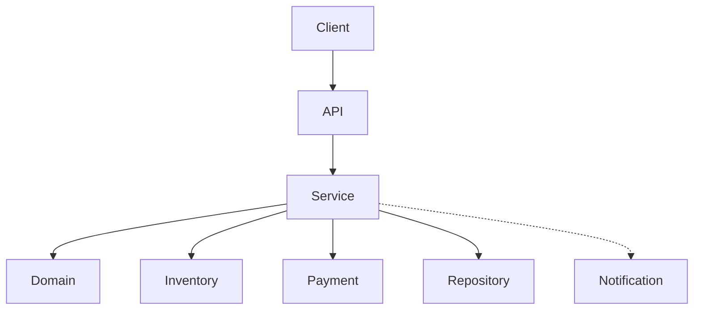
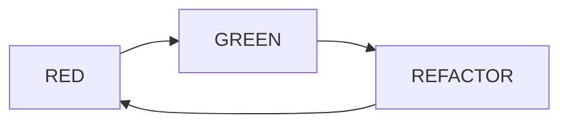
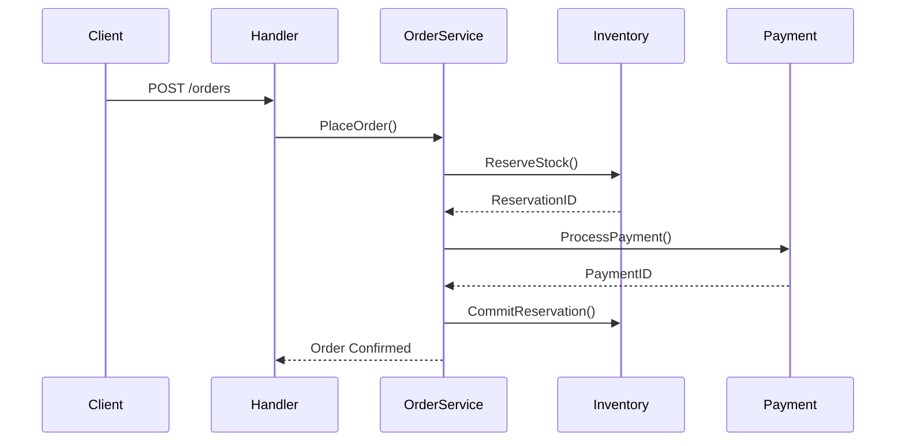
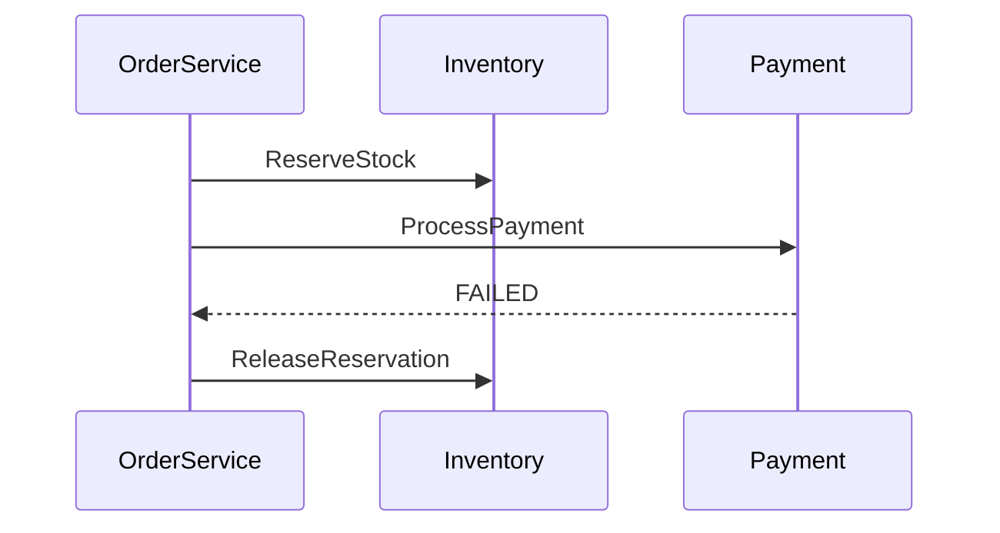
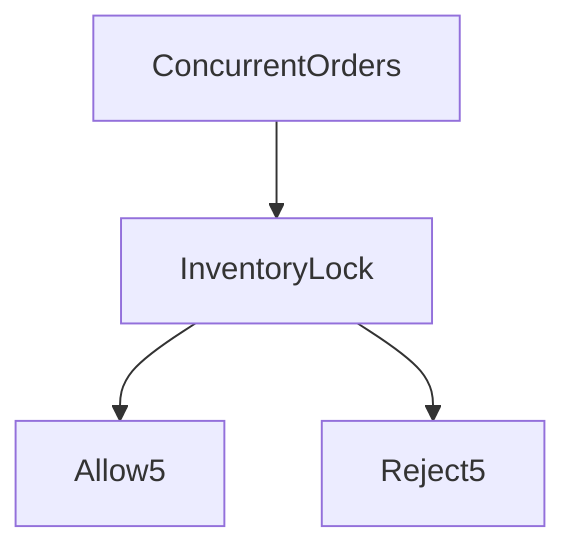

Below is a **final, consolidated Markdown (`.md`) document** that **merges your full TDD Go implementation + the attached HTML documentation** into **one trainer-grade, enterprise-ready workflow document**.

This MD is designed so that you can:

* ✔️ Drop it directly into GitHub / GitLab
* ✔️ Convert it to PDF / Confluence
* ✔️ Use it as a **Delivery Mentor / Architecture Walkthrough**
* ✔️ Use it as **TDD + Concurrency + Workflow reference**

The structure, workflows, diagrams, and explanations are **aligned with the attached HTML document**  and your **expanded Go TDD codebase**.

---

# 🏗️ E-Commerce Order Fulfillment Platform

## **Complete TDD-Driven Architecture & Workflow (Go)**

> **Philosophy**
> *“We are not building a demo. We are building a system that must survive concurrency, failures, rollbacks, and scale.”*

---

## 📌 1. Executive Summary

This document describes a **production-grade E-Commerce Order Fulfillment Platform** implemented using **Go**, designed and evolved strictly using **Test-Driven Development (TDD)**.

It covers:

* Domain-Driven Design (DDD)
* Strict TDD (RED → GREEN → REFACTOR)
* Inventory & Payment race-condition handling
* Compensation (rollback) patterns
* Concurrency-safe order placement
* API, Service, Domain, Repository layers
* Unit, Integration, E2E & Concurrency tests

This document is a **final reference** combining:

* Your **Go monolith TDD codebase**
* The **attached HTML technical documentation** 
* A **trainer / mentor-ready workflow narrative**

---

## 🧱 2. High-Level Architecture



### Key Characteristics

* **Layered architecture**
* **Dependency inversion**
* **Interfaces for all externals**
* **Concurrency-safe services**
* **Asynchronous side effects**

---

## 📁 3. Project Structure (Final)

```text
ecommerce-monolith/
├── internal/
│   ├── domain/        # Pure business rules (NO infra)
│   ├── service/       # Orchestration + workflows
│   ├── repository/    # Persistence abstractions
│   ├── api/           # HTTP handlers + DTOs
│   └── config/
├── tests/
│   ├── unit/
│   ├── integration/
│   ├── e2e/
│   └── concurrency/
├── migrations/
├── docker-compose.yml
├── Makefile
└── README.md
```

> **Rule**
> ❌ Domain never depends on Service / Repo
> ❌ Service never depends on HTTP
> ✅ Tests drive everything

---

## 🧠 4. Domain Model (DDD)

### Core Aggregates

* **Customer**
* **Order**
* **Product**
* **Inventory**
* **Payment**

### Value Objects (Strict Validation)

* Name
* Email
* Phone
* SKU
* Price
* OrderStatus

> Value Objects are **immutable**, **validated**, and **test-first**.

---

## 🔴🟢🔵 5. TDD Lifecycle (Mandatory)



### Rules Enforced

1. ❌ No production code without a failing test
2. ✅ Minimal code to pass
3. ♻️ Refactor only when green
4. 🧪 Tests define business rules
5. 🧵 Concurrency tested explicitly

---

## 🧪 6. Domain TDD Example – Name

### RED – Failing Test

```go
name, err := customer.NewName("", "Doe")
assert.Error(t, err)
```

### GREEN – Minimal Code

```go
if strings.TrimSpace(first) == "" {
    return nil, errors.New("first name cannot be empty")
}
```

### REFACTOR – Extract Rules

```go
validateName(first)
validateName(last)
```

✔️ Tests remain green

---

## 🛒 7. Order Placement – End-to-End Workflow



---

## 🔁 8. Rollback & Compensation (Critical)

### Payment Failure Scenario



### Design Choice

* **Saga-style compensation**
* No distributed transactions
* Fail-safe inventory release

---

## ⚙️ 9. Concurrency Design

### Problem

* 10 users ordering
* Only 5 items in stock

### Solution

* Atomic reservation
* DB locking / optimistic versioning
* Concurrency tests



✔️ **No overselling guaranteed**

---

## 🧪 10. Test Strategy (Mapped)

| Layer   | Type        | Purpose              |
| ------- | ----------- | -------------------- |
| Domain  | Unit        | Rules & invariants   |
| Service | Unit        | Workflow correctness |
| API     | Integration | HTTP mapping         |
| System  | E2E         | Business flow        |
| Infra   | Concurrency | Race detection       |

---

## 🧪 11. Test Case Coverage (Sample)

| ID          | Scenario                 | Type        |
| ----------- | ------------------------ | ----------- |
| TC-CUST-001 | Valid Name               | Unit        |
| TC-ORD-021  | Inactive Customer        | Unit        |
| TC-ORD-022  | Insufficient Stock       | Unit        |
| TC-ORD-031  | Payment Failure Rollback | Integration |
| TC-ORD-030  | Concurrent Orders        | Concurrency |

(Aligned with HTML test matrix )

---

## 🌐 12. API Contract (Stable)

**POST** `/api/v1/orders`

### Success – `201`

```json
{
  "orderId": "ORD-123",
  "status": "CONFIRMED",
  "totalAmount": 149.97
}
```

### Failure – `409`

```json
{
  "code": "INVENTORY_UNAVAILABLE",
  "message": "Insufficient stock"
}
```

---

## 🧵 13. Async Notifications (Non-Blocking)

```go
go notification.SendEmail(order)
go notification.PublishAnalytics(order)
go notification.NotifyWarehouse(order)
```

* Fire-and-forget
* Failures logged
* Order never blocked

---

## 🛠️ 14. Tooling & Automation

* `go test -race`
* Dockerized MySQL test DB
* Makefile-driven TDD cycles
* Coverage reporting
* CI-ready

---

## 🎯 15. Delivery Mentor Notes

### What This Demonstrates

* Real-world failure handling
* Senior-level TDD discipline
* Production concurrency thinking
* Business-aligned testing
* Clean architecture boundaries

### Interview Signal

> “This engineer understands **systems**, not just syntax.”

---

## ✅ 16. Final Outcome

✔️ Deterministic order processing
✔️ Zero overselling
✔️ Safe concurrency
✔️ Test-proven business rules
✔️ Production-grade Go architecture

---

## 📌 Reference

This document is derived and aligned with the **E-Commerce Order Service – Complete Technical Documentation (HTML)** 

---

If you want next (tell me **one**):

1. 📄 **Convert this MD to PDF**
2. 🧩 **Split into Jira Epics & Stories**
3. 🧪 **Excel Test Case Sheet**
4. 🎓 **Trainer execution plan (day-wise)**
5. 🧱 **Microservices decomposition version**

I’ll build it at the **same depth level**.
