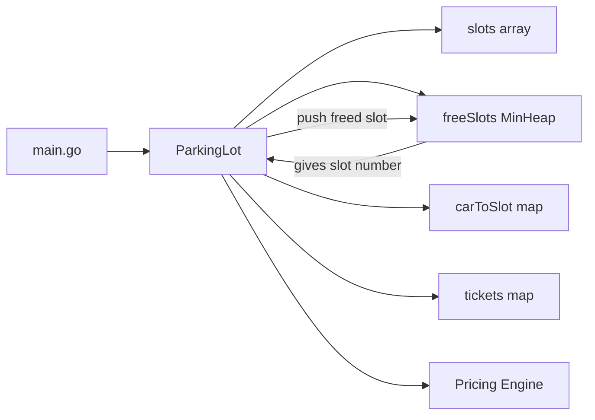
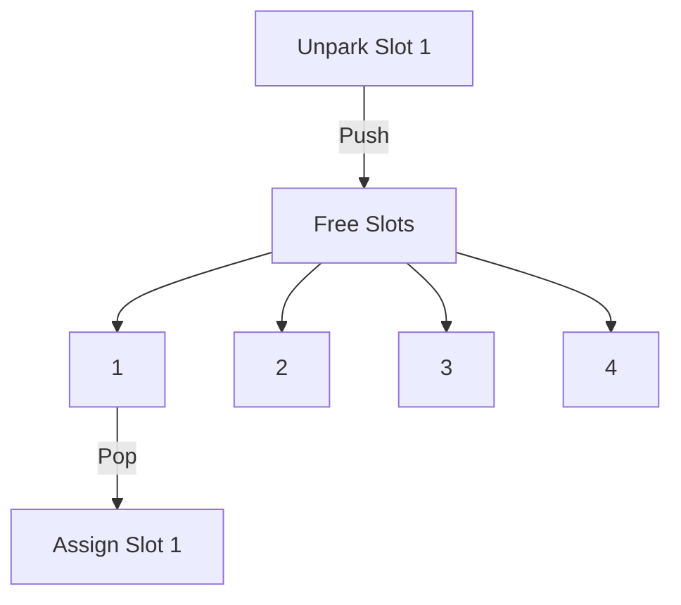

Nice 👍 — a **Mermaid workflow** is perfect for classroom explanation and whiteboard-style reasoning.

Below are **three Mermaid diagrams**:

1️⃣ Overall Parking Lot System Flow
2️⃣ Park Car Flow (with MinHeap)
3️⃣ Unpark Car Flow (with MinHeap)

You can paste these into any Mermaid editor or Markdown viewer.

---

# 🧭 1) Overall Parking Lot Architecture



### How to Explain

* main.go calls ParkingLot
* ParkingLot is the brain
* MinHeap only manages free slot numbers
* Pricing only calculates money

---

# 🚗 2) Park Car Workflow (MinHeap in Action)

```mermaid
flowchart TD
    A[Driver Arrives] --> B[Call Park(car)]

    B --> C{freeSlots empty?}

    C -- Yes --> D[Return Parking Full]

    C -- No --> E[heap.Pop -> smallest slot]

    E --> F[Assign car to slots[slot-1]]

    F --> G[carToSlot[reg] = slot]

    G --> H[Create Ticket]

    H --> I[Return Slot Number]
```

### Teaching Focus

* Decision point
* Heap pop
* Mapping update
* Ticket creation

---

# 🚙 3) Unpark Car Workflow (MinHeap in Action)

```mermaid
flowchart TD
    A[Driver Wants Exit] --> B[Call Unpark(regNo)]

    B --> C{regNo exists in map?}

    C -- No --> D[Return Car Not Found]

    C -- Yes --> E[Find Slot Number]

    E --> F[Get Ticket]

    F --> G[Clear slots[slot-1]]

    G --> H[heap.Push(slot)]

    H --> I[Calculate Fee]

    I --> J[Return Fee]
```

### Teaching Focus

* Lookup
* Slot release
* Heap push
* Pricing

---

# 🧠 4) MinHeap Internal Conceptual View



---

# 
1. Show Architecture diagram
2. Show Park flow
3. Show Unpark flow
4. Ask students:

   * Why heap.Pop?
   * Why heap.Push?
   * What happens if heap empty?

---

# ✅ Key Teaching Message

> MinHeap is not business logic.
> It is an efficiency tool that supports business rules.

---


