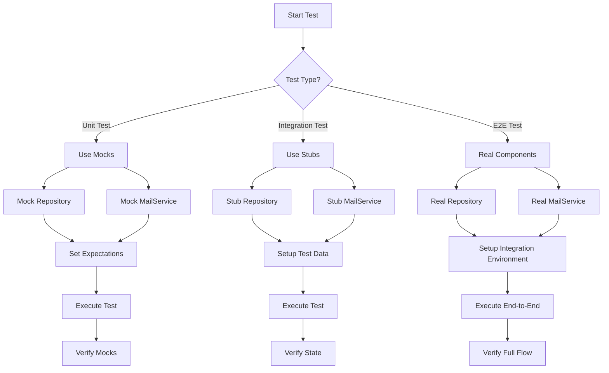
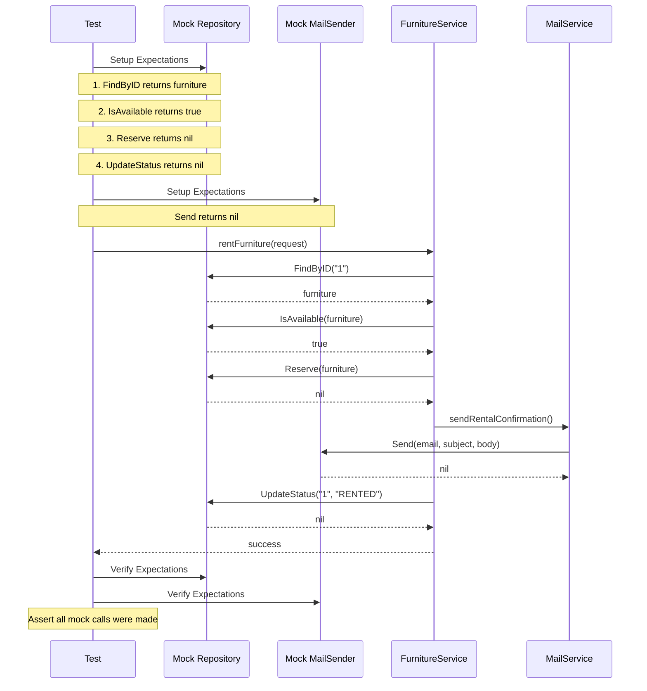
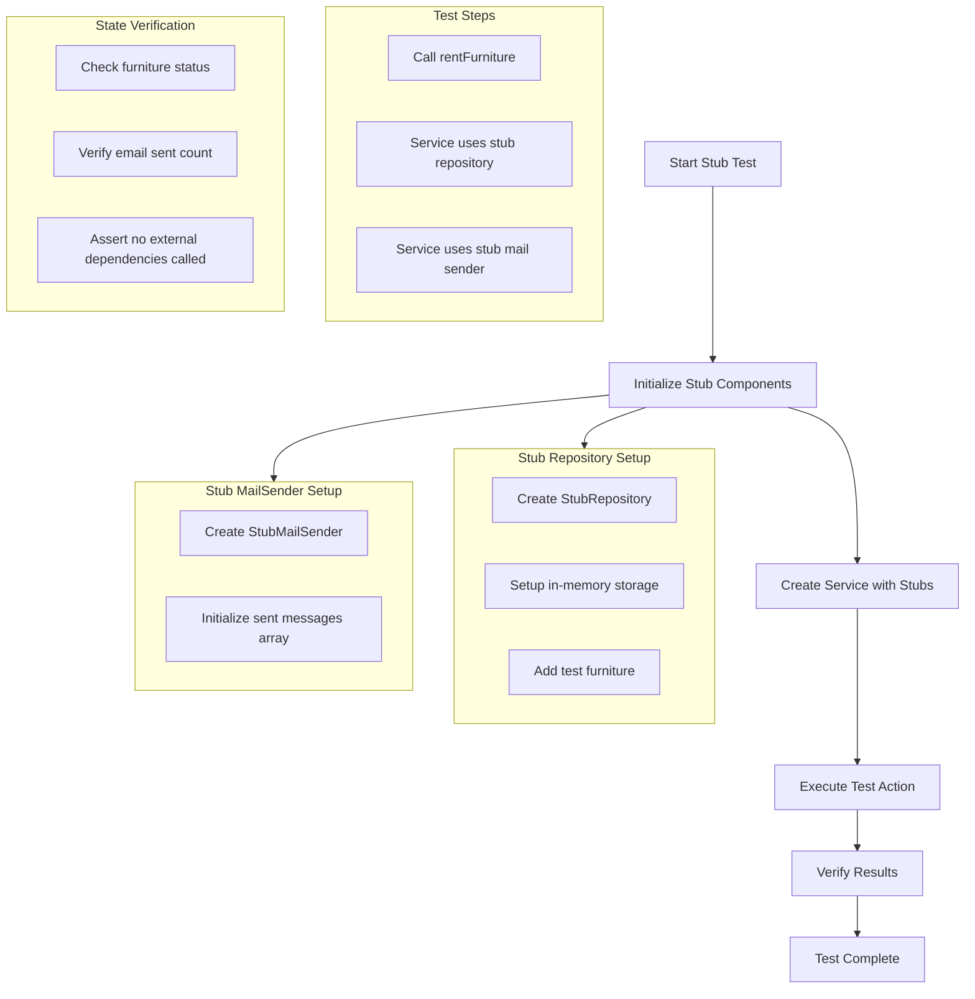
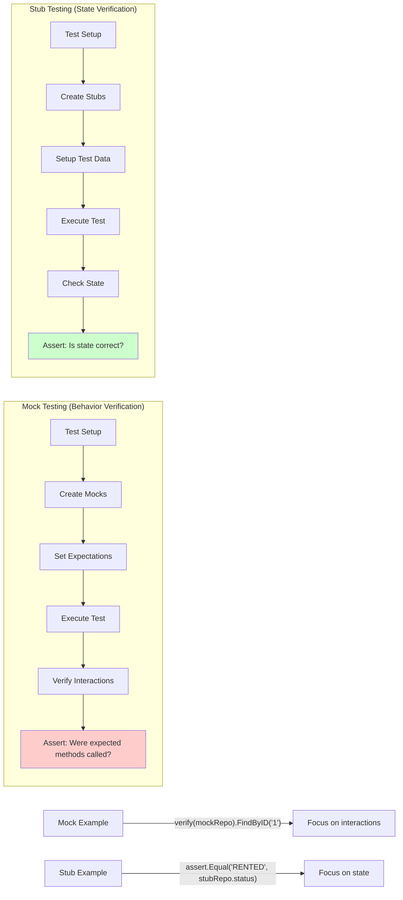
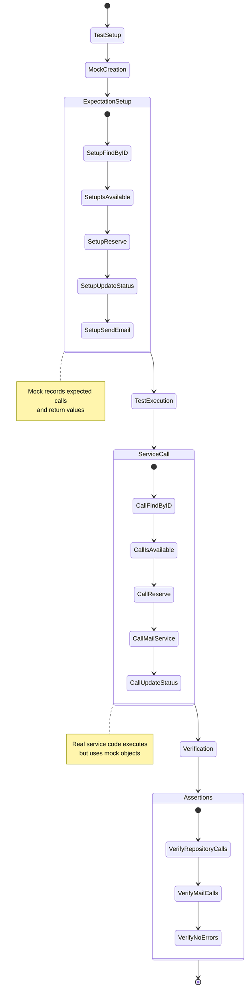
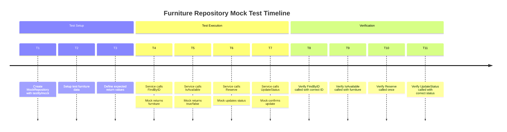
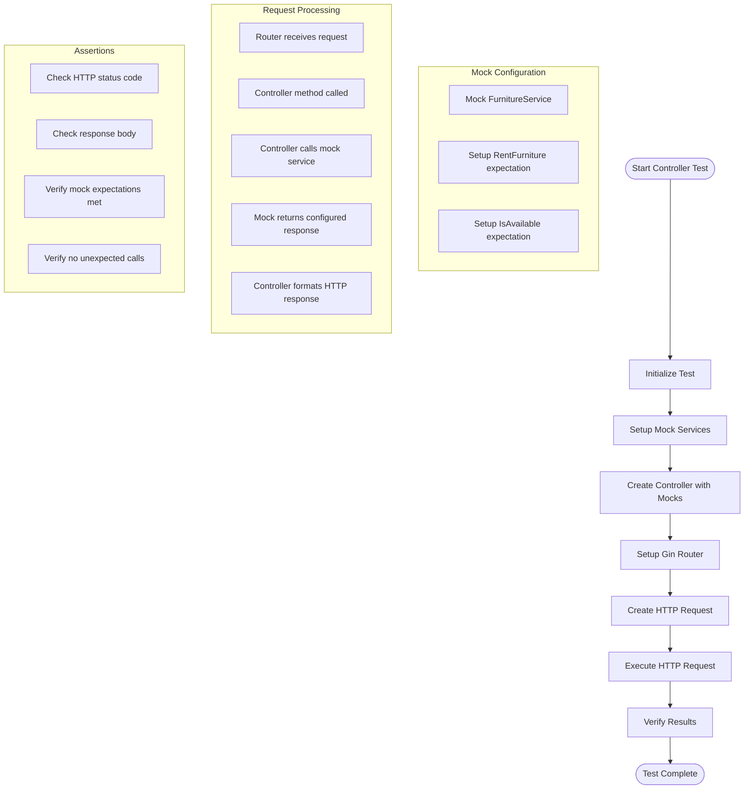
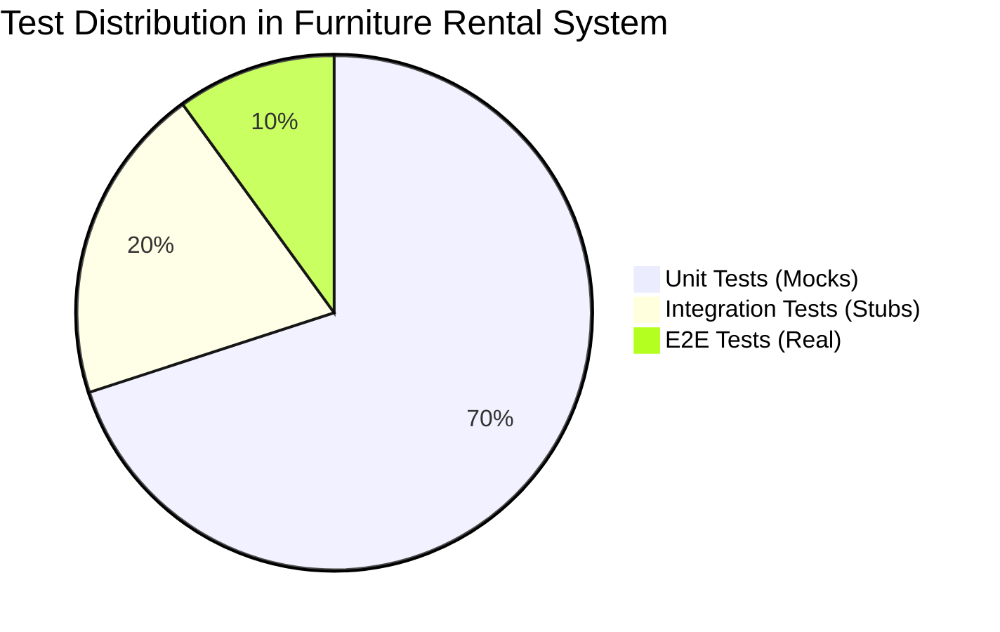
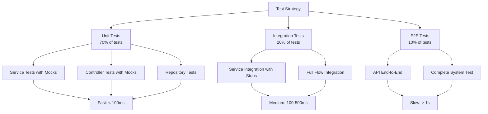

I'll create a complete Go implementation for the furniture rental system with proper testing using testify and mocks/stubs.

## Complete Go Implementation

### 1. **Project Structure**
```
furniture-rental/
├── main.go
├── go.mod
├── internal/
│   ├── controller/
│   │   ├── furniture_controller.go
│   │   └── furniture_controller_test.go
│   ├── service/
│   │   ├── furniture_service.go
│   │   ├── furniture_service_test.go
│   │   └── mail_service.go
│   ├── repository/
│   │   ├── furniture_repository.go
│   │   └── furniture_repository_test.go
│   └── domain/
│       ├── models.go
│       └── errors.go
└── pkg/
    └── mail/
        └── mail_sender.go
```

### 2. **go.mod**
```go
module furniture-rental

go 1.21

require (
    github.com/gin-gonic/gin v1.9.1
    github.com/stretchr/testify v1.8.4
)

require (
    // other dependencies...
)
```

### 3. **Domain Models & Errors**
```go
// internal/domain/models.go
package domain

import "time"

type FurnitureStatus string

const (
	StatusAvailable FurnitureStatus = "AVAILABLE"
	StatusRented    FurnitureStatus = "RENTED"
	StatusReserved  FurnitureStatus = "RESERVED"
)

type Furniture struct {
	ID          string          `json:"id"`
	Name        string          `json:"name"`
	Description string          `json:"description"`
	DailyRate   float64         `json:"daily_rate"`
	Status      FurnitureStatus `json:"status"`
	CreatedAt   time.Time       `json:"created_at"`
	UpdatedAt   time.Time       `json:"updated_at"`
}

type RentalRequest struct {
	FurnitureID string    `json:"furniture_id" binding:"required"`
	CustomerID  string    `json:"customer_id" binding:"required"`
	StartDate   time.Time `json:"start_date" binding:"required"`
	EndDate     time.Time `json:"end_date" binding:"required"`
}

type Message struct {
	To      string `json:"to"`
	Subject string `json:"subject"`
	Body    string `json:"body"`
}
```

```go
// internal/domain/errors.go
package domain

import "errors"

var (
	ErrFurnitureNotFound = errors.New("furniture not found")
	ErrFurnitureUnavailable = errors.New("furniture is not available for rent")
	ErrInvalidRentalPeriod = errors.New("invalid rental period")
)
```

### 4. **Repository Layer**
```go
// internal/repository/furniture_repository.go
package repository

import (
	"furniture-rental/internal/domain"
	"sync"
)

type FurnitureRepository interface {
	FindByID(id string) (*domain.Furniture, error)
	IsAvailable(furniture *domain.Furniture) bool
	Reserve(furniture *domain.Furniture) error
	UpdateStatus(id string, status domain.FurnitureStatus) error
	Save(furniture *domain.Furniture) error
}

type InMemoryFurnitureRepository struct {
	mu         sync.RWMutex
	furniture  map[string]*domain.Furniture
}

func NewInMemoryFurnitureRepository() *InMemoryFurnitureRepository {
	return &InMemoryFurnitureRepository{
		furniture: make(map[string]*domain.Furniture),
	}
}

func (r *InMemoryFurnitureRepository) FindByID(id string) (*domain.Furniture, error) {
	r.mu.RLock()
	defer r.mu.RUnlock()
	
	furniture, exists := r.furniture[id]
	if !exists {
		return nil, domain.ErrFurnitureNotFound
	}
	
	// Return a copy to avoid mutation
	furnitureCopy := *furniture
	return &furnitureCopy, nil
}

func (r *InMemoryFurnitureRepository) IsAvailable(furniture *domain.Furniture) bool {
	r.mu.RLock()
	defer r.mu.RUnlock()
	
	f, exists := r.furniture[furniture.ID]
	if !exists {
		return false
	}
	
	return f.Status == domain.StatusAvailable
}

func (r *InMemoryFurnitureRepository) Reserve(furniture *domain.Furniture) error {
	r.mu.Lock()
	defer r.mu.Unlock()
	
	f, exists := r.furniture[furniture.ID]
	if !exists {
		return domain.ErrFurnitureNotFound
	}
	
	if f.Status != domain.StatusAvailable {
		return domain.ErrFurnitureUnavailable
	}
	
	f.Status = domain.StatusReserved
	f.UpdatedAt = time.Now()
	
	return nil
}

func (r *InMemoryFurnitureRepository) UpdateStatus(id string, status domain.FurnitureStatus) error {
	r.mu.Lock()
	defer r.mu.Unlock()
	
	f, exists := r.furniture[id]
	if !exists {
		return domain.ErrFurnitureNotFound
	}
	
	f.Status = status
	f.UpdatedAt = time.Now()
	
	return nil
}

func (r *InMemoryFurnitureRepository) Save(furniture *domain.Furniture) error {
	r.mu.Lock()
	defer r.mu.Unlock()
	
	r.furniture[furniture.ID] = furniture
	return nil
}

func (r *InMemoryFurnitureRepository) SeedData() {
	r.Save(&domain.Furniture{
		ID:          "1",
		Name:        "Modern Sofa",
		Description: "Comfortable 3-seater sofa",
		DailyRate:   25.99,
		Status:      domain.StatusAvailable,
		CreatedAt:   time.Now(),
		UpdatedAt:   time.Now(),
	})
	
	r.Save(&domain.Furniture{
		ID:          "2",
		Name:        "Office Chair",
		Description: "Ergonomic office chair",
		DailyRate:   15.50,
		Status:      domain.StatusRented,
		CreatedAt:   time.Now(),
		UpdatedAt:   time.Now(),
	})
}
```

### 5. **Mail Sender Interface (External Package)**
```go
// pkg/mail/mail_sender.go
package mail

type MailSender interface {
	Send(to, subject, body string) error
}

type JavaMailSender struct {
	// Configuration fields would go here
	// e.g., SMTP host, port, credentials
}

func NewJavaMailSender() *JavaMailSender {
	return &JavaMailSender{}
}

func (j *JavaMailSender) Send(to, subject, body string) error {
	// Simulate sending email via JavaMailSender
	// In real implementation, this would connect to SMTP server
	// and send the email
	
	// For now, just print or log
	// fmt.Printf("Sending email via JavaMailSender:\nTo: %s\nSubject: %s\nBody: %s\n", to, subject, body)
	
	return nil // Return actual error in real implementation
}
```

### 6. **Mail Service (Adapter)**
```go
// internal/service/mail_service.go
package service

import (
	"furniture-rental/internal/domain"
	"furniture-rental/pkg/mail"
)

type MailService struct {
	mailSender mail.MailSender
}

func NewMailService(mailSender mail.MailSender) *MailService {
	return &MailService{
		mailSender: mailSender,
	}
}

func (m *MailService) Send(msg domain.Message) error {
	// This is the adapter pattern implementation
	// It adapts our domain.Message to the JavaMailSender interface
	
	if err := m.mailSender.Send(msg.To, msg.Subject, msg.Body); err != nil {
		return err
	}
	
	return nil
}

// Helper method for sending rental confirmation
func (m *MailService) SendRentalConfirmation(customerEmail, furnitureName string) error {
	subject := "Furniture Rental Confirmation"
	body := "Thank you for renting " + furnitureName + ". Your rental has been confirmed."
	
	msg := domain.Message{
		To:      customerEmail,
		Subject: subject,
		Body:    body,
	}
	
	return m.Send(msg)
}
```

### 7. **Furniture Service**
```go
// internal/service/furniture_service.go
package service

import (
	"furniture-rental/internal/domain"
	"furniture-rental/internal/repository"
)

type FurnitureService interface {
	RentFurniture(rentalRequest domain.RentalRequest) error
	IsAvailable(furnitureID string) (bool, error)
}

type FurnitureRentService struct {
	repo       repository.FurnitureRepository
	mailService *MailService
}

func NewFurnitureRentService(repo repository.FurnitureRepository, mailService *MailService) *FurnitureRentService {
	return &FurnitureRentService{
		repo:        repo,
		mailService: mailService,
	}
}

func (s *FurnitureRentService) RentFurniture(rentalRequest domain.RentalRequest) error {
	// 1. Find the furniture
	furniture, err := s.repo.FindByID(rentalRequest.FurnitureID)
	if err != nil {
		return domain.ErrFurnitureNotFound
	}
	
	// 2. Check if available
	if !s.repo.IsAvailable(furniture) {
		return domain.ErrFurnitureUnavailable
	}
	
	// 3. Reserve the furniture
	if err := s.repo.Reserve(furniture); err != nil {
		return err
	}
	
	// 4. Send confirmation email
	// In a real system, you'd get customer email from a customer service
	// For now, we'll use a placeholder
	email := "customer@example.com"
	if err := s.mailService.SendRentalConfirmation(email, furniture.Name); err != nil {
		// Log the error but don't fail the rental process
		// You might want to implement retry logic or queue the email
	}
	
	// 5. Update status to rented (after successful payment in real system)
	if err := s.repo.UpdateStatus(furniture.ID, domain.StatusRented); err != nil {
		return err
	}
	
	return nil
}

func (s *FurnitureRentService) IsAvailable(furnitureID string) (bool, error) {
	furniture, err := s.repo.FindByID(furnitureID)
	if err != nil {
		return false, err
	}
	
	return s.repo.IsAvailable(furniture), nil
}
```

### 8. **Controller**
```go
// internal/controller/furniture_controller.go
package controller

import (
	"net/http"
	"time"
	
	"furniture-rental/internal/domain"
	"furniture-rental/internal/service"
	
	"github.com/gin-gonic/gin"
)

type FurnitureController struct {
	furnitureService service.FurnitureService
}

func NewFurnitureController(furnitureService service.FurnitureService) *FurnitureController {
	return &FurnitureController{
		furnitureService: furnitureService,
	}
}

// POST /furniture/{id}/rent
func (c *FurnitureController) RentFurniture(ctx *gin.Context) {
	id := ctx.Param("id")
	
	var rentalRequest domain.RentalRequest
	if err := ctx.ShouldBindJSON(&rentalRequest); err != nil {
		ctx.JSON(http.StatusBadRequest, gin.H{"error": err.Error()})
		return
	}
	
	// Ensure the ID in path matches the ID in request body
	rentalRequest.FurnitureID = id
	
	// Validate rental period
	if rentalRequest.EndDate.Before(rentalRequest.StartDate) {
		ctx.JSON(http.StatusBadRequest, gin.H{
			"error": "end date must be after start date",
		})
		return
	}
	
	if rentalRequest.StartDate.Before(time.Now()) {
		ctx.JSON(http.StatusBadRequest, gin.H{
			"error": "start date must be in the future",
		})
		return
	}
	
	// Rent the furniture
	err := c.furnitureService.RentFurniture(rentalRequest)
	if err != nil {
		switch err {
		case domain.ErrFurnitureNotFound:
			ctx.JSON(http.StatusNotFound, gin.H{"error": "furniture not found"})
		case domain.ErrFurnitureUnavailable:
			ctx.JSON(http.StatusConflict, gin.H{"error": "furniture is not available"})
		default:
			ctx.JSON(http.StatusInternalServerError, gin.H{"error": "internal server error"})
		}
		return
	}
	
	ctx.JSON(http.StatusOK, gin.H{
		"message": "furniture rented successfully",
		"data":    rentalRequest,
	})
}

// GET /furniture/{id}/availability
func (c *FurnitureController) CheckAvailability(ctx *gin.Context) {
	id := ctx.Param("id")
	
	isAvailable, err := c.furnitureService.IsAvailable(id)
	if err != nil {
		if err == domain.ErrFurnitureNotFound {
			ctx.JSON(http.StatusNotFound, gin.H{"error": "furniture not found"})
		} else {
			ctx.JSON(http.StatusInternalServerError, gin.H{"error": "internal server error"})
		}
		return
	}
	
	ctx.JSON(http.StatusOK, gin.H{
		"furniture_id": id,
		"available":    isAvailable,
	})
}
```

### 9. **Main Application**
```go
// main.go
package main

import (
	"log"
	
	"furniture-rental/internal/controller"
	"furniture-rental/internal/repository"
	"furniture-rental/internal/service"
	"furniture-rental/pkg/mail"
	
	"github.com/gin-gonic/gin"
)

func main() {
	// Initialize dependencies
	furnitureRepo := repository.NewInMemoryFurnitureRepository()
	furnitureRepo.SeedData() // Add some test data
	
	javaMailSender := mail.NewJavaMailSender()
	mailService := service.NewMailService(javaMailSender)
	furnitureService := service.NewFurnitureRentService(furnitureRepo, mailService)
	furnitureController := controller.NewFurnitureController(furnitureService)
	
	// Setup Gin router
	router := gin.Default()
	
	// Routes
	router.POST("/furniture/:id/rent", furnitureController.RentFurniture)
	router.GET("/furniture/:id/availability", furnitureController.CheckAvailability)
	
	// Health check
	router.GET("/health", func(c *gin.Context) {
		c.JSON(200, gin.H{"status": "ok"})
	})
	
	// Start server
	log.Println("Server starting on port 8080...")
	if err := router.Run(":8080"); err != nil {
		log.Fatal("Failed to start server:", err)
	}
}
```

### 10. **Tests with Testify and Mocks**

First, install testify:
```bash
go get github.com/stretchr/testify
```

#### **Repository Test**
```go
// internal/repository/furniture_repository_test.go
package repository

import (
	"testing"
	"time"
	
	"furniture-rental/internal/domain"
	"github.com/stretchr/testify/assert"
	"github.com/stretchr/testify/require"
)

func TestInMemoryFurnitureRepository(t *testing.T) {
	repo := NewInMemoryFurnitureRepository()
	
	furniture := &domain.Furniture{
		ID:          "test-1",
		Name:        "Test Furniture",
		Description: "Test Description",
		DailyRate:   100.0,
		Status:      domain.StatusAvailable,
		CreatedAt:   time.Now(),
		UpdatedAt:   time.Now(),
	}
	
	t.Run("Save and FindByID", func(t *testing.T) {
		err := repo.Save(furniture)
		require.NoError(t, err)
		
		found, err := repo.FindByID("test-1")
		require.NoError(t, err)
		assert.Equal(t, furniture.ID, found.ID)
		assert.Equal(t, furniture.Name, found.Name)
	})
	
	t.Run("FindByID - Not Found", func(t *testing.T) {
		_, err := repo.FindByID("non-existent")
		assert.ErrorIs(t, err, domain.ErrFurnitureNotFound)
	})
	
	t.Run("IsAvailable", func(t *testing.T) {
		available := repo.IsAvailable(furniture)
		assert.True(t, available)
		
		// Update status to rented
		furniture.Status = domain.StatusRented
		repo.Save(furniture)
		
		available = repo.IsAvailable(furniture)
		assert.False(t, available)
	})
	
	t.Run("Reserve", func(t *testing.T) {
		// Reset to available
		furniture.Status = domain.StatusAvailable
		repo.Save(furniture)
		
		err := repo.Reserve(furniture)
		require.NoError(t, err)
		
		// Verify status changed to reserved
		updated, _ := repo.FindByID(furniture.ID)
		assert.Equal(t, domain.StatusReserved, updated.Status)
	})
	
	t.Run("Reserve - Already Rented", func(t *testing.T) {
		furniture.Status = domain.StatusRented
		repo.Save(furniture)
		
		err := repo.Reserve(furniture)
		assert.ErrorIs(t, err, domain.ErrFurnitureUnavailable)
	})
}
```

#### **Mock Repository for Service Tests**
```go
// internal/service/furniture_service_test.go
package service

import (
	"testing"
	"time"
	
	"furniture-rental/internal/domain"
	"github.com/stretchr/testify/assert"
	"github.com/stretchr/testify/mock"
	"github.com/stretchr/testify/require"
)

// MockFurnitureRepository implements repository.FurnitureRepository for testing
type MockFurnitureRepository struct {
	mock.Mock
}

func (m *MockFurnitureRepository) FindByID(id string) (*domain.Furniture, error) {
	args := m.Called(id)
	if args.Get(0) == nil {
		return nil, args.Error(1)
	}
	return args.Get(0).(*domain.Furniture), args.Error(1)
}

func (m *MockFurnitureRepository) IsAvailable(furniture *domain.Furniture) bool {
	args := m.Called(furniture)
	return args.Bool(0)
}

func (m *MockFurnitureRepository) Reserve(furniture *domain.Furniture) error {
	args := m.Called(furniture)
	return args.Error(0)
}

func (m *MockFurnitureRepository) UpdateStatus(id string, status domain.FurnitureStatus) error {
	args := m.Called(id, status)
	return args.Error(0)
}

func (m *MockFurnitureRepository) Save(furniture *domain.Furniture) error {
	args := m.Called(furniture)
	return args.Error(0)
}

// MockMailSender for testing
type MockMailSender struct {
	mock.Mock
}

func (m *MockMailSender) Send(to, subject, body string) error {
	args := m.Called(to, subject, body)
	return args.Error(0)
}

func TestFurnitureRentService_RentFurniture(t *testing.T) {
	furniture := &domain.Furniture{
		ID:          "1",
		Name:        "Test Sofa",
		Description: "Test Description",
		DailyRate:   25.99,
		Status:      domain.StatusAvailable,
		CreatedAt:   time.Now(),
		UpdatedAt:   time.Now(),
	}
	
	rentalRequest := domain.RentalRequest{
		FurnitureID: "1",
		CustomerID:  "customer-123",
		StartDate:   time.Now().Add(24 * time.Hour),
		EndDate:     time.Now().Add(48 * time.Hour),
	}
	
	t.Run("Successful rental", func(t *testing.T) {
		mockRepo := new(MockFurnitureRepository)
		mockMailSender := new(MockMailSender)
		mailService := NewMailService(mockMailSender)
		service := NewFurnitureRentService(mockRepo, mailService)
		
		// Setup expectations
		mockRepo.On("FindByID", "1").Return(furniture, nil)
		mockRepo.On("IsAvailable", furniture).Return(true)
		mockRepo.On("Reserve", furniture).Return(nil)
		mockRepo.On("UpdateStatus", "1", domain.StatusRented).Return(nil)
		mockMailSender.On("Send", "customer@example.com", 
			"Furniture Rental Confirmation", 
			mock.AnythingOfType("string")).Return(nil)
		
		// Execute
		err := service.RentFurniture(rentalRequest)
		
		// Verify
		require.NoError(t, err)
		mockRepo.AssertExpectations(t)
		mockMailSender.AssertExpectations(t)
	})
	
	t.Run("Furniture not found", func(t *testing.T) {
		mockRepo := new(MockFurnitureRepository)
		mockMailSender := new(MockMailSender)
		mailService := NewMailService(mockMailSender)
		service := NewFurnitureRentService(mockRepo, mailService)
		
		mockRepo.On("FindByID", "1").Return(nil, domain.ErrFurnitureNotFound)
		
		err := service.RentFurniture(rentalRequest)
		assert.ErrorIs(t, err, domain.ErrFurnitureNotFound)
		mockRepo.AssertExpectations(t)
	})
	
	t.Run("Furniture not available", func(t *testing.T) {
		mockRepo := new(MockFurnitureRepository)
		mockMailSender := new(MockMailSender)
		mailService := NewMailService(mockMailSender)
		service := NewFurnitureRentService(mockRepo, mailService)
		
		mockRepo.On("FindByID", "1").Return(furniture, nil)
		mockRepo.On("IsAvailable", furniture).Return(false)
		
		err := service.RentFurniture(rentalRequest)
		assert.ErrorIs(t, err, domain.ErrFurnitureUnavailable)
		mockRepo.AssertExpectations(t)
	})
	
	t.Run("Reserve fails", func(t *testing.T) {
		mockRepo := new(MockFurnitureRepository)
		mockMailSender := new(MockMailSender)
		mailService := NewMailService(mockMailSender)
		service := NewFurnitureRentService(mockRepo, mailService)
		
		mockRepo.On("FindByID", "1").Return(furniture, nil)
		mockRepo.On("IsAvailable", furniture).Return(true)
		mockRepo.On("Reserve", furniture).Return(assert.AnError)
		
		err := service.RentFurniture(rentalRequest)
		assert.Error(t, err)
		mockRepo.AssertExpectations(t)
	})
}

func TestFurnitureRentService_IsAvailable(t *testing.T) {
	furniture := &domain.Furniture{
		ID:     "1",
		Status: domain.StatusAvailable,
	}
	
	t.Run("Available furniture", func(t *testing.T) {
		mockRepo := new(MockFurnitureRepository)
		mockMailSender := new(MockMailSender)
		mailService := NewMailService(mockMailSender)
		service := NewFurnitureRentService(mockRepo, mailService)
		
		mockRepo.On("FindByID", "1").Return(furniture, nil)
		mockRepo.On("IsAvailable", furniture).Return(true)
		
		available, err := service.IsAvailable("1")
		
		assert.NoError(t, err)
		assert.True(t, available)
		mockRepo.AssertExpectations(t)
	})
	
	t.Run("Not available furniture", func(t *testing.T) {
		mockRepo := new(MockFurnitureRepository)
		mockMailSender := new(MockMailSender)
		mailService := NewMailService(mockMailSender)
		service := NewFurnitureRentService(mockRepo, mailService)
		
		furniture.Status = domain.StatusRented
		mockRepo.On("FindByID", "1").Return(furniture, nil)
		mockRepo.On("IsAvailable", furniture).Return(false)
		
		available, err := service.IsAvailable("1")
		
		assert.NoError(t, err)
		assert.False(t, available)
		mockRepo.AssertExpectations(t)
	})
}
```

#### **Controller Tests with HTTP Testing**
```go
// internal/controller/furniture_controller_test.go
package controller

import (
	"bytes"
	"encoding/json"
	"net/http"
	"net/http/httptest"
	"testing"
	"time"
	
	"furniture-rental/internal/domain"
	"github.com/gin-gonic/gin"
	"github.com/stretchr/testify/assert"
	"github.com/stretchr/testify/mock"
)

// MockFurnitureService for controller tests
type MockFurnitureService struct {
	mock.Mock
}

func (m *MockFurnitureService) RentFurniture(rentalRequest domain.RentalRequest) error {
	args := m.Called(rentalRequest)
	return args.Error(0)
}

func (m *MockFurnitureService) IsAvailable(furnitureID string) (bool, error) {
	args := m.Called(furnitureID)
	return args.Bool(0), args.Error(1)
}

func TestFurnitureController_RentFurniture(t *testing.T) {
	gin.SetMode(gin.TestMode)
	
	startDate := time.Now().Add(24 * time.Hour)
	endDate := time.Now().Add(48 * time.Hour)
	
	tests := []struct {
		name           string
		furnitureID    string
		requestBody    map[string]interface{}
		setupMock      func(*MockFurnitureService)
		expectedStatus int
	}{
		{
			name:        "Successful rental",
			furnitureID: "1",
			requestBody: map[string]interface{}{
				"furniture_id": "1",
				"customer_id":  "customer-123",
				"start_date":   startDate.Format(time.RFC3339),
				"end_date":     endDate.Format(time.RFC3339),
			},
			setupMock: func(m *MockFurnitureService) {
				m.On("RentFurniture", mock.AnythingOfType("domain.RentalRequest")).Return(nil)
			},
			expectedStatus: http.StatusOK,
		},
		{
			name:        "Furniture not found",
			furnitureID: "999",
			requestBody: map[string]interface{}{
				"furniture_id": "999",
				"customer_id":  "customer-123",
				"start_date":   startDate.Format(time.RFC3339),
				"end_date":     endDate.Format(time.RFC3339),
			},
			setupMock: func(m *MockFurnitureService) {
				m.On("RentFurniture", mock.AnythingOfType("domain.RentalRequest")).Return(domain.ErrFurnitureNotFound)
			},
			expectedStatus: http.StatusNotFound,
		},
		{
			name:        "Furniture unavailable",
			furnitureID: "2",
			requestBody: map[string]interface{}{
				"furniture_id": "2",
				"customer_id":  "customer-123",
				"start_date":   startDate.Format(time.RFC3339),
				"end_date":     endDate.Format(time.RFC3339),
			},
			setupMock: func(m *MockFurnitureService) {
				m.On("RentFurniture", mock.AnythingOfType("domain.RentalRequest")).Return(domain.ErrFurnitureUnavailable)
			},
			expectedStatus: http.StatusConflict,
		},
		{
			name:        "Invalid request body",
			furnitureID: "1",
			requestBody: map[string]interface{}{
				"furniture_id": "1",
				// Missing required fields
			},
			setupMock:      func(m *MockFurnitureService) {},
			expectedStatus: http.StatusBadRequest,
		},
	}
	
	for _, tt := range tests {
		t.Run(tt.name, func(t *testing.T) {
			// Setup
			mockService := new(MockFurnitureService)
			tt.setupMock(mockService)
			
			controller := NewFurnitureController(mockService)
			
			// Create request
			body, _ := json.Marshal(tt.requestBody)
			req, _ := http.NewRequest(http.MethodPost, "/furniture/"+tt.furnitureID+"/rent", bytes.NewBuffer(body))
			req.Header.Set("Content-Type", "application/json")
			
			// Create response recorder
			rr := httptest.NewRecorder()
			
			// Create Gin context
			router := gin.New()
			router.POST("/furniture/:id/rent", controller.RentFurniture)
			
			// Serve request
			router.ServeHTTP(rr, req)
			
			// Assert
			assert.Equal(t, tt.expectedStatus, rr.Code)
			mockService.AssertExpectations(t)
		})
	}
}

func TestFurnitureController_CheckAvailability(t *testing.T) {
	gin.SetMode(gin.TestMode)
	
	tests := []struct {
		name           string
		furnitureID    string
		setupMock      func(*MockFurnitureService)
		expectedStatus int
		expectedBody   map[string]interface{}
	}{
		{
			name:        "Available furniture",
			furnitureID: "1",
			setupMock: func(m *MockFurnitureService) {
				m.On("IsAvailable", "1").Return(true, nil)
			},
			expectedStatus: http.StatusOK,
			expectedBody: map[string]interface{}{
				"furniture_id": "1",
				"available":    true,
			},
		},
		{
			name:        "Not available furniture",
			furnitureID: "2",
			setupMock: func(m *MockFurnitureService) {
				m.On("IsAvailable", "2").Return(false, nil)
			},
			expectedStatus: http.StatusOK,
			expectedBody: map[string]interface{}{
				"furniture_id": "2",
				"available":    false,
			},
		},
		{
			name:        "Furniture not found",
			furnitureID: "999",
			setupMock: func(m *MockFurnitureService) {
				m.On("IsAvailable", "999").Return(false, domain.ErrFurnitureNotFound)
			},
			expectedStatus: http.StatusNotFound,
		},
	}
	
	for _, tt := range tests {
		t.Run(tt.name, func(t *testing.T) {
			// Setup
			mockService := new(MockFurnitureService)
			tt.setupMock(mockService)
			
			controller := NewFurnitureController(mockService)
			
			// Create request
			req, _ := http.NewRequest(http.MethodGet, "/furniture/"+tt.furnitureID+"/availability", nil)
			
			// Create response recorder
			rr := httptest.NewRecorder()
			
			// Create Gin context
			router := gin.New()
			router.GET("/furniture/:id/availability", controller.CheckAvailability)
			
			// Serve request
			router.ServeHTTP(rr, req)
			
			// Assert
			assert.Equal(t, tt.expectedStatus, rr.Code)
			
			if tt.expectedBody != nil {
				var response map[string]interface{}
				err := json.Unmarshal(rr.Body.Bytes(), &response)
				assert.NoError(t, err)
				
				assert.Equal(t, tt.expectedBody["furniture_id"], response["furniture_id"])
				assert.Equal(t, tt.expectedBody["available"], response["available"])
			}
			
			mockService.AssertExpectations(t)
		})
	}
}
```

#### **Integration Test**
```go
// integration_test.go
package main

import (
	"bytes"
	"encoding/json"
	"net/http"
	"net/http/httptest"
	"testing"
	"time"
	
	"furniture-rental/internal/controller"
	"furniture-rental/internal/domain"
	"furniture-rental/internal/repository"
	"furniture-rental/internal/service"
	"furniture-rental/pkg/mail"
	
	"github.com/gin-gonic/gin"
	"github.com/stretchr/testify/assert"
	"github.com/stretchr/testify/require"
)

func TestFurnitureRentalIntegration(t *testing.T) {
	gin.SetMode(gin.TestMode)
	
	// Setup real components
	repo := repository.NewInMemoryFurnitureRepository()
	repo.SeedData()
	
	mailSender := mail.NewJavaMailSender()
	mailService := service.NewMailService(mailSender)
	furnitureService := service.NewFurnitureRentService(repo, mailService)
	controller := controller.NewFurnitureController(furnitureService)
	
	router := gin.New()
	router.POST("/furniture/:id/rent", controller.RentFurniture)
	router.GET("/furniture/:id/availability", controller.CheckAvailability)
	
	t.Run("Check availability of existing furniture", func(t *testing.T) {
		req, _ := http.NewRequest(http.MethodGet, "/furniture/1/availability", nil)
		rr := httptest.NewRecorder()
		
		router.ServeHTTP(rr, req)
		
		assert.Equal(t, http.StatusOK, rr.Code)
		
		var response map[string]interface{}
		err := json.Unmarshal(rr.Body.Bytes(), &response)
		require.NoError(t, err)
		
		assert.Equal(t, "1", response["furniture_id"])
		assert.True(t, response["available"].(bool))
	})
	
	t.Run("Rent available furniture", func(t *testing.T) {
		rentalRequest := map[string]interface{}{
			"furniture_id": "1",
			"customer_id":  "customer-123",
			"start_date":   time.Now().Add(24 * time.Hour).Format(time.RFC3339),
			"end_date":     time.Now().Add(48 * time.Hour).Format(time.RFC3339),
		}
		
		body, _ := json.Marshal(rentalRequest)
		req, _ := http.NewRequest(http.MethodPost, "/furniture/1/rent", bytes.NewBuffer(body))
		req.Header.Set("Content-Type", "application/json")
		
		rr := httptest.NewRecorder()
		router.ServeHTTP(rr, req)
		
		assert.Equal(t, http.StatusOK, rr.Code)
		
		// Verify furniture is now rented
		availabilityReq, _ := http.NewRequest(http.MethodGet, "/furniture/1/availability", nil)
		availabilityRR := httptest.NewRecorder()
		router.ServeHTTP(availabilityRR, availabilityReq)
		
		var availabilityResponse map[string]interface{}
		err := json.Unmarshal(availabilityRR.Body.Bytes(), &availabilityResponse)
		require.NoError(t, err)
		
		// Should be false now since it's rented
		assert.False(t, availabilityResponse["available"].(bool))
	})
	
	t.Run("Try to rent already rented furniture", func(t *testing.T) {
		rentalRequest := map[string]interface{}{
			"furniture_id": "2", // This one is already rented in seed data
			"customer_id":  "customer-456",
			"start_date":   time.Now().Add(24 * time.Hour).Format(time.RFC3339),
			"end_date":     time.Now().Add(48 * time.Hour).Format(time.RFC3339),
		}
		
		body, _ := json.Marshal(rentalRequest)
		req, _ := http.NewRequest(http.MethodPost, "/furniture/2/rent", bytes.NewBuffer(body))
		req.Header.Set("Content-Type", "application/json")
		
		rr := httptest.NewRecorder()
		router.ServeHTTP(rr, req)
		
		assert.Equal(t, http.StatusConflict, rr.Code)
	})
	
	t.Run("Try to rent non-existent furniture", func(t *testing.T) {
		rentalRequest := map[string]interface{}{
			"furniture_id": "999",
			"customer_id":  "customer-789",
			"start_date":   time.Now().Add(24 * time.Hour).Format(time.RFC3339),
			"end_date":     time.Now().Add(48 * time.Hour).Format(time.RFC3339),
		}
		
		body, _ := json.Marshal(rentalRequest)
		req, _ := http.NewRequest(http.MethodPost, "/furniture/999/rent", bytes.NewBuffer(body))
		req.Header.Set("Content-Type", "application/json")
		
		rr := httptest.NewRecorder()
		router.ServeHTTP(rr, req)
		
		assert.Equal(t, http.StatusNotFound, rr.Code)
	})
}
```

#### **Stub Implementation Example**
```go
// internal/service/furniture_service_stub_test.go
package service

import (
	"testing"
	"time"
	
	"furniture-rental/internal/domain"
	"github.com/stretchr/testify/assert"
)

// StubFurnitureRepository for simple testing
type StubFurnitureRepository struct {
	Furniture map[string]*domain.Furniture
}

func (s *StubFurnitureRepository) FindByID(id string) (*domain.Furniture, error) {
	furniture, exists := s.Furniture[id]
	if !exists {
		return nil, domain.ErrFurnitureNotFound
	}
	return furniture, nil
}

func (s *StubFurnitureRepository) IsAvailable(furniture *domain.Furniture) bool {
	f, exists := s.Furniture[furniture.ID]
	if !exists {
		return false
	}
	return f.Status == domain.StatusAvailable
}

func (s *StubFurnitureRepository) Reserve(furniture *domain.Furniture) error {
	f, exists := s.Furniture[furniture.ID]
	if !exists {
		return domain.ErrFurnitureNotFound
	}
	
	if f.Status != domain.StatusAvailable {
		return domain.ErrFurnitureUnavailable
	}
	
	f.Status = domain.StatusReserved
	f.UpdatedAt = time.Now()
	
	return nil
}

func (s *StubFurnitureRepository) UpdateStatus(id string, status domain.FurnitureStatus) error {
	f, exists := s.Furniture[id]
	if !exists {
		return domain.ErrFurnitureNotFound
	}
	
	f.Status = status
	f.UpdatedAt = time.Now()
	
	return nil
}

func (s *StubFurnitureRepository) Save(furniture *domain.Furniture) error {
	s.Furniture[furniture.ID] = furniture
	return nil
}

// StubMailSender for simple testing
type StubMailSender struct {
	SentMessages []string
}

func (s *StubMailSender) Send(to, subject, body string) error {
	s.SentMessages = append(s.SentMessages, subject)
	return nil
}

func TestFurnitureRentServiceWithStubs(t *testing.T) {
	// Setup stubs
	stubRepo := &StubFurnitureRepository{
		Furniture: make(map[string]*domain.Furniture),
	}
	
	stubMailSender := &StubMailSender{}
	mailService := NewMailService(stubMailSender)
	service := NewFurnitureRentService(stubRepo, mailService)
	
	// Add test furniture
	furniture := &domain.Furniture{
		ID:     "stub-1",
		Name:   "Stub Sofa",
		Status: domain.StatusAvailable,
	}
	stubRepo.Save(furniture)
	
	rentalRequest := domain.RentalRequest{
		FurnitureID: "stub-1",
		CustomerID:  "customer-stub",
		StartDate:   time.Now().Add(24 * time.Hour),
		EndDate:     time.Now().Add(48 * time.Hour),
	}
	
	// Test rental
	err := service.RentFurniture(rentalRequest)
	assert.NoError(t, err)
	
	// Verify furniture status changed
	updatedFurniture, _ := stubRepo.FindByID("stub-1")
	assert.Equal(t, domain.StatusRented, updatedFurniture.Status)
	
	// Verify email was sent
	assert.Len(t, stubMailSender.SentMessages, 1)
	assert.Contains(t, stubMailSender.SentMessages[0], "Furniture Rental Confirmation")
}
```

### 11. **Running the Application**

```bash
# Initialize module
go mod init furniture-rental

# Get dependencies
go get -u github.com/gin-gonic/gin
go get -u github.com/stretchr/testify

# Run tests
go test ./...

# Run the application
go run main.go
```

### 12. **Key Design Patterns Used**

1. **Adapter Pattern**: `MailService` adapts the `JavaMailSender` interface to our domain
2. **Repository Pattern**: Abstract data access layer
3. **Dependency Injection**: All dependencies are injected via constructors
4. **Mocking**: Using testify/mock for testing
5. **Stubbing**: Using simple stub implementations for testing

This implementation provides:
- Complete REST API with Gin
- Proper error handling
- Comprehensive tests with mocks and stubs
- Clear separation of concerns
- Adapter pattern for external dependencies
- Thread-safe repository implementation
- Integration and unit tests
## 1. **Overall Testing Strategy Workflow**



## 2. **Mock Testing Workflow for Service Layer**



## 3. **Stub Testing Workflow**



## 4. **Mock vs. Stub Comparison Workflow**



## 5. **Complete Test Execution Flow with Mocks**



## 6. **Mail Service Adapter Testing Workflow**

```mermaid
graph TB
    subgraph "Adapter Pattern Test"
        A[Start] --> B{Test Type?}
        
        B -->|Unit Test| C[Use Mock]
        C --> D[Mock JavaMailSender]
        D --> E[Set expectations on send()]
        E --> F[Call MailService.Send()]
        F --> G[Verify mock.send() called]
        
        B -->|Integration Test| H[Use Stub]
        H --> I[Stub JavaMailSender]
        I --> J[Record sent messages]
        J --> K[Call MailService.Send()]
        K --> L[Check message recorded]
        
        B -->|Real Test| M[Real Implementation]
        M --> N[Real JavaMailSender]
        N --> O[Configure SMTP]
        O --> P[Call MailService.Send()]
        P --> Q[Verify email received]
    end
    
    subgraph "Adapter Pattern Flow"
        R[Domain.Message] --> S[MailService Adapter]
        S --> T[Adapts to]
        T --> U[JavaMailSender Interface]
        U --> V[to, subject, body]
    end
```

## 7. **Repository Mock Testing Workflow**



## 8. **Controller Mock Testing Workflow**



## 9. **Test Data Flow with Stubs**

```mermaid
graph TD
    subgraph "Test Data Initialization"
        TD1[Test Furniture Data] --> TD2[Furniture ID: 'test-1']
        TD2 --> TD3[Status: 'AVAILABLE']
        TD3 --> TD4[Name: 'Test Sofa']
    end
    
    subgraph "Stub Repository State"
        SR1[StubRepository.furniture] --> SR2['test-1': Furniture]
        SR2 --> SR3[Initial Status: AVAILABLE]
    end
    
    subgraph "Stub Mail Sender State"
        MS1[StubMailSender.sentMessages] --> MS2[Empty array]
    end
    
    subgraph "Test Execution"
        TE1[Call rentFurniture] --> TE2[Repository updates status]
        TE2 --> TE3[Status: RESERVED → RENTED]
        TE3 --> TE4[Mail sender records message]
        TE4 --> MS3[Array: ['Confirmation email']]
    end
    
    subgraph "Final State Verification"
        FV1[Check repository status] --> FV2[Assert: Status = RENTED]
        FV3[Check sent messages] --> FV4[Assert: Length = 1]
    end
```

## 10. **Complete Test Pyramid Workflow**





These Mermaid diagrams illustrate:

1. **Different testing strategies** (mocks vs stubs vs real implementations)
2. **Sequence of operations** in mock-based testing
3. **State changes** in stub-based testing
4. **Adapter pattern testing** for the MailService
5. **Complete test workflows** from setup to verification
6. **Test pyramid distribution** showing the balance between different test types

The key differences shown:
- **Mocks**: Verify interactions and method calls
- **Stubs**: Verify state changes and results
- **Real**: Verify actual system behavior
