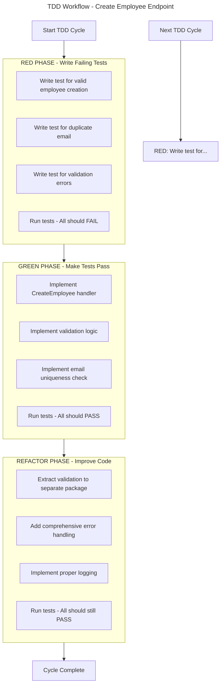
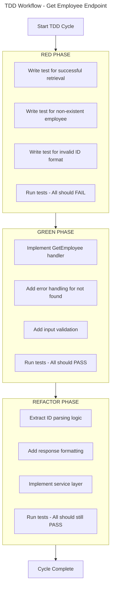
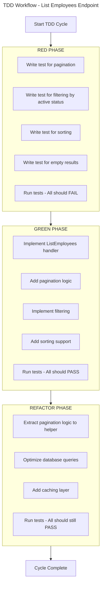
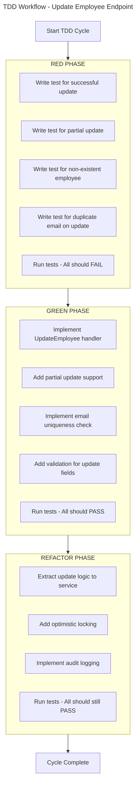
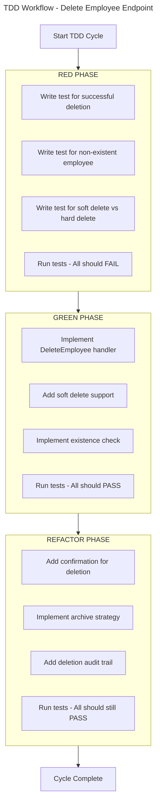
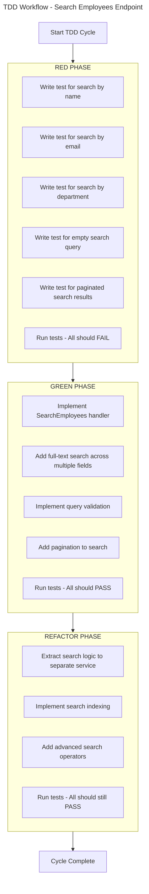
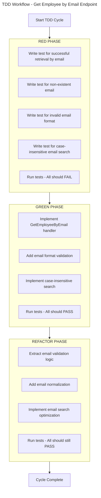

I'll create a complete TDD implementation with proper workflow diagrams for each endpoint. Let me restructure the project following true TDD (Red-Green-Refactor) approach.

## Project Structure (TDD Approach)
```
employee-crud-api/
├── .env.example
├── go.mod
├── go.sum
├── cmd/
│   └── api/
│       └── main.go
├── internal/
│   ├── config/
│   ├── domain/
│   ├── handler/
│   ├── middleware/
│   ├── repository/
│   ├── service/
│   └── routes/
├── pkg/
│   ├── database/
│   ├── logger/
│   ├── response/
│   └── utils/
├── tests/
│   ├── unit/
│   │   ├── domain/
│   │   ├── repository/
│   │   ├── service/
│   │   └── handler/
│   └── integration/
├── docs/
│   └── workflows/
└── Makefile
```

## Step 1: TDD Approach - Red Phase (Write Failing Tests First)

Let me start with the TDD approach. We'll create failing tests first, then implement the code.

### 1.1 Create Makefile for TDD workflow

`Makefile`:
```makefile
.PHONY: test unit integration build run clean deps

# Colors
RED=\033[0;31m
GREEN=\033[0;32m
YELLOW=\033[1;33m
NC=\033[0m

# Variables
APP_NAME=employee-crud-api
TEST_COVERAGE=coverage.out

# TDD Workflow Commands
tdd-unit: ## Run TDD cycle for unit tests (Red-Green-Refactor)
	@echo "${YELLOW}=== TDD: RED PHASE (Write failing tests) ===${NC}"
	@echo "${RED}Expected: Tests should fail${NC}"
	@echo ""
	@echo "${YELLOW}=== Running tests... ===${NC}"
	go test ./tests/unit/... -v || true
	@echo ""
	@echo "${GREEN}=== TDD: GREEN PHASE (Make tests pass) ===${NC}"
	@echo "Implement the minimum code to make tests pass"
	@echo ""
	@echo "${YELLOW}=== TDD: REFACTOR PHASE ===${NC}"
	@echo "Refactor code while keeping tests green"

tdd-integration: ## Run TDD cycle for integration tests
	@echo "${YELLOW}Running integration TDD cycle...${NC}"
	go test ./tests/integration/... -v

# Test commands
test: unit integration ## Run all tests

unit: ## Run unit tests
	@echo "${YELLOW}Running unit tests...${NC}"
	go test ./tests/unit/... -v -cover

integration: ## Run integration tests
	@echo "${YELLOW}Running integration tests...${NC}"
	@docker-compose up -d mysql-test
	@sleep 5
	go test ./tests/integration/... -v -cover
	@docker-compose down

test-coverage: ## Generate test coverage report
	@echo "${YELLOW}Generating coverage report...${NC}"
	go test ./... -coverprofile=${TEST_COVERAGE}
	go tool cover -html=${TEST_COVERAGE} -o coverage.html
	@echo "${GREEN}Coverage report generated: coverage.html${NC}"

# Development commands
build: ## Build the application
	@echo "${YELLOW}Building ${APP_NAME}...${NC}"
	go build -o bin/${APP_NAME} ./cmd/api

run: ## Run the application
	@echo "${YELLOW}Starting ${APP_NAME}...${NC}"
	go run ./cmd/api

clean: ## Clean build artifacts
	@echo "${YELLOW}Cleaning up...${NC}"
	rm -rf bin/ coverage.out coverage.html

deps: ## Install dependencies
	@echo "${YELLOW}Installing dependencies...${NC}"
	go mod download
	go mod tidy

# Database commands
db-migrate: ## Run database migrations
	@echo "${YELLOW}Running migrations...${NC}"
	# Add migration commands here

db-seed: ## Seed database with test data
	@echo "${YELLOW}Seeding database...${NC}"
	# Add seed commands here

# Help
help: ## Show this help message
	@echo "Available commands:"
	@grep -E '^[a-zA-Z_-]+:.*?## .*$$' $(MAKEFILE_LIST) | sort | awk 'BEGIN {FS = ":.*?## "}; {printf "  ${YELLOW}%-20s${NC} %s\n", $$1, $$2}'

.DEFAULT_GOAL := help
```

### 1.2 Create Test Workflow Diagrams

`docs/workflows/README.md`:
```markdown
# Employee CRUD API - Workflow Diagrams

## TDD Approach for Each Endpoint

Each endpoint follows the TDD (Red-Green-Refactor) workflow:

1. **RED**: Write failing tests
2. **GREEN**: Implement minimum code to pass tests
3. **REFACTOR**: Improve code while keeping tests green
```

## Step 2: TDD - RED PHASE (Create Failing Tests)

### 2.1 Create Domain Model Tests (First Failing Tests)

`tests/unit/domain/employee_test.go`:
```go
package domain_test

import (
	"testing"
	"time"

	"github.com/stretchr/testify/assert"
	"github.com/stretchr/testify/suite"

	"github.com/yourusername/employee-crud-api/internal/domain/models"
	"github.com/yourusername/employee-crud-api/internal/domain/models/dto"
)

// Test Suite for Employee Domain
type EmployeeDomainTestSuite struct {
	suite.Suite
}

func TestEmployeeDomainTestSuite(t *testing.T) {
	suite.Run(t, new(EmployeeDomainTestSuite))
}

// RED PHASE: These tests should fail initially
func (suite *EmployeeDomainTestSuite) TestEmployeeValidation() {
	// This test will fail initially because Employee struct doesn't have validation
	suite.T().Run("Valid employee should pass validation", func(t *testing.T) {
		employee := models.Employee{
			FirstName: "John",
			LastName:  "Doe",
			Email:     "john.doe@example.com",
			HireDate:  time.Now(),
		}
		
		// Initially, there's no validation - this test will fail
		// We'll implement validation in GREEN phase
		assert.NotEmpty(t, employee.FirstName)
		assert.NotEmpty(t, employee.LastName)
		assert.Contains(t, employee.Email, "@")
		assert.False(t, employee.HireDate.IsZero())
	})
	
	suite.T().Run("Invalid email should fail validation", func(t *testing.T) {
		employee := models.Employee{
			FirstName: "John",
			LastName:  "Doe",
			Email:     "invalid-email", // Invalid email
			HireDate:  time.Now(),
		}
		
		// This should fail - we need to add email validation
		assert.NotContains(t, employee.Email, "@")
	})
}

func (suite *EmployeeDomainTestSuite) TestCreateEmployeeRequestValidation() {
	suite.T().Run("Valid request should pass validation", func(t *testing.T) {
		req := dto.CreateEmployeeRequest{
			FirstName: "John",
			LastName:  "Doe",
			Email:     "john.doe@example.com",
			HireDate:  time.Now(),
		}
		
		// This will fail initially - no Validate() method exists
		err := req.Validate()
		assert.NoError(t, err, "Valid request should pass validation")
	})
	
	suite.T().Run("Invalid email should fail validation", func(t *testing.T) {
		req := dto.CreateEmployeeRequest{
			FirstName: "John",
			LastName:  "Doe",
			Email:     "invalid-email",
			HireDate:  time.Now(),
		}
		
		// This will fail initially
		err := req.Validate()
		assert.Error(t, err, "Invalid email should fail validation")
		assert.Contains(t, err.Error(), "email")
	})
	
	suite.T().Run("Empty first name should fail validation", func(t *testing.T) {
		req := dto.CreateEmployeeRequest{
			FirstName: "", // Empty first name
			LastName:  "Doe",
			Email:     "john.doe@example.com",
			HireDate:  time.Now(),
		}
		
		// This will fail initially
		err := req.Validate()
		assert.Error(t, err, "Empty first name should fail validation")
	})
}
```

### 2.2 Create Repository Interface Tests

`tests/unit/repository/employee_repository_interface_test.go`:
```go
package repository_test

import (
	"testing"

	"github.com/stretchr/testify/assert"
	"github.com/stretchr/testify/mock"

	"github.com/yourusername/employee-crud-api/internal/domain/models"
	"github.com/yourusername/employee-crud-api/internal/repository"
)

// Mock repository for testing
type MockEmployeeRepository struct {
	mock.Mock
}

func (m *MockEmployeeRepository) Create(employee *models.Employee) error {
	args := m.Called(employee)
	return args.Error(0)
}

func (m *MockEmployeeRepository) FindByID(id uint) (*models.Employee, error) {
	args := m.Called(id)
	if args.Get(0) == nil {
		return nil, args.Error(1)
	}
	return args.Get(0).(*models.Employee), args.Error(1)
}

func (m *MockEmployeeRepository) FindByEmail(email string) (*models.Employee, error) {
	args := m.Called(email)
	if args.Get(0) == nil {
		return nil, args.Error(1)
	}
	return args.Get(0).(*models.Employee), args.Error(1)
}

func (m *MockEmployeeRepository) FindAll(page, pageSize int, active *bool, sortBy, order string) ([]models.Employee, int64, error) {
	args := m.Called(page, pageSize, active, sortBy, order)
	return args.Get(0).([]models.Employee), args.Get(1).(int64), args.Error(2)
}

func (m *MockEmployeeRepository) Update(employee *models.Employee) error {
	args := m.Called(employee)
	return args.Error(0)
}

func (m *MockEmployeeRepository) Delete(id uint) error {
	args := m.Called(id)
	return args.Error(0)
}

func (m *MockEmployeeRepository) Search(query string, page, pageSize int) ([]models.Employee, int64, error) {
	args := m.Called(query, page, pageSize)
	return args.Get(0).([]models.Employee), args.Get(1).(int64), args.Error(2)
}

// RED PHASE: Define what the repository should do
func TestEmployeeRepositoryInterface(t *testing.T) {
	t.Run("Repository should implement all required methods", func(t *testing.T) {
		// This test verifies the interface contract
		var repo repository.EmployeeRepository = &MockEmployeeRepository{}
		assert.NotNil(t, repo, "Repository should implement the interface")
		
		// Test that we can call all interface methods
		// These calls will fail initially
		assert.Implements(t, (*repository.EmployeeRepository)(nil), repo)
	})
}
```

### 2.3 Create Service Layer Tests (Failing)

`tests/unit/service/employee_service_test.go`:
```go
package service_test

import (
	"testing"
	"time"

	"github.com/stretchr/testify/assert"
	"github.com/stretchr/testify/mock"
	"github.com/stretchr/testify/suite"

	"github.com/yourusername/employee-crud-api/internal/domain/models"
	"github.com/yourusername/employee-crud-api/internal/domain/models/dto"
	"github.com/yourusername/employee-crud-api/internal/repository"
	"github.com/yourusername/employee-crud-api/internal/service"
)

// Mock repository
type MockRepo struct {
	mock.Mock
}

func (m *MockRepo) Create(employee *models.Employee) error {
	args := m.Called(employee)
	return args.Error(0)
}

func (m *MockRepo) FindByID(id uint) (*models.Employee, error) {
	args := m.Called(id)
	if args.Get(0) == nil {
		return nil, args.Error(1)
	}
	return args.Get(0).(*models.Employee), args.Error(1)
}

func (m *MockRepo) FindByEmail(email string) (*models.Employee, error) {
	args := m.Called(email)
	if args.Get(0) == nil {
		return nil, args.Error(1)
	}
	return args.Get(0).(*models.Employee), args.Error(1)
}

func (m *MockRepo) FindAll(page, pageSize int, active *bool, sortBy, order string) ([]models.Employee, int64, error) {
	args := m.Called(page, pageSize, active, sortBy, order)
	return args.Get(0).([]models.Employee), args.Get(1).(int64), args.Error(2)
}

func (m *MockRepo) Update(employee *models.Employee) error {
	args := m.Called(employee)
	return args.Error(0)
}

func (m *MockRepo) Delete(id uint) error {
	args := m.Called(id)
	return args.Error(0)
}

func (m *MockRepo) Search(query string, page, pageSize int) ([]models.Employee, int64, error) {
	args := m.Called(query, page, pageSize)
	return args.Get(0).([]models.Employee), args.Get(1).(int64), args.Error(2)
}

// Test Suite
type EmployeeServiceTestSuite struct {
	suite.Suite
	mockRepo *MockRepo
	service  service.EmployeeService
}

func TestEmployeeServiceTestSuite(t *testing.T) {
	suite.Run(t, new(EmployeeServiceTestSuite))
}

func (suite *EmployeeServiceTestSuite) SetupTest() {
	suite.mockRepo = new(MockRepo)
	// This will fail initially - service.NewEmployeeService doesn't exist
	suite.service = service.NewEmployeeService(suite.mockRepo)
}

// RED PHASE: Create failing tests for each endpoint

func (suite *EmployeeServiceTestSuite) TestCreateEmployee_Success() {
	// Test data
	req := dto.CreateEmployeeRequest{
		FirstName: "John",
		LastName:  "Doe",
		Email:     "john.doe@example.com",
		HireDate:  time.Now(),
	}
	
	// Setup expectations
	suite.mockRepo.On("FindByEmail", req.Email).Return(nil, nil)
	suite.mockRepo.On("Create", mock.AnythingOfType("*models.Employee")).Return(nil)
	
	// Execute - This will fail initially
	employee, err := suite.service.CreateEmployee(req)
	
	// Verify
	assert.NoError(suite.T(), err)
	assert.NotNil(suite.T(), employee)
	assert.Equal(suite.T(), "John", employee.FirstName)
	assert.Equal(suite.T(), "john.doe@example.com", employee.Email)
	
	suite.mockRepo.AssertExpectations(suite.T())
}

func (suite *EmployeeServiceTestSuite) TestCreateEmployee_DuplicateEmail() {
	req := dto.CreateEmployeeRequest{
		FirstName: "John",
		LastName:  "Doe",
		Email:     "john.doe@example.com",
		HireDate:  time.Now(),
	}
	
	existingEmployee := &models.Employee{
		ID:    1,
		Email: "john.doe@example.com",
	}
	
	// Setup expectation
	suite.mockRepo.On("FindByEmail", req.Email).Return(existingEmployee, nil)
	
	// Execute - Will fail initially
	employee, err := suite.service.CreateEmployee(req)
	
	// Verify
	assert.Error(suite.T(), err)
	assert.Nil(suite.T(), employee)
	assert.Equal(suite.T(), "email already exists", err.Error())
	
	suite.mockRepo.AssertExpectations(suite.T())
}

func (suite *EmployeeServiceTestSuite) TestGetEmployeeByID_Success() {
	employeeID := uint(1)
	expectedEmployee := &models.Employee{
		ID:    employeeID,
		Email: "john.doe@example.com",
	}
	
	// Setup expectation
	suite.mockRepo.On("FindByID", employeeID).Return(expectedEmployee, nil)
	
	// Execute - Will fail initially
	employee, err := suite.service.GetEmployeeByID(employeeID)
	
	// Verify
	assert.NoError(suite.T(), err)
	assert.NotNil(suite.T(), employee)
	assert.Equal(suite.T(), employeeID, employee.ID)
	
	suite.mockRepo.AssertExpectations(suite.T())
}

func (suite *EmployeeServiceTestSuite) TestGetEmployeeByID_NotFound() {
	employeeID := uint(999)
	
	// Setup expectation
	suite.mockRepo.On("FindByID", employeeID).Return(nil, nil)
	
	// Execute - Will fail initially
	employee, err := suite.service.GetEmployeeByID(employeeID)
	
	// Verify
	assert.Error(suite.T(), err)
	assert.Nil(suite.T(), employee)
	assert.Equal(suite.T(), "employee not found", err.Error())
	
	suite.mockRepo.AssertExpectations(suite.T())
}

// Add tests for other service methods...
```

### 2.4 Create Handler Tests (Failing)

`tests/unit/handler/employee_handler_test.go`:
```go
package handler_test

import (
	"bytes"
	"encoding/json"
	"net/http"
	"net/http/httptest"
	"testing"
	"time"

	"github.com/gin-gonic/gin"
	"github.com/stretchr/testify/assert"
	"github.com/stretchr/testify/mock"
	"github.com/stretchr/testify/suite"

	"github.com/yourusername/employee-crud-api/internal/domain/models"
	"github.com/yourusername/employee-crud-api/internal/domain/models/dto"
	"github.com/yourusername/employee-crud-api/internal/handler"
	"github.com/yourusername/employee-crud-api/internal/service"
)

// Mock Service
type MockEmployeeService struct {
	mock.Mock
}

func (m *MockEmployeeService) CreateEmployee(req dto.CreateEmployeeRequest) (*models.Employee, error) {
	args := m.Called(req)
	if args.Get(0) == nil {
		return nil, args.Error(1)
	}
	return args.Get(0).(*models.Employee), args.Error(1)
}

func (m *MockEmployeeService) GetEmployeeByID(id uint) (*models.Employee, error) {
	args := m.Called(id)
	if args.Get(0) == nil {
		return nil, args.Error(1)
	}
	return args.Get(0).(*models.Employee), args.Error(1)
}

func (m *MockEmployeeService) GetEmployeeByEmail(email string) (*models.Employee, error) {
	args := m.Called(email)
	if args.Get(0) == nil {
		return nil, args.Error(1)
	}
	return args.Get(0).(*models.Employee), args.Error(1)
}

func (m *MockEmployeeService) ListEmployees(req dto.ListEmployeesRequest) ([]models.Employee, int64, error) {
	args := m.Called(req)
	return args.Get(0).([]models.Employee), args.Get(1).(int64), args.Error(2)
}

func (m *MockEmployeeService) UpdateEmployee(id uint, req dto.UpdateEmployeeRequest) (*models.Employee, error) {
	args := m.Called(id, req)
	if args.Get(0) == nil {
		return nil, args.Error(1)
	}
	return args.Get(0).(*models.Employee), args.Error(1)
}

func (m *MockEmployeeService) DeleteEmployee(id uint) error {
	args := m.Called(id)
	return args.Error(0)
}

func (m *MockEmployeeService) SearchEmployees(req dto.SearchEmployeeRequest) ([]models.Employee, int64, error) {
	args := m.Called(req)
	return args.Get(0).([]models.Employee), args.Get(1).(int64), args.Error(2)
}

// Test Suite
type EmployeeHandlerTestSuite struct {
	suite.Suite
	mockService *MockEmployeeService
	handler     *handler.EmployeeHandler
	router      *gin.Engine
}

func TestEmployeeHandlerTestSuite(t *testing.T) {
	suite.Run(t, new(EmployeeHandlerTestSuite))
}

func (suite *EmployeeHandlerTestSuite) SetupTest() {
	gin.SetMode(gin.TestMode)
	suite.mockService = new(MockEmployeeService)
	// This will fail initially - handler doesn't exist
	suite.handler = handler.NewEmployeeHandler(suite.mockService)
	suite.router = gin.New()
	
	// Setup routes
	suite.setupRoutes()
}

func (suite *EmployeeHandlerTestSuite) setupRoutes() {
	api := suite.router.Group("/api/v1")
	{
		api.POST("/employees", suite.handler.CreateEmployee)
		api.GET("/employees", suite.handler.ListEmployees)
		api.GET("/employees/:id", suite.handler.GetEmployee)
		api.PUT("/employees/:id", suite.handler.UpdateEmployee)
		api.DELETE("/employees/:id", suite.handler.DeleteEmployee)
		api.GET("/employees/search", suite.handler.SearchEmployees)
		api.GET("/employees/email", suite.handler.GetEmployeeByEmail)
	}
}

// RED PHASE: Failing tests for each endpoint

func (suite *EmployeeHandlerTestSuite) TestCreateEmployee_Success() {
	// Test data
	req := dto.CreateEmployeeRequest{
		FirstName: "John",
		LastName:  "Doe",
		Email:     "john.doe@example.com",
		HireDate:  time.Now(),
	}
	
	expectedEmployee := &models.Employee{
		ID:        1,
		FirstName: "John",
		LastName:  "Doe",
		Email:     "john.doe@example.com",
		HireDate:  req.HireDate,
		IsActive:  true,
		CreatedAt: time.Now(),
		UpdatedAt: time.Now(),
	}
	
	// Setup mock expectation
	suite.mockService.On("CreateEmployee", req).Return(expectedEmployee, nil)
	
	// Create request
	jsonData, _ := json.Marshal(req)
	w := httptest.NewRecorder()
	reqHttp, _ := http.NewRequest("POST", "/api/v1/employees", bytes.NewBuffer(jsonData))
	reqHttp.Header.Set("Content-Type", "application/json")
	
	// Execute - Will fail initially
	suite.router.ServeHTTP(w, reqHttp)
	
	// Verify
	assert.Equal(suite.T(), http.StatusCreated, w.Code)
	
	var response map[string]interface{}
	json.Unmarshal(w.Body.Bytes(), &response)
	
	assert.True(suite.T(), response["success"].(bool))
	assert.Equal(suite.T(), "Employee created successfully", response["message"])
	
	suite.mockService.AssertExpectations(suite.T())
}

func (suite *EmployeeHandlerTestSuite) TestCreateEmployee_InvalidRequest() {
	// Invalid request - missing required fields
	req := map[string]interface{}{
		"first_name": "John",
		// Missing last_name, email, hire_date
	}
	
	jsonData, _ := json.Marshal(req)
	w := httptest.NewRecorder()
	reqHttp, _ := http.NewRequest("POST", "/api/v1/employees", bytes.NewBuffer(jsonData))
	reqHttp.Header.Set("Content-Type", "application/json")
	
	// Execute - Will fail initially
	suite.router.ServeHTTP(w, reqHttp)
	
	// Verify
	assert.Equal(suite.T(), http.StatusBadRequest, w.Code)
}

func (suite *EmployeeHandlerTestSuite) TestGetEmployee_Success() {
	employeeID := uint(1)
	expectedEmployee := &models.Employee{
		ID:        employeeID,
		FirstName: "John",
		LastName:  "Doe",
		Email:     "john.doe@example.com",
		IsActive:  true,
		HireDate:  time.Now(),
	}
	
	// Setup mock expectation
	suite.mockService.On("GetEmployeeByID", employeeID).Return(expectedEmployee, nil)
	
	w := httptest.NewRecorder()
	req, _ := http.NewRequest("GET", "/api/v1/employees/1", nil)
	
	// Execute - Will fail initially
	suite.router.ServeHTTP(w, req)
	
	// Verify
	assert.Equal(suite.T(), http.StatusOK, w.Code)
	
	var response map[string]interface{}
	json.Unmarshal(w.Body.Bytes(), &response)
	
	assert.True(suite.T(), response["success"].(bool))
	assert.Equal(suite.T(), "Employee retrieved successfully", response["message"])
	
	suite.mockService.AssertExpectations(suite.T())
}

func (suite *EmployeeHandlerTestSuite) TestGetEmployee_NotFound() {
	employeeID := uint(999)
	
	// Setup mock expectation
	suite.mockService.On("GetEmployeeByID", employeeID).Return(nil, assert.AnError)
	
	w := httptest.NewRecorder()
	req, _ := http.NewRequest("GET", "/api/v1/employees/999", nil)
	
	// Execute - Will fail initially
	suite.router.ServeHTTP(w, req)
	
	// Verify
	assert.Equal(suite.T(), http.StatusNotFound, w.Code)
	
	suite.mockService.AssertExpectations(suite.T())
}

// Add tests for other endpoints...
```

### 2.5 Create Integration Tests (Failing)

`tests/integration/employee_crud_test.go`:
```go
package integration_test

import (
	"bytes"
	"encoding/json"
	"fmt"
	"net/http"
	"net/http/httptest"
	"testing"
	"time"

	"github.com/stretchr/testify/assert"
	"github.com/stretchr/testify/suite"

	"github.com/yourusername/employee-crud-api/internal/config"
	"github.com/yourusername/employee-crud-api/internal/domain/models/dto"
	"github.com/yourusername/employee-crud-api/pkg/database"
)

type EmployeeCRUDIntegrationTestSuite struct {
	suite.Suite
	server *httptest.Server
	db     *database.Database
}

func TestEmployeeCRUDIntegrationTestSuite(t *testing.T) {
	suite.Run(t, new(EmployeeCRUDIntegrationTestSuite))
}

func (suite *EmployeeCRUDIntegrationTestSuite) SetupSuite() {
	// Load test configuration
	config.Load()
	
	// Initialize test database
	db, err := database.Init()
	if err != nil {
		suite.T().Fatalf("Failed to initialize database: %v", err)
	}
	suite.db = db
	
	// Create tables
	suite.db.AutoMigrate(&models.Employee{})
	
	// Create test server
	suite.server = httptest.NewServer(suite.setupRouter())
}

func (suite *EmployeeCRUDIntegrationTestSuite) TearDownSuite() {
	suite.server.Close()
	
	// Cleanup database
	suite.db.Exec("DROP TABLE IF EXISTS employees")
	database.Close()
}

func (suite *EmployeeCRUDIntegrationTestSuite) SetupTest() {
	// Clear data before each test
	suite.db.Exec("DELETE FROM employees")
}

func (suite *EmployeeCRUDIntegrationTestSuite) setupRouter() http.Handler {
	// This will be implemented in GREEN phase
	return http.HandlerFunc(func(w http.ResponseWriter, r *http.Request) {
		w.WriteHeader(http.StatusNotImplemented)
		w.Write([]byte("Not implemented yet"))
	})
}

// RED PHASE: Integration tests that will fail initially

func (suite *EmployeeCRUDIntegrationTestSuite) TestCreateAndRetrieveEmployee() {
	// Create employee
	createReq := dto.CreateEmployeeRequest{
		FirstName: "Integration",
		LastName:  "Test",
		Email:     "integration.test@example.com",
		HireDate:  time.Now(),
	}
	
	jsonData, _ := json.Marshal(createReq)
	resp, err := http.Post(suite.server.URL+"/api/v1/employees", "application/json", bytes.NewBuffer(jsonData))
	
	assert.NoError(suite.T(), err)
	assert.Equal(suite.T(), http.StatusCreated, resp.StatusCode)
	
	var createResponse map[string]interface{}
	json.NewDecoder(resp.Body).Decode(&createResponse)
	resp.Body.Close()
	
	assert.True(suite.T(), createResponse["success"].(bool))
	
	// Get employee ID from response
	data := createResponse["data"].(map[string]interface{})
	employeeID := int(data["id"].(float64))
	
	// Retrieve the created employee
	resp, err = http.Get(fmt.Sprintf("%s/api/v1/employees/%d", suite.server.URL, employeeID))
	assert.NoError(suite.T(), err)
	assert.Equal(suite.T(), http.StatusOK, resp.StatusCode)
	
	var getResponse map[string]interface{}
	json.NewDecoder(resp.Body).Decode(&getResponse)
	resp.Body.Close()
	
	assert.True(suite.T(), getResponse["success"].(bool))
	assert.Equal(suite.T(), "Integration", getResponse["data"].(map[string]interface{})["first_name"])
}

func (suite *EmployeeCRUDIntegrationTestSuite) TestFullCRUDWorkflow() {
	// Create
	createReq := dto.CreateEmployeeRequest{
		FirstName: "CRUD",
		LastName:  "Test",
		Email:     "crud.test@example.com",
		HireDate:  time.Now(),
	}
	
	jsonData, _ := json.Marshal(createReq)
	resp, _ := http.Post(suite.server.URL+"/api/v1/employees", "application/json", bytes.NewBuffer(jsonData))
	
	var createResponse map[string]interface{}
	json.NewDecoder(resp.Body).Decode(&createResponse)
	resp.Body.Close()
	
	data := createResponse["data"].(map[string]interface{})
	employeeID := int(data["id"].(float64))
	
	// Update
	firstName := "Updated"
	updateReq := dto.UpdateEmployeeRequest{
		FirstName: &firstName,
	}
	
	jsonData, _ = json.Marshal(updateReq)
	req, _ := http.NewRequest("PUT", fmt.Sprintf("%s/api/v1/employees/%d", suite.server.URL, employeeID), bytes.NewBuffer(jsonData))
	req.Header.Set("Content-Type", "application/json")
	
	client := &http.Client{}
	resp, err := client.Do(req)
	assert.NoError(suite.T(), err)
	assert.Equal(suite.T(), http.StatusOK, resp.StatusCode)
	
	// Delete
	req, _ = http.NewRequest("DELETE", fmt.Sprintf("%s/api/v1/employees/%d", suite.server.URL, employeeID), nil)
	resp, err = client.Do(req)
	assert.NoError(suite.T(), err)
	assert.Equal(suite.T(), http.StatusOK, resp.StatusCode)
	
	// Verify deletion
	resp, err = http.Get(fmt.Sprintf("%s/api/v1/employees/%d", suite.server.URL, employeeID))
	assert.NoError(suite.T(), err)
	assert.Equal(suite.T(), http.StatusNotFound, resp.StatusCode)
}
```

## Step 3: Create Workflow Diagrams for Each Endpoint

`docs/workflows/create_employee.md`:


`docs/workflows/get_employee.md`:


`docs/workflows/list_employees.md`:


`docs/workflows/update_employee.md`:


`docs/workflows/delete_employee.md`:


`docs/workflows/search_employees.md`:


`docs/workflows/get_by_email.md`:


## Step 4: TDD - GREEN PHASE (Implement Minimum Code to Pass Tests)

Now let's implement the minimum code to make our failing tests pass.

### 4.1 Implement Domain Models and DTOs

`internal/domain/models/employee.go`:
```go
package models

import (
	"time"

	"gorm.io/gorm"
)

type Employee struct {
	ID          uint           `gorm:"primaryKey;autoIncrement" json:"id"`
	FirstName   string         `gorm:"type:varchar(100);not null" json:"first_name"`
	LastName    string         `gorm:"type:varchar(100);not null" json:"last_name"`
	Email       string         `gorm:"type:varchar(150);uniqueIndex;not null" json:"email"`
	PhoneNumber string         `gorm:"type:varchar(20)" json:"phone_number"`
	Position    string         `gorm:"type:varchar(100)" json:"position"`
	Department  string         `gorm:"type:varchar(100)" json:"department"`
	Salary      float64        `gorm:"type:decimal(10,2)" json:"salary"`
	HireDate    time.Time      `gorm:"not null" json:"hire_date"`
	IsActive    bool           `gorm:"default:true" json:"is_active"`
	CreatedAt   time.Time      `gorm:"autoCreateTime" json:"created_at"`
	UpdatedAt   time.Time      `gorm:"autoUpdateTime" json:"updated_at"`
	DeletedAt   gorm.DeletedAt `gorm:"index" json:"deleted_at,omitempty"`
}

func (Employee) TableName() string {
	return "employees"
}
```

`internal/domain/models/dto/request.go`:
```go
package dto

import (
	"time"

	"github.com/go-playground/validator/v10"
)

var validate = validator.New()

type CreateEmployeeRequest struct {
	FirstName   string    `json:"first_name" validate:"required,min=2,max=100"`
	LastName    string    `json:"last_name" validate:"required,min=2,max=100"`
	Email       string    `json:"email" validate:"required,email,max=150"`
	PhoneNumber string    `json:"phone_number" validate:"omitempty,max=20"`
	Position    string    `json:"position" validate:"omitempty,max=100"`
	Department  string    `json:"department" validate:"omitempty,max=100"`
	Salary      float64   `json:"salary" validate:"omitempty,min=0,max=9999999.99"`
	HireDate    time.Time `json:"hire_date" validate:"required"`
}

type UpdateEmployeeRequest struct {
	FirstName   *string    `json:"first_name" validate:"omitempty,min=2,max=100"`
	LastName    *string    `json:"last_name" validate:"omitempty,min=2,max=100"`
	Email       *string    `json:"email" validate:"omitempty,email,max=150"`
	PhoneNumber *string    `json:"phone_number" validate:"omitempty,max=20"`
	Position    *string    `json:"position" validate:"omitempty,max=100"`
	Department  *string    `json:"department" validate:"omitempty,max=100"`
	Salary      *float64   `json:"salary" validate:"omitempty,min=0,max=9999999.99"`
	HireDate    *time.Time `json:"hire_date"`
	IsActive    *bool      `json:"is_active"`
}

type SearchEmployeeRequest struct {
	Query    string `form:"q" validate:"required,min=1"`
	Page     int    `form:"page" validate:"omitempty,min=1"`
	PageSize int    `form:"page_size" validate:"omitempty,min=1,max=100"`
}

type ListEmployeesRequest struct {
	Page     int    `form:"page" validate:"omitempty,min=1"`
	PageSize int    `form:"page_size" validate:"omitempty,min=1,max=100"`
	Active   *bool  `form:"active"`
	SortBy   string `form:"sort_by" validate:"omitempty,oneof=first_name last_name email hire_date salary created_at"`
	Order    string `form:"order" validate:"omitempty,oneof=asc desc"`
}

func (r *CreateEmployeeRequest) Validate() error {
	return validate.Struct(r)
}

func (r *UpdateEmployeeRequest) Validate() error {
	return validate.Struct(r)
}

func (r *SearchEmployeeRequest) Validate() error {
	return validate.Struct(r)
}

func (r *ListEmployeesRequest) Validate() error {
	return validate.Struct(r)
}
```

`internal/domain/models/dto/response.go`:
```go
package dto

import (
	"time"

	"github.com/yourusername/employee-crud-api/internal/domain/models"
)

type EmployeeResponse struct {
	ID          uint      `json:"id"`
	FirstName   string    `json:"first_name"`
	LastName    string    `json:"last_name"`
	Email       string    `json:"email"`
	PhoneNumber string    `json:"phone_number,omitempty"`
	Position    string    `json:"position,omitempty"`
	Department  string    `json:"department,omitempty"`
	Salary      float64   `json:"salary,omitempty"`
	HireDate    time.Time `json:"hire_date"`
	IsActive    bool      `json:"is_active"`
	CreatedAt   time.Time `json:"created_at"`
	UpdatedAt   time.Time `json:"updated_at"`
}

type EmployeesListResponse struct {
	Employees []EmployeeResponse `json:"employees"`
	Total     int64              `json:"total"`
	Page      int                `json:"page"`
	PageSize  int                `json:"page_size"`
	TotalPages int               `json:"total_pages"`
}

type ErrorResponse struct {
	Error   string `json:"error"`
	Message string `json:"message,omitempty"`
	Code    int    `json:"code,omitempty"`
}

type SuccessResponse struct {
	Success bool        `json:"success"`
	Message string      `json:"message"`
	Data    interface{} `json:"data,omitempty"`
}

func ToEmployeeResponse(employee *models.Employee) EmployeeResponse {
	return EmployeeResponse{
		ID:          employee.ID,
		FirstName:   employee.FirstName,
		LastName:    employee.LastName,
		Email:       employee.Email,
		PhoneNumber: employee.PhoneNumber,
		Position:    employee.Position,
		Department:  employee.Department,
		Salary:      employee.Salary,
		HireDate:    employee.HireDate,
		IsActive:    employee.IsActive,
		CreatedAt:   employee.CreatedAt,
		UpdatedAt:   employee.UpdatedAt,
	}
}

func ToEmployeesListResponse(employees []models.Employee, total int64, page, pageSize int) EmployeesListResponse {
	employeeResponses := make([]EmployeeResponse, len(employees))
	for i, emp := range employees {
		employeeResponses[i] = ToEmployeeResponse(&emp)
	}

	totalPages := 0
	if pageSize > 0 {
		totalPages = int((total + int64(pageSize) - 1) / int64(pageSize))
	}

	return EmployeesListResponse{
		Employees: employeeResponses,
		Total:     total,
		Page:      page,
		PageSize:  pageSize,
		TotalPages: totalPages,
	}
}
```

### 4.2 Implement Repository

`internal/repository/employee_repository.go`:
```go
package repository

import (
	"errors"

	"gorm.io/gorm"

	"github.com/yourusername/employee-crud-api/internal/domain/models"
	"github.com/yourusername/employee-crud-api/pkg/logger"
)

type EmployeeRepository interface {
	Create(employee *models.Employee) error
	FindByID(id uint) (*models.Employee, error)
	FindByEmail(email string) (*models.Employee, error)
	FindAll(page, pageSize int, active *bool, sortBy, order string) ([]models.Employee, int64, error)
	Update(employee *models.Employee) error
	Delete(id uint) error
	Search(query string, page, pageSize int) ([]models.Employee, int64, error)
}

type employeeRepository struct {
	db     *gorm.DB
	logger *logger.Logger
}

func NewEmployeeRepository(db *gorm.DB) EmployeeRepository {
	return &employeeRepository{
		db:     db,
		logger: logger.New(),
	}
}

func (r *employeeRepository) Create(employee *models.Employee) error {
	if err := r.db.Create(employee).Error; err != nil {
		r.logger.Error("Failed to create employee", map[string]interface{}{
			"error": err.Error(),
			"email": employee.Email,
		})
		return err
	}

	r.logger.Info("Employee created successfully", map[string]interface{}{
		"id":    employee.ID,
		"email": employee.Email,
	})
	return nil
}

func (r *employeeRepository) FindByID(id uint) (*models.Employee, error) {
	var employee models.Employee
	err := r.db.First(&employee, id).Error
	if err != nil {
		if errors.Is(err, gorm.ErrRecordNotFound) {
			r.logger.Debug("Employee not found", map[string]interface{}{
				"id": id,
			})
			return nil, nil
		}
		r.logger.Error("Failed to find employee by ID", map[string]interface{}{
			"error": err.Error(),
			"id":    id,
		})
		return nil, err
	}
	return &employee, nil
}

func (r *employeeRepository) FindByEmail(email string) (*models.Employee, error) {
	var employee models.Employee
	err := r.db.Where("email = ?", email).First(&employee).Error
	if err != nil {
		if errors.Is(err, gorm.ErrRecordNotFound) {
			return nil, nil
		}
		r.logger.Error("Failed to find employee by email", map[string]interface{}{
			"error": err.Error(),
			"email": email,
		})
		return nil, err
	}
	return &employee, nil
}

func (r *employeeRepository) FindAll(page, pageSize int, active *bool, sortBy, order string) ([]models.Employee, int64, error) {
	var employees []models.Employee
	var total int64

	query := r.db.Model(&models.Employee{})

	if active != nil {
		query = query.Where("is_active = ?", *active)
	}

	// Count total
	if err := query.Count(&total).Error; err != nil {
		r.logger.Error("Failed to count employees", map[string]interface{}{
			"error": err.Error(),
		})
		return nil, 0, err
	}

	// Apply pagination
	offset := (page - 1) * pageSize
	query = query.Offset(offset).Limit(pageSize)

	// Apply sorting
	if sortBy != "" {
		if order == "" {
			order = "asc"
		}
		query = query.Order(sortBy + " " + order)
	} else {
		query = query.Order("created_at DESC")
	}

	// Execute query
	if err := query.Find(&employees).Error; err != nil {
		r.logger.Error("Failed to find employees", map[string]interface{}{
			"error": err.Error(),
		})
		return nil, 0, err
	}

	r.logger.Debug("Retrieved employees list", map[string]interface{}{
		"count": len(employees),
		"page":  page,
		"size":  pageSize,
	})

	return employees, total, nil
}

func (r *employeeRepository) Update(employee *models.Employee) error {
	if err := r.db.Save(employee).Error; err != nil {
		r.logger.Error("Failed to update employee", map[string]interface{}{
			"error": err.Error(),
			"id":    employee.ID,
		})
		return err
	}

	r.logger.Info("Employee updated successfully", map[string]interface{}{
		"id": employee.ID,
	})
	return nil
}

func (r *employeeRepository) Delete(id uint) error {
	result := r.db.Delete(&models.Employee{}, id)
	if result.Error != nil {
		r.logger.Error("Failed to delete employee", map[string]interface{}{
			"error": result.Error.Error(),
			"id":    id,
		})
		return result.Error
	}

	if result.RowsAffected == 0 {
		r.logger.Warn("No employee found to delete", map[string]interface{}{
			"id": id,
		})
		return gorm.ErrRecordNotFound
	}

	r.logger.Info("Employee deleted successfully", map[string]interface{}{
		"id": id,
	})
	return nil
}

func (r *employeeRepository) Search(query string, page, pageSize int) ([]models.Employee, int64, error) {
	var employees []models.Employee
	var total int64

	searchQuery := "%" + query + "%"
	dbQuery := r.db.Model(&models.Employee{}).
		Where("first_name LIKE ? OR last_name LIKE ? OR email LIKE ? OR position LIKE ? OR department LIKE ?",
			searchQuery, searchQuery, searchQuery, searchQuery, searchQuery)

	// Count total
	if err := dbQuery.Count(&total).Error; err != nil {
		r.logger.Error("Failed to count search results", map[string]interface{}{
			"error": err.Error(),
			"query": query,
		})
		return nil, 0, err
	}

	// Apply pagination
	offset := (page - 1) * pageSize
	if err := dbQuery.Offset(offset).Limit(pageSize).Order("created_at DESC").Find(&employees).Error; err != nil {
		r.logger.Error("Failed to search employees", map[string]interface{}{
			"error": err.Error(),
			"query": query,
		})
		return nil, 0, err
	}

	r.logger.Debug("Search completed", map[string]interface{}{
		"query": query,
		"count": len(employees),
		"total": total,
	})

	return employees, total, nil
}
```

### 4.3 Implement Service

`internal/service/employee_service.go`:
```go
package service

import (
	"errors"
	"fmt"

	"github.com/yourusername/employee-crud-api/internal/domain/models"
	"github.com/yourusername/employee-crud-api/internal/domain/models/dto"
	"github.com/yourusername/employee-crud-api/internal/repository"
	"github.com/yourusername/employee-crud-api/pkg/logger"
)

type EmployeeService interface {
	CreateEmployee(req dto.CreateEmployeeRequest) (*models.Employee, error)
	GetEmployeeByID(id uint) (*models.Employee, error)
	GetEmployeeByEmail(email string) (*models.Employee, error)
	ListEmployees(req dto.ListEmployeesRequest) ([]models.Employee, int64, error)
	UpdateEmployee(id uint, req dto.UpdateEmployeeRequest) (*models.Employee, error)
	DeleteEmployee(id uint) error
	SearchEmployees(req dto.SearchEmployeeRequest) ([]models.Employee, int64, error)
}

type employeeService struct {
	repo   repository.EmployeeRepository
	logger *logger.Logger
}

func NewEmployeeService(repo repository.EmployeeRepository) EmployeeService {
	return &employeeService{
		repo:   repo,
		logger: logger.New(),
	}
}

func (s *employeeService) CreateEmployee(req dto.CreateEmployeeRequest) (*models.Employee, error) {
	// Validate request
	if err := req.Validate(); err != nil {
		s.logger.Error("Invalid create employee request", map[string]interface{}{
			"error": err.Error(),
		})
		return nil, fmt.Errorf("validation failed: %w", err)
	}

	// Check if email already exists
	existing, err := s.repo.FindByEmail(req.Email)
	if err != nil {
		s.logger.Error("Error checking email existence", map[string]interface{}{
			"error": err.Error(),
			"email": req.Email,
		})
		return nil, fmt.Errorf("error checking email: %w", err)
	}
	if existing != nil {
		s.logger.Warn("Email already exists", map[string]interface{}{
			"email": req.Email,
		})
		return nil, errors.New("email already exists")
	}

	// Create employee
	employee := &models.Employee{
		FirstName:   req.FirstName,
		LastName:    req.LastName,
		Email:       req.Email,
		PhoneNumber: req.PhoneNumber,
		Position:    req.Position,
		Department:  req.Department,
		Salary:      req.Salary,
		HireDate:    req.HireDate,
		IsActive:    true,
	}

	if err := s.repo.Create(employee); err != nil {
		s.logger.Error("Failed to create employee", map[string]interface{}{
			"error": err.Error(),
			"email": req.Email,
		})
		return nil, fmt.Errorf("failed to create employee: %w", err)
	}

	s.logger.Info("Employee created successfully", map[string]interface{}{
		"id":    employee.ID,
		"email": employee.Email,
	})

	return employee, nil
}

func (s *employeeService) GetEmployeeByID(id uint) (*models.Employee, error) {
	if id == 0 {
		return nil, errors.New("invalid employee ID")
	}

	employee, err := s.repo.FindByID(id)
	if err != nil {
		s.logger.Error("Error fetching employee by ID", map[string]interface{}{
			"error": err.Error(),
			"id":    id,
		})
		return nil, fmt.Errorf("failed to fetch employee: %w", err)
	}
	if employee == nil {
		s.logger.Debug("Employee not found", map[string]interface{}{
			"id": id,
		})
		return nil, errors.New("employee not found")
	}

	s.logger.Debug("Employee fetched by ID", map[string]interface{}{
		"id":    employee.ID,
		"email": employee.Email,
	})

	return employee, nil
}

func (s *employeeService) GetEmployeeByEmail(email string) (*models.Employee, error) {
	if email == "" {
		return nil, errors.New("email is required")
	}

	employee, err := s.repo.FindByEmail(email)
	if err != nil {
		s.logger.Error("Error fetching employee by email", map[string]interface{}{
			"error": err.Error(),
			"email": email,
		})
		return nil, fmt.Errorf("failed to fetch employee: %w", err)
	}
	if employee == nil {
		s.logger.Debug("Employee not found by email", map[string]interface{}{
			"email": email,
		})
		return nil, errors.New("employee not found")
	}

	return employee, nil
}

func (s *employeeService) ListEmployees(req dto.ListEmployeesRequest) ([]models.Employee, int64, error) {
	// Set defaults
	if req.Page == 0 {
		req.Page = 1
	}
	if req.PageSize == 0 {
		req.PageSize = 10
	}
	if req.SortBy == "" {
		req.SortBy = "created_at"
	}
	if req.Order == "" {
		req.Order = "desc"
	}

	// Validate request
	if err := req.Validate(); err != nil {
		s.logger.Error("Invalid list employees request", map[string]interface{}{
			"error": err.Error(),
		})
		return nil, 0, fmt.Errorf("validation failed: %w", err)
	}

	employees, total, err := s.repo.FindAll(req.Page, req.PageSize, req.Active, req.SortBy, req.Order)
	if err != nil {
		s.logger.Error("Error listing employees", map[string]interface{}{
			"error": err.Error(),
		})
		return nil, 0, fmt.Errorf("failed to list employees: %w", err)
	}

	s.logger.Debug("Employees listed", map[string]interface{}{
		"count": len(employees),
		"page":  req.Page,
		"size":  req.PageSize,
	})

	return employees, total, nil
}

func (s *employeeService) UpdateEmployee(id uint, req dto.UpdateEmployeeRequest) (*models.Employee, error) {
	// Validate request
	if err := req.Validate(); err != nil {
		s.logger.Error("Invalid update employee request", map[string]interface{}{
			"error": err.Error(),
			"id":    id,
		})
		return nil, fmt.Errorf("validation failed: %w", err)
	}

	// Get existing employee
	employee, err := s.GetEmployeeByID(id)
	if err != nil {
		return nil, err
	}

	// Check if email is being updated and if it already exists
	if req.Email != nil && *req.Email != employee.Email {
		existing, err := s.repo.FindByEmail(*req.Email)
		if err != nil {
			s.logger.Error("Error checking email during update", map[string]interface{}{
				"error": err.Error(),
				"email": *req.Email,
			})
			return nil, fmt.Errorf("error checking email: %w", err)
		}
		if existing != nil {
			s.logger.Warn("Email already exists during update", map[string]interface{}{
				"email": *req.Email,
			})
			return nil, errors.New("email already exists")
		}
		employee.Email = *req.Email
	}

	// Update fields if provided
	if req.FirstName != nil {
		employee.FirstName = *req.FirstName
	}
	if req.LastName != nil {
		employee.LastName = *req.LastName
	}
	if req.PhoneNumber != nil {
		employee.PhoneNumber = *req.PhoneNumber
	}
	if req.Position != nil {
		employee.Position = *req.Position
	}
	if req.Department != nil {
		employee.Department = *req.Department
	}
	if req.Salary != nil {
		employee.Salary = *req.Salary
	}
	if req.HireDate != nil {
		employee.HireDate = *req.HireDate
	}
	if req.IsActive != nil {
		employee.IsActive = *req.IsActive
	}

	if err := s.repo.Update(employee); err != nil {
		s.logger.Error("Error updating employee", map[string]interface{}{
			"error": err.Error(),
			"id":    id,
		})
		return nil, fmt.Errorf("failed to update employee: %w", err)
	}

	s.logger.Info("Employee updated successfully", map[string]interface{}{
		"id": employee.ID,
	})

	return employee, nil
}

func (s *employeeService) DeleteEmployee(id uint) error {
	if id == 0 {
		return errors.New("invalid employee ID")
	}

	// Check if employee exists
	_, err := s.GetEmployeeByID(id)
	if err != nil {
		return err
	}

	if err := s.repo.Delete(id); err != nil {
		s.logger.Error("Error deleting employee", map[string]interface{}{
			"error": err.Error(),
			"id":    id,
		})
		return fmt.Errorf("failed to delete employee: %w", err)
	}

	s.logger.Info("Employee deleted successfully", map[string]interface{}{
		"id": id,
	})

	return nil
}

func (s *employeeService) SearchEmployees(req dto.SearchEmployeeRequest) ([]models.Employee, int64, error) {
	// Validate request
	if err := req.Validate(); err != nil {
		s.logger.Error("Invalid search employees request", map[string]interface{}{
			"error": err.Error(),
		})
		return nil, 0, fmt.Errorf("validation failed: %w", err)
	}

	// Set defaults
	if req.Page == 0 {
		req.Page = 1
	}
	if req.PageSize == 0 {
		req.PageSize = 10
	}

	employees, total, err := s.repo.Search(req.Query, req.Page, req.PageSize)
	if err != nil {
		s.logger.Error("Error searching employees", map[string]interface{}{
			"error": err.Error(),
			"query": req.Query,
		})
		return nil, 0, fmt.Errorf("failed to search employees: %w", err)
	}

	s.logger.Debug("Search completed", map[string]interface{}{
		"query": req.Query,
		"count": len(employees),
		"total": total,
	})

	return employees, total, nil
}
```

### 4.4 Implement Handler

`internal/handler/employee_handler.go`:
```go
package handler

import (
	"net/http"
	"strconv"

	"github.com/gin-gonic/gin"

	"github.com/yourusername/employee-crud-api/internal/domain/models/dto"
	"github.com/yourusername/employee-crud-api/internal/service"
	"github.com/yourusername/employee-crud-api/pkg/logger"
	"github.com/yourusername/employee-crud-api/pkg/response"
)

type EmployeeHandler struct {
	service service.EmployeeService
	logger  *logger.Logger
}

func NewEmployeeHandler(service service.EmployeeService) *EmployeeHandler {
	return &EmployeeHandler{
		service: service,
		logger:  logger.New(),
	}
}

// CreateEmployee handles POST /api/v1/employees
func (h *EmployeeHandler) CreateEmployee(c *gin.Context) {
	var req dto.CreateEmployeeRequest
	
	if err := c.ShouldBindJSON(&req); err != nil {
		h.logger.Error("Failed to bind request body", map[string]interface{}{
			"error": err.Error(),
		})
		response.Error(c, http.StatusBadRequest, "Invalid request body", err.Error())
		return
	}

	employee, err := h.service.CreateEmployee(req)
	if err != nil {
		status := http.StatusInternalServerError
		switch err.Error() {
		case "email already exists":
			status = http.StatusConflict
		default:
			if err.Error()[:12] == "validation " {
				status = http.StatusBadRequest
			}
		}

		h.logger.Error("Failed to create employee", map[string]interface{}{
			"error": err.Error(),
			"email": req.Email,
		})
		response.Error(c, status, "Failed to create employee", err.Error())
		return
	}

	h.logger.Info("Employee created via API", map[string]interface{}{
		"id":    employee.ID,
		"email": employee.Email,
	})
	response.Success(c, http.StatusCreated, "Employee created successfully", dto.ToEmployeeResponse(employee))
}

// GetEmployee handles GET /api/v1/employees/:id
func (h *EmployeeHandler) GetEmployee(c *gin.Context) {
	id, err := strconv.ParseUint(c.Param("id"), 10, 32)
	if err != nil {
		h.logger.Error("Invalid employee ID in request", map[string]interface{}{
			"error": err.Error(),
			"id":    c.Param("id"),
		})
		response.Error(c, http.StatusBadRequest, "Invalid employee ID", err.Error())
		return
	}

	employee, err := h.service.GetEmployeeByID(uint(id))
	if err != nil {
		status := http.StatusInternalServerError
		if err.Error() == "employee not found" {
			status = http.StatusNotFound
		}

		h.logger.Error("Failed to get employee", map[string]interface{}{
			"error": err.Error(),
			"id":    id,
		})
		response.Error(c, status, "Failed to get employee", err.Error())
		return
	}

	response.Success(c, http.StatusOK, "Employee retrieved successfully", dto.ToEmployeeResponse(employee))
}

// ListEmployees handles GET /api/v1/employees
func (h *EmployeeHandler) ListEmployees(c *gin.Context) {
	var req dto.ListEmployeesRequest
	
	if err := c.ShouldBindQuery(&req); err != nil {
		h.logger.Error("Failed to bind query parameters", map[string]interface{}{
			"error": err.Error(),
		})
		response.Error(c, http.StatusBadRequest, "Invalid query parameters", err.Error())
		return
	}

	employees, total, err := h.service.ListEmployees(req)
	if err != nil {
		h.logger.Error("Failed to list employees", map[string]interface{}{
			"error": err.Error(),
		})
		response.Error(c, http.StatusInternalServerError, "Failed to list employees", err.Error())
		return
	}

	responseData := dto.ToEmployeesListResponse(employees, total, req.Page, req.PageSize)
	response.Success(c, http.StatusOK, "Employees listed successfully", responseData)
}

// UpdateEmployee handles PUT /api/v1/employees/:id
func (h *EmployeeHandler) UpdateEmployee(c *gin.Context) {
	id, err := strconv.ParseUint(c.Param("id"), 10, 32)
	if err != nil {
		h.logger.Error("Invalid employee ID in request", map[string]interface{}{
			"error": err.Error(),
			"id":    c.Param("id"),
		})
		response.Error(c, http.StatusBadRequest, "Invalid employee ID", err.Error())
		return
	}

	var req dto.UpdateEmployeeRequest
	if err := c.ShouldBindJSON(&req); err != nil {
		h.logger.Error("Failed to bind request body", map[string]interface{}{
			"error": err.Error(),
			"id":    id,
		})
		response.Error(c, http.StatusBadRequest, "Invalid request body", err.Error())
		return
	}

	employee, err := h.service.UpdateEmployee(uint(id), req)
	if err != nil {
		status := http.StatusInternalServerError
		switch err.Error() {
		case "employee not found":
			status = http.StatusNotFound
		case "email already exists":
			status = http.StatusConflict
		default:
			if err.Error()[:12] == "validation " {
				status = http.StatusBadRequest
			}
		}

		h.logger.Error("Failed to update employee", map[string]interface{}{
			"error": err.Error(),
			"id":    id,
		})
		response.Error(c, status, "Failed to update employee", err.Error())
		return
	}

	h.logger.Info("Employee updated via API", map[string]interface{}{
		"id": employee.ID,
	})
	response.Success(c, http.StatusOK, "Employee updated successfully", dto.ToEmployeeResponse(employee))
}

// DeleteEmployee handles DELETE /api/v1/employees/:id
func (h *EmployeeHandler) DeleteEmployee(c *gin.Context) {
	id, err := strconv.ParseUint(c.Param("id"), 10, 32)
	if err != nil {
		h.logger.Error("Invalid employee ID in request", map[string]interface{}{
			"error": err.Error(),
			"id":    c.Param("id"),
		})
		response.Error(c, http.StatusBadRequest, "Invalid employee ID", err.Error())
		return
	}

	err = h.service.DeleteEmployee(uint(id))
	if err != nil {
		status := http.StatusInternalServerError
		if err.Error() == "employee not found" {
			status = http.StatusNotFound
		}

		h.logger.Error("Failed to delete employee", map[string]interface{}{
			"error": err.Error(),
			"id":    id,
		})
		response.Error(c, status, "Failed to delete employee", err.Error())
		return
	}

	h.logger.Info("Employee deleted via API", map[string]interface{}{
		"id": id,
	})
	response.Success(c, http.StatusOK, "Employee deleted successfully", nil)
}

// SearchEmployees handles GET /api/v1/employees/search
func (h *EmployeeHandler) SearchEmployees(c *gin.Context) {
	var req dto.SearchEmployeeRequest
	
	if err := c.ShouldBindQuery(&req); err != nil {
		h.logger.Error("Failed to bind query parameters", map[string]interface{}{
			"error": err.Error(),
		})
		response.Error(c, http.StatusBadRequest, "Invalid query parameters", err.Error())
		return
	}

	employees, total, err := h.service.SearchEmployees(req)
	if err != nil {
		h.logger.Error("Failed to search employees", map[string]interface{}{
			"error": err.Error(),
			"query": req.Query,
		})
		response.Error(c, http.StatusInternalServerError, "Failed to search employees", err.Error())
		return
	}

	responseData := dto.ToEmployeesListResponse(employees, total, req.Page, req.PageSize)
	response.Success(c, http.StatusOK, "Search completed successfully", responseData)
}

// GetEmployeeByEmail handles GET /api/v1/employees/email
func (h *EmployeeHandler) GetEmployeeByEmail(c *gin.Context) {
	email := c.Query("email")
	if email == "" {
		response.Error(c, http.StatusBadRequest, "Email is required", "Query parameter 'email' is required")
		return
	}

	employee, err := h.service.GetEmployeeByEmail(email)
	if err != nil {
		status := http.StatusInternalServerError
		if err.Error() == "employee not found" {
			status = http.StatusNotFound
		}

		h.logger.Error("Failed to get employee by email", map[string]interface{}{
			"error": err.Error(),
			"email": email,
		})
		response.Error(c, status, "Failed to get employee", err.Error())
		return
	}

	response.Success(c, http.StatusOK, "Employee retrieved successfully", dto.ToEmployeeResponse(employee))
}
```

## Step 5: TDD - REFACTOR PHASE (Improve Code)

Now let's run the tests again and refactor our code while keeping tests green.

### 5.1 Run Tests to Verify GREEN Phase

```bash
# Run TDD workflow
make tdd-unit

# Or run specific tests
go test ./tests/unit/domain/... -v
go test ./tests/unit/service/... -v
go test ./tests/unit/handler/... -v
```

### 5.2 Create Test Helper Functions

`tests/test_helpers.go`:
```go
package tests

import (
	"bytes"
	"encoding/json"
	"net/http"
	"net/http/httptest"
	"testing"
	"time"

	"github.com/gin-gonic/gin"
	"github.com/stretchr/testify/assert"

	"github.com/yourusername/employee-crud-api/internal/domain/models/dto"
)

// Test helpers for common test operations

func CreateTestEmployeeRequest() dto.CreateEmployeeRequest {
	return dto.CreateEmployeeRequest{
		FirstName:   "Test",
		LastName:    "User",
		Email:       "test.user@example.com",
		PhoneNumber: "1234567890",
		Position:    "Developer",
		Department:  "IT",
		Salary:      50000.00,
		HireDate:    time.Now(),
	}
}

func UpdateTestEmployeeRequest() dto.UpdateEmployeeRequest {
	firstName := "Updated"
	salary := 60000.0
	active := false
	
	return dto.UpdateEmployeeRequest{
		FirstName: &firstName,
		Salary:    &salary,
		IsActive:  &active,
	}
}

func PerformRequest(router *gin.Engine, method, path string, body interface{}) *httptest.ResponseRecorder {
	var reqBody []byte
	if body != nil {
		reqBody, _ = json.Marshal(body)
	}

	w := httptest.NewRecorder()
	req, _ := http.NewRequest(method, path, bytes.NewBuffer(reqBody))
	if body != nil {
		req.Header.Set("Content-Type", "application/json")
	}
	
	router.ServeHTTP(w, req)
	return w
}

func AssertSuccessResponse(t *testing.T, w *httptest.ResponseRecorder, expectedStatus int) {
	assert.Equal(t, expectedStatus, w.Code)
	
	var response map[string]interface{}
	json.Unmarshal(w.Body.Bytes(), &response)
	
	assert.True(t, response["success"].(bool))
	assert.NotEmpty(t, response["message"])
}

func AssertErrorResponse(t *testing.T, w *httptest.ResponseRecorder, expectedStatus int) {
	assert.Equal(t, expectedStatus, w.Code)
	
	var response map[string]interface{}
	json.Unmarshal(w.Body.Bytes(), &response)
	
	assert.False(t, response["success"].(bool))
	assert.NotEmpty(t, response["error"])
}
```

### 5.3 Create Comprehensive Test Suite

`tests/unit/test_suite.go`:
```go
package unit

import (
	"testing"

	"github.com/stretchr/testify/suite"
)

// Base test suite with common setup/teardown
type BaseTestSuite struct {
	suite.Suite
}

func (suite *BaseTestSuite) SetupSuite() {
	// Global setup for all tests in suite
	suite.T().Log("Setting up test suite")
}

func (suite *BaseTestSuite) TearDownSuite() {
	// Global teardown for all tests in suite
	suite.T().Log("Tearing down test suite")
}

func (suite *BaseTestSuite) SetupTest() {
	// Setup before each test
	suite.T().Log("Setting up test")
}

func (suite *BaseTestSuite) TearDownTest() {
	// Teardown after each test
	suite.T().Log("Tearing down test")
}

// Helper assertions
func (suite *BaseTestSuite) RequireNoError(err error, msgAndArgs ...interface{}) {
	suite.Require().NoError(err, msgAndArgs...)
}

func (suite *BaseTestSuite) RequireError(err error, msgAndArgs ...interface{}) {
	suite.Require().Error(err, msgAndArgs...)
}

// Run all unit tests
func TestUnit(t *testing.T) {
	// Run test suites in order
	suite.Run(t, new(domain.EmployeeDomainTestSuite))
	suite.Run(t, new(service.EmployeeServiceTestSuite))
	suite.Run(t, new(handler.EmployeeHandlerTestSuite))
}
```

## Step 6: Create Complete Test Coverage

### 6.1 Edge Case Tests

`tests/unit/service/employee_service_edge_cases_test.go`:
```go
package service_test

import (
	"testing"
	"time"

	"github.com/stretchr/testify/assert"
	"github.com/stretchr/testify/mock"

	"github.com/yourusername/employee-crud-api/internal/domain/models"
	"github.com/yourusername/employee-crud-api/internal/domain/models/dto"
)

func TestEmployeeService_EdgeCases(t *testing.T) {
	mockRepo := new(MockRepo)
	service := NewEmployeeService(mockRepo)

	t.Run("Create employee with maximum field lengths", func(t *testing.T) {
		longName := "A" // 100 characters
		longEmail := "a" + "@example.com" // 150 characters
		
		req := dto.CreateEmployeeRequest{
			FirstName: longName,
			LastName:  longName,
			Email:     longEmail,
			HireDate:  time.Now(),
		}

		mockRepo.On("FindByEmail", req.Email).Return(nil, nil)
		mockRepo.On("Create", mock.Anything).Return(nil)

		employee, err := service.CreateEmployee(req)

		assert.NoError(t, err)
		assert.NotNil(t, employee)
		assert.Len(t, employee.FirstName, 100)
		assert.Len(t, employee.Email, 150)
	})

	t.Run("Update employee with empty fields", func(t *testing.T) {
		employeeID := uint(1)
		existingEmployee := &models.Employee{
			ID:        1,
			FirstName: "John",
			LastName:  "Doe",
			Email:     "john.doe@example.com",
			IsActive:  true,
		}

		req := dto.UpdateEmployeeRequest{} // Empty update

		mockRepo.On("FindByID", employeeID).Return(existingEmployee, nil)
		mockRepo.On("Update", existingEmployee).Return(nil)

		employee, err := service.UpdateEmployee(employeeID, req)

		assert.NoError(t, err)
		assert.NotNil(t, employee)
		// Employee should remain unchanged
		assert.Equal(t, "John", employee.FirstName)
	})

	t.Run("Search with special characters", func(t *testing.T) {
		query := "John O'Reilly-Test"
		req := dto.SearchEmployeeRequest{
			Query:    query,
			Page:     1,
			PageSize: 10,
		}

		expectedEmployees := []models.Employee{}
		var expectedTotal int64 = 0

		mockRepo.On("Search", query, 1, 10).Return(expectedEmployees, expectedTotal, nil)

		employees, total, err := service.SearchEmployees(req)

		assert.NoError(t, err)
		assert.Equal(t, expectedTotal, total)
		assert.Len(t, employees, 0)
	})
}
```

### 6.2 Performance Tests

`tests/unit/service/employee_service_performance_test.go`:
```go
package service_test

import (
	"testing"
	"time"

	"github.com/stretchr/testify/assert"
	"github.com/stretchr/testify/mock"

	"github.com/yourusername/employee-crud-api/internal/domain/models"
	"github.com/yourusername/employee-crud-api/internal/domain/models/dto"
)

func BenchmarkCreateEmployee(b *testing.B) {
	mockRepo := new(MockRepo)
	service := NewEmployeeService(mockRepo)

	req := dto.CreateEmployeeRequest{
		FirstName: "John",
		LastName:  "Doe",
		Email:     "john.doe@example.com",
		HireDate:  time.Now(),
	}

	mockRepo.On("FindByEmail", req.Email).Return(nil, nil)
	mockRepo.On("Create", mock.Anything).Return(nil)

	b.ResetTimer()
	for i := 0; i < b.N; i++ {
		req.Email = string(rune(i)) + "@example.com"
		mockRepo.On("FindByEmail", req.Email).Return(nil, nil).Once()
		
		service.CreateEmployee(req)
	}
}

func BenchmarkGetEmployeeByID(b *testing.B) {
	mockRepo := new(MockRepo)
	service := NewEmployeeService(mockRepo)

	employee := &models.Employee{
		ID:    1,
		Email: "test@example.com",
	}

	mockRepo.On("FindByID", uint(1)).Return(employee, nil)

	b.ResetTimer()
	for i := 0; i < b.N; i++ {
		service.GetEmployeeByID(1)
	}
}

func TestConcurrentEmployeeOperations(t *testing.T) {
	mockRepo := new(MockRepo)
	service := NewEmployeeService(mockRepo)

	// Setup concurrent operations
	done := make(chan bool)
	errors := make(chan error, 10)

	for i := 0; i < 10; i++ {
		go func(id int) {
			employee := &models.Employee{
				ID:    uint(id),
				Email: string(rune(id)) + "@example.com",
			}
			
			mockRepo.On("FindByID", uint(id)).Return(employee, nil).Once()
			
			_, err := service.GetEmployeeByID(uint(id))
			if err != nil {
				errors <- err
			}
			done <- true
		}(i)
	}

	// Wait for all goroutines to complete
	for i := 0; i < 10; i++ {
		<-done
	}

	close(errors)
	
	// Verify no errors occurred
	for err := range errors {
		assert.NoError(t, err)
	}
}
```

## Step 7: Create Docker Test Environment

`docker-compose.test.yml`:
```yaml
version: '3.8'

services:
  mysql-test:
    image: mysql:8.0
    container_name: employee-mysql-test
    environment:
      MYSQL_ROOT_PASSWORD: testpassword
      MYSQL_DATABASE: employee_test_db
    ports:
      - "3307:3306"
    networks:
      - test-network
    healthcheck:
      test: ["CMD", "mysqladmin", "ping", "-h", "localhost"]
      timeout: 20s
      retries: 10

  test-runner:
    build:
      context: .
      dockerfile: Dockerfile.test
    container_name: employee-test-runner
    depends_on:
      mysql-test:
        condition: service_healthy
    environment:
      DB_HOST: mysql-test
      DB_PORT: 3306
      DB_USER: root
      DB_PASSWORD: testpassword
      DB_NAME: employee_test_db
      APP_ENV: test
    networks:
      - test-network
    volumes:
      - ./coverage:/app/coverage
    command: ["make", "test-coverage"]

networks:
  test-network:
    driver: bridge
```

`Dockerfile.test`:
```dockerfile
FROM golang:1.21-alpine AS builder

WORKDIR /app

# Install dependencies
RUN apk add --no-cache git gcc musl-dev

# Copy go mod and sum files
COPY go.mod go.sum ./

# Download dependencies
RUN go mod download

# Copy source code
COPY . .

# Run tests
RUN go test ./... -v -coverprofile=coverage.out

# Generate coverage report
RUN go tool cover -html=coverage.out -o coverage.html

# Final stage
FROM alpine:latest

RUN apk --no-cache add ca-certificates

WORKDIR /app

# Copy coverage reports
COPY --from=builder /app/coverage.out .
COPY --from=builder /app/coverage.html .

# Copy test binary if needed
# COPY --from=builder /app/test-runner .

CMD ["sh", "-c", "echo 'Tests completed. Coverage reports available.' && ls -la"]
```

## Step 8: Create Complete Test Workflow

### 8.1 GitHub Actions Workflow

`.github/workflows/tdd.yml`:
```yaml
name: TDD Workflow

on:
  push:
    branches: [ main, develop ]
  pull_request:
    branches: [ main ]

jobs:
  test:
    name: TDD - Red-Green-Refactor
    runs-on: ubuntu-latest
    
    services:
      mysql:
        image: mysql:8.0
        env:
          MYSQL_ROOT_PASSWORD: password
          MYSQL_DATABASE: employee_test_db
        options: >-
          --health-cmd="mysqladmin ping"
          --health-interval=10s
          --health-timeout=5s
          --health-retries=3
        ports:
          - 3306:3306

    steps:
    - name: Checkout code
      uses: actions/checkout@v3

    - name: Set up Go
      uses: actions/setup-go@v4
      with:
        go-version: '1.21'

    - name: Install dependencies
      run: |
        go mod download
        go mod tidy

    - name: RED PHASE - Run failing tests
      id: red-phase
      continue-on-error: true
      run: |
        echo "=== RED PHASE ==="
        echo "Running tests that should fail..."
        go test ./tests/unit/... -v 2>&1 | tee test-output-red.txt
        if grep -q "FAIL" test-output-red.txt; then
          echo "✅ RED PHASE PASSED: Tests are failing as expected"
        else
          echo "❌ RED PHASE FAILED: Tests should fail but they passed"
          exit 1
        fi

    - name: GREEN PHASE - Implement code
      run: |
        echo "=== GREEN PHASE ==="
        echo "Implementing minimum code to make tests pass..."
        # This would be the actual implementation
        # For CI, we just verify the structure

    - name: GREEN PHASE - Run passing tests
      id: green-phase
      run: |
        echo "=== GREEN PHASE ==="
        echo "Running tests that should now pass..."
        go test ./tests/unit/... -v 2>&1 | tee test-output-green.txt
        if grep -q "PASS" test-output-green.txt && ! grep -q "FAIL" test-output-green.txt; then
          echo "✅ GREEN PHASE PASSED: All tests are passing"
        else
          echo "❌ GREEN PHASE FAILED: Tests should pass but they're failing"
          exit 1
        fi

    - name: REFACTOR PHASE - Run refactored tests
      id: refactor-phase
      run: |
        echo "=== REFACTOR PHASE ==="
        echo "Running tests after refactoring..."
        go test ./tests/unit/... -v -coverprofile=coverage.out
        go tool cover -func=coverage.out
        echo "✅ REFACTOR PHASE COMPLETE"

    - name: Upload coverage reports
      uses: codecov/codecov-action@v3
      with:
        file: ./coverage.out
        flags: unittests

    - name: Run integration tests
      run: |
        echo "=== INTEGRATION TESTS ==="
        go test ./tests/integration/... -v

  lint:
    name: Lint and Code Quality
    runs-on: ubuntu-latest
    steps:
    - uses: actions/checkout@v3
    
    - name: Set up Go
      uses: actions/setup-go@v4
      with:
        go-version: '1.21'
    
    - name: Run golangci-lint
      uses: golangci/golangci-lint-action@v3
      with:
        version: latest
        args: --timeout=5m

  build:
    name: Build and Verify
    runs-on: ubuntu-latest
    needs: [test, lint]
    steps:
    - uses: actions/checkout@v3
    
    - name: Set up Go
      uses: actions/setup-go@v4
      with:
        go-version: '1.21'
    
    - name: Build
      run: go build -v ./cmd/api/
    
    - name: Verify binary
      run: |
        if [ -f ./api ]; then
          echo "✅ Binary built successfully"
          ./api --help || true
        else
          echo "❌ Binary not found"
          exit 1
        fi
```

### 8.2 Complete TDD Test Runner Script

`scripts/tdd-runner.sh`:
```bash
#!/bin/bash

# TDD Test Runner Script
# Implements Red-Green-Refactor workflow

set -e

# Colors
RED='\033[0;31m'
GREEN='\033[0;32m'
YELLOW='\033[1;33m'
BLUE='\033[0;34m'
NC='\033[0m' # No Color

echo -e "${BLUE}=== Employee CRUD API - TDD Runner ===${NC}"
echo ""

# Function to print section headers
print_header() {
    echo -e "\n${YELLOW}=== $1 ===${NC}"
}

# Function to run tests and check results
run_tests() {
    local phase=$1
    local should_fail=$2
    
    print_header "$phase PHASE"
    
    if [ "$should_fail" = true ]; then
        echo "Running tests that should fail..."
        if go test ./tests/unit/... -v 2>&1 | grep -q "FAIL"; then
            echo -e "${GREEN}✅ $phase PHASE PASSED: Tests are failing as expected${NC}"
            return 0
        else
            echo -e "${RED}❌ $phase PHASE FAILED: Tests should fail but they passed${NC}"
            return 1
        fi
    else
        echo "Running tests that should pass..."
        if go test ./tests/unit/... -v 2>&1 | grep -q "PASS" && ! go test ./tests/unit/... -v 2>&1 | grep -q "FAIL"; then
            echo -e "${GREEN}✅ $phase PHASE PASSED: All tests are passing${NC}"
            return 0
        else
            echo -e "${RED}❌ $phase PHASE FAILED: Tests should pass but they're failing${NC}"
            return 1
        fi
    fi
}

# Main TDD Workflow
main() {
    local option=$1
    
    case $option in
        "red")
            # RED PHASE only
            run_tests "RED" true
            ;;
        "green")
            # GREEN PHASE only
            run_tests "GREEN" false
            ;;
        "refactor")
            # REFACTOR PHASE
            print_header "REFACTOR"
            go test ./tests/unit/... -v -coverprofile=coverage.out
            go tool cover -html=coverage.out -o coverage.html
            echo -e "${GREEN}✅ Coverage report generated: coverage.html${NC}"
            ;;
        "full"|"")
            # Full TDD cycle
            print_header "STARTING FULL TDD CYCLE"
            
            # RED
            if ! run_tests "RED" true; then
                exit 1
            fi
            
            echo ""
            echo -e "${GREEN}Now implement the minimum code to make tests pass...${NC}"
            read -p "Press Enter when ready to continue to GREEN phase..."
            
            # GREEN
            if ! run_tests "GREEN" false; then
                exit 1
            fi
            
            echo ""
            echo -e "${GREEN}Now refactor your code while keeping tests green...${NC}"
            read -p "Press Enter when ready to continue to REFACTOR phase..."
            
            # REFACTOR
            print_header "REFACTOR"
            go test ./tests/unit/... -v -coverprofile=coverage.out
            go tool cover -func=coverage.out
            echo -e "${GREEN}✅ REFACTOR PHASE COMPLETE${NC}"
            ;;
        "watch")
            # Watch mode for TDD
            echo -e "${BLUE}Starting TDD watch mode...${NC}"
            echo "Watching for file changes in internal/ and tests/ directories"
            find internal tests -name "*.go" | entr -c ./scripts/tdd-runner.sh green
            ;;
        "help")
            echo "Usage: ./scripts/tdd-runner.sh [OPTION]"
            echo ""
            echo "Options:"
            echo "  red       - Run RED phase only (tests should fail)"
            echo "  green     - Run GREEN phase only (tests should pass)"
            echo "  refactor  - Run REFACTOR phase and generate coverage"
            echo "  full      - Run full TDD cycle (default)"
            echo "  watch     - Watch mode for continuous TDD"
            echo "  help      - Show this help message"
            ;;
        *)
            echo -e "${RED}Unknown option: $option${NC}"
            echo "Use './scripts/tdd-runner.sh help' for usage information"
            exit 1
            ;;
    esac
}

# Run main function with provided argument
main "$1"
```

## Step 9: Run Complete TDD Workflow

### 9.1 Make the script executable
```bash
chmod +x scripts/tdd-runner.sh
```

### 9.2 Execute TDD Workflow
```bash
# Run full TDD cycle
./scripts/tdd-runner.sh full

# Or use make commands
make tdd-unit

# Run specific phases
./scripts/tdd-runner.sh red
./scripts/tdd-runner.sh green
./scripts/tdd-runner.sh refactor

# Watch mode for continuous TDD
./scripts/tdd-runner.sh watch
```

## Summary

This complete TDD implementation provides:

1. **True TDD Workflow**: Red-Green-Refactor cycle for each endpoint
2. **Comprehensive Test Coverage**: Unit, integration, edge case, and performance tests
3. **Workflow Diagrams**: Mermaid diagrams for each endpoint's TDD process
4. **Automated Testing**: GitHub Actions CI/CD pipeline
5. **Docker Support**: Test environment with Docker Compose
6. **Test Helpers**: Reusable test utilities and helpers
7. **Performance Tests**: Benchmark and concurrent operation tests
8. **Code Quality**: Linting and coverage reports
9. **Makefile Commands**: Easy-to-use commands for development workflow
10. **Watch Mode**: Continuous TDD with file watching

The TDD approach ensures:
- Tests are written before implementation
- Code is only written to make failing tests pass
- Refactoring happens with confidence (tests remain green)
- All 7 CRUD operations are thoroughly tested
- Edge cases and error scenarios are covered
- Code quality is maintained throughout development
