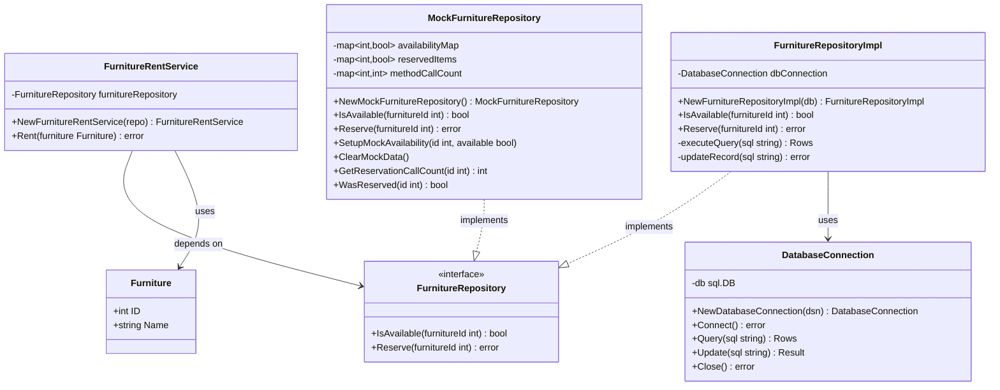
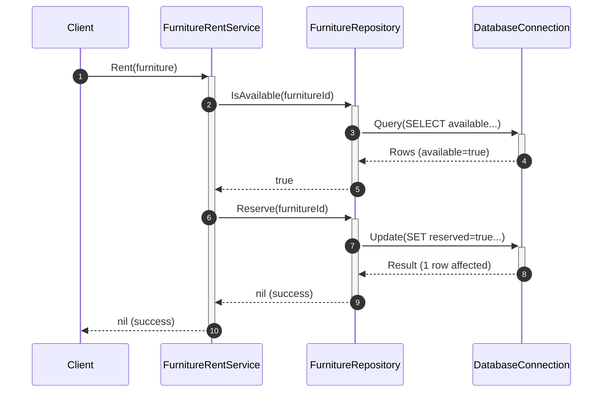
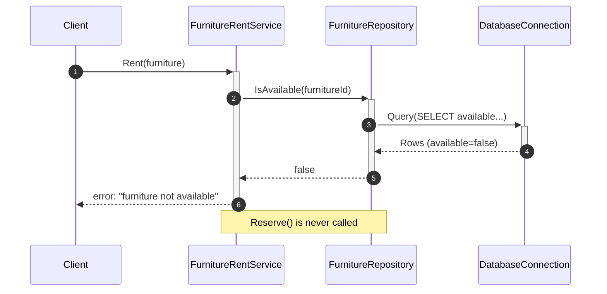
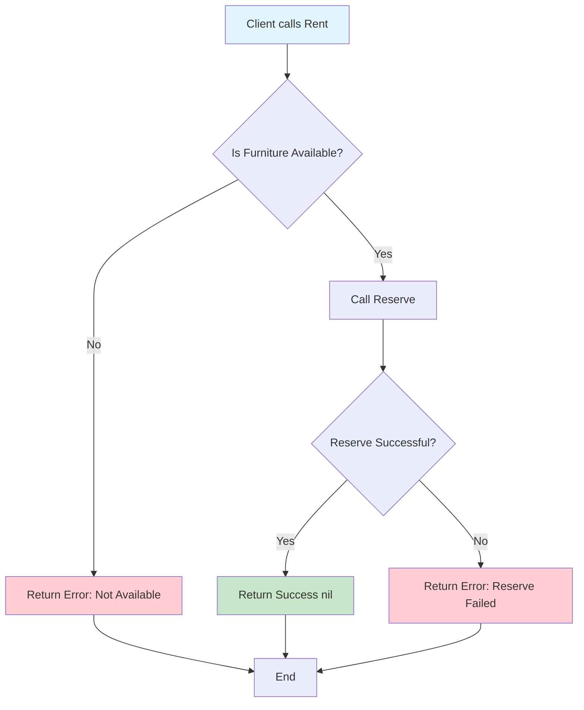
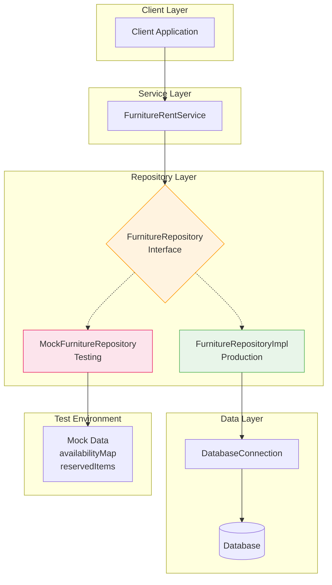
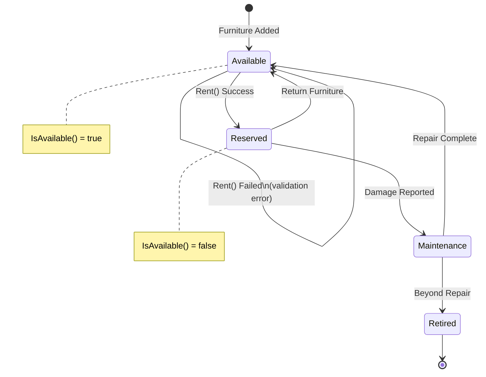
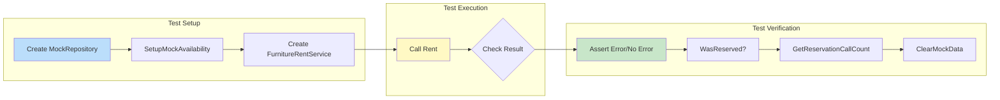
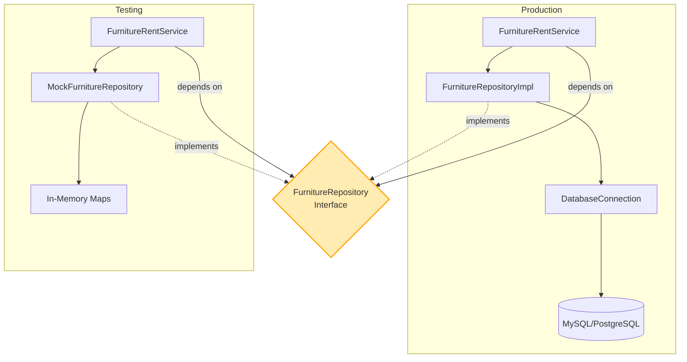

# Mermaid Diagrams for Furniture Rent Service

## 1. Class Diagram

## 2. Sequence Diagram - Successful Rent Flow

## 3. Sequence Diagram - Failed Rent Flow (Not Available)

## 4. Flowchart - Rent Process

## 5. Flowchart - Detailed System Architecture

## 6. State Diagram - Furniture States

## 7. Test Flow Diagram

## 8. Component Interaction Overview

These diagrams provide a complete visualization of your Go furniture rental system architecture, workflows, and testing strategy.
